# PBF-LB/M NoSQL Data Warehouse

> **Comprehensive Data Engineering Platform for Powder Bed Fusion - Laser Beam/Metal (PBF-LB/M) Additive Manufacturing Research**

[](LICENSE)
[](https://www.python.org/downloads/)
[](https://spark.apache.org/)
[](https://airflow.apache.org/)
[](https://www.mongodb.com/)
[](https://redis.io/)
[](https://cassandra.apache.org/)
[](https://www.elastic.co/elasticsearch/)
[](https://neo4j.com/)

## 🎯 **Overview**

This project provides a complete data pipeline solution for PBF-LB/M research, enabling advanced data analysis, process optimization, and quality assurance through:

- **Multi-Model NoSQL Architecture**: PostgreSQL, MongoDB, Redis, Cassandra, Elasticsearch, Neo4j
- **Advanced Build File Processing**: libSLM/PySLM integration for world-class parsing
- **3D Voxel Visualization**: Spatially-resolved process control and quality analysis
- **Comprehensive Analytics**: Sensitivity analysis, statistical modeling, and ML
- **Virtual Environment**: Virtual testing and simulation capabilities
- **Real-Time Processing**: Streaming data ingestion and processing

## 🏗️ **Architecture**

```mermaid
graph TB
    subgraph "📊 Data Sources"
        ISPM[ISPM Sensors<br/>📡 Real-time]
        CT[CT Scans<br/>🔬 Batch]
        BUILD[Build Files<br/>🏗️ Batch]
        CAD[CAD Models<br/>📐 Batch]
    end

    subgraph "💾 Data Lakes"
        DATA_LAKE_LOCAL[Local Data Lake<br/>📦 Historical Data]
        DATA_LAKE_CLOUD[Cloud Data Lake<br/>☁️ Historical Data]
    end

    subgraph "⚙️ Processing"
        KAFKA[Kafka Streaming]
        SPARK[Spark Processing]
        AIRFLOW[Airflow Orchestration]
    end

    subgraph "🏠 Local Storage"
        POSTGRES[(PostgreSQL<br/>🗄️ Operational)]
        MONGODB[(MongoDB<br/>🍃 Documents)]
        REDIS[(Redis<br/>⚡ Cache)]
        MINIO[(MinIO<br/>📦 Object Storage)]
        CLICKHOUSE[(ClickHouse<br/>📊 Data Warehouse)]
        ELASTICSEARCH[(Elasticsearch<br/>🔍 Search & Analytics)]
    end

    subgraph "☁️ Cloud Storage"
        SNOWFLAKE[(Snowflake<br/>❄️ Analytics)]
        AWS_S3[(AWS S3<br/>☁️ Data Lake)]
        BIGQUERY[(BigQuery<br/>🔍 Research)]
    end

    subgraph "🤖 ML & Research"
        ML_TRAINING[ML Model Training]
        ADVANCED_ANALYTICS[Advanced Analytics]
        RESEARCH[Research Queries]
        OPERATIONS[Daily Operations<br/>📊 Operational Work]
    end

    %% Data Flow
    ISPM --> KAFKA --> SPARK
    CT --> SPARK
    BUILD --> SPARK
    CAD --> SPARK
    DATA_LAKE_LOCAL --> SPARK
    DATA_LAKE_CLOUD --> SPARK
    
    SPARK --> POSTGRES
    SPARK --> MONGODB
    SPARK --> REDIS
    SPARK --> ELASTICSEARCH
    SPARK --> CLICKHOUSE
    SPARK --> SNOWFLAKE
    SPARK --> MINIO

    %% ML and Analytics Usage
    POSTGRES -->|Real-time Queries| OPERATIONS
    MONGODB -->|Document Queries| OPERATIONS
    REDIS -->|Cache Access| OPERATIONS
    CLICKHOUSE -->|ML Models, Quality Prediction, Parameter Optimization| ML_TRAINING
    SNOWFLAKE -->|ML Models, Quality Prediction, Parameter Optimization| ML_TRAINING
    CLICKHOUSE -->|Sensitivity Analysis, Statistical Analysis, Process Analysis| ADVANCED_ANALYTICS
    SNOWFLAKE -->|Sensitivity Analysis, Statistical Analysis, Process Analysis| ADVANCED_ANALYTICS
    ELASTICSEARCH -->|Full-text Search, Log Analysis, Real-time Search| ADVANCED_ANALYTICS
    AWS_S3 -->|Data Exploration| RESEARCH
    BIGQUERY -->|Ad-hoc Queries| RESEARCH

    %% Styling
    classDef dataSource fill:#e1f5ff,stroke:#01579b,stroke-width:2px,color:#000
    classDef dataLake fill:#e8f5e9,stroke:#2e7d32,stroke-width:2px,color:#000
    classDef processing fill:#fff3e0,stroke:#e65100,stroke-width:2px,color:#000
    classDef localStorage fill:#f3e5f5,stroke:#4a148c,stroke-width:2px,color:#000
    classDef cloudStorage fill:#e0f2f1,stroke:#004d40,stroke-width:2px,color:#000
    classDef mlResearch fill:#fce4ec,stroke:#880e4f,stroke-width:2px,color:#000

    class ISPM,CT,BUILD,CAD dataSource
    class DATA_LAKE_LOCAL,DATA_LAKE_CLOUD dataLake
    class KAFKA,SPARK,AIRFLOW processing
    class POSTGRES,MONGODB,REDIS,MINIO,CLICKHOUSE,ELASTICSEARCH localStorage
    class SNOWFLAKE,AWS_S3,BIGQUERY cloudStorage
    class ML_TRAINING,ADVANCED_ANALYTICS,RESEARCH,OPERATIONS mlResearch
```



## 🔧 **Core Components**

### **1. Data Pipeline**
- **Multi-Source Ingestion**: Streaming (Kafka), Batch (ETL), CDC (Change Data Capture)
- **Real-Time Processing**: Apache Flink for streaming, Apache Spark for batch
- **Multi-Model Storage**: Optimized database selection based on data characteristics
- **Quality Management**: Comprehensive validation, monitoring, and remediation
- **Workflow Orchestration**: Apache Airflow DAGs for complex workflows

### **2. Build File Processing**
- **libSLM Integration**: C++ library for parsing .mtt, .sli, .cli, .rea, .slm files
- **PySLM Integration**: Python library for advanced analysis and visualization
- **10 Specialized Extractors**: Power, velocity, path, energy, layer, timestamp, focus, jump, style, geometry
- **Per-Geometry Parameters**: Laser parameters defined for individual scan paths
- **CT-Build Correlation**: Temporal correlation for defect analysis
- **🚀 Build File Editor**: Revolutionary tool for modifying build files and generating artificial artifacts

### **3. Voxel Visualization**
- **3D Voxel Grid**: Spatially-resolved representation of PBF-LB/M components
- **Multi-Modal Fusion**: Integration of CAD, process, ISPM, and CT data
- **Interactive 3D Rendering**: Real-time visualization and navigation
- **Defect Detection**: AI-powered 3D defect detection and classification
- **Porosity Analysis**: Comprehensive porosity characterization

### **4. Analytics Engine**
- **Sensitivity Analysis**: Sobol indices, Morris screening, design of experiments
- **Statistical Analysis**: Multivariate, time series, regression, nonparametric methods
- **Process Analysis**: Parameter optimization, quality prediction, sensor analysis
- **ML Integration**: Random forest, neural networks, Bayesian analysis

### **5. Virtual Environment**
- **VM Management**: Virtual machine orchestration and provisioning
- **Simulation Engines**: Thermal, fluid, mechanical, multi-physics simulation
- **Digital Twin**: Real-time synchronization and prediction
- **Testing Frameworks**: Experimental design, automated testing, validation
- **Cloud Integration**: AWS, Azure, GCP with distributed computing

## 🚀 **Key Features**

### **Advanced Build File Processing**
- **libSLM/PySLM Integration**: World-class parsing of .mtt, .sli, .cli, .rea, .slm files
- **10 Specialized Extractors**: Power, velocity, path, energy, layer, timestamp, focus, jump, style, geometry
- **Per-Geometry Parameters**: Laser parameters defined for individual scan paths
- **CT-Build Correlation**: Temporal correlation for defect analysis
- **🚀 Build File Editor**: Revolutionary tool for modifying build files and generating artificial artifacts

### **3D Voxel Visualization**
- **Spatial Resolution**: Voxel-level analysis and process control
- **Multi-Modal Fusion**: Integration of CAD, process, ISPM, and CT data
- **Interactive 3D Rendering**: Real-time visualization and navigation
- **Defect Detection**: AI-powered 3D defect detection and classification

### **Comprehensive Analytics**
- **Sensitivity Analysis**: Sobol indices, Morris screening, design of experiments
- **Statistical Analysis**: Multivariate, time series, regression, nonparametric methods
- **Process Analysis**: Parameter optimization, quality prediction, sensor analysis
- **ML Integration**: Random forest, neural networks, Bayesian analysis

### **Virtual Environment**
- **VM Management**: Virtual machine orchestration and provisioning
- **Simulation Engines**: Thermal, fluid, mechanical, multi-physics simulation
- **Digital Twin**: Real-time synchronization and prediction
- **Testing Frameworks**: Experimental design, automated testing, validation

## 🛠️ Technology Stack

### **Data Processing**
- **Apache Spark**: Distributed data processing and ETL
- **Apache Kafka**: Real-time data streaming
- **Apache Airflow**: Workflow orchestration
- **DBT**: Data transformation and modeling

### **🗄️ Multi-Model Data Storage**

*For detailed information on all data models, schemas, and relationships, see [Data Models Reference](docs/storage/data-models.md)*

#### **🏠 Local Storage (On-Premises)**
- **PostgreSQL**: Primary operational database for daily operational work and real-time queries
- **MongoDB**: Document storage for daily operational work, unstructured data, metadata
- **Redis**: High-performance caching layer for daily operations, session management
- **MinIO**: Local object storage (S3-compatible), raw data backup, development datasets
- **ClickHouse**: Columnar data warehouse for analytics, time-series data, and ML training
- **Elasticsearch**: Search and analytics engine for full-text search, log analysis, and real-time search capabilities

#### **☁️ Cloud Storage (AWS/Azure/GCP)**
- **Snowflake**: Large-scale analytics, data warehousing, ML training, business intelligence
- **AWS S3**: Scalable data lake, long-term storage, data archiving
- **BigQuery**: Ad-hoc queries, data exploration, research analytics
- **MongoDB Atlas**: Managed document storage, global distribution

#### **🤖 ML Research & Advanced Analytics**
- **Training Data**: Stored in both local (fast access) and cloud (scalability)
- **Research Data**: Cloud storage for collaboration and sharing
- **Analytics**: Data warehouse for complex queries and business intelligence
- **Data Lake**: Raw data storage for exploration and experimentation

### **ML & Research Activities**

The data stored in **ClickHouse** and **Snowflake** is used for the following ML and analytics activities:

**🤖 ML Model Training** (using ClickHouse & Snowflake):
- **ML Models**: Random Forest, Neural Networks, Bayesian Analysis
- **Quality Prediction**: Defect detection and quality forecasting models
- **Parameter Optimization**: ML-driven process parameter tuning

**📊 Advanced Analytics** (using ClickHouse & Snowflake):
- **Sensitivity Analysis**: Sobol indices, Morris screening, design of experiments
- **Statistical Analysis**: Multivariate analysis, time series, regression, nonparametric methods
- **Process Analysis**: Sensor data analysis, process optimization, root cause analysis

### **Infrastructure**
- **Docker**: Containerization
- **Kubernetes**: Container orchestration
- **Terraform**: Infrastructure as code
- **Prometheus**: Monitoring and alerting
- **Grafana**: Visualization and dashboards

### **Development**
- **Python 3.9+**: Primary programming language
- **PySpark**: Spark Python API
- **FastAPI**: API development
- **Pydantic**: Data validation and serialization
- **Pytest**: Testing framework

## 📁 **Project Structure**

```
pbf-lbm-nosql-data-warehouse/
├── src/                        # Source code
│   ├── data_pipeline/          # Main data pipeline
│   ├── core/                   # Core domain entities
│   └── ml/                     # Machine learning models
├── config/                     # Configuration files
├── docs/                       # Documentation
├── docker/                     # Docker configurations
├── requirements/               # Python dependencies
└── roadmaps/                   # Project roadmap
```

*Detailed project structure available in [docs/project-structure.md](docs/project-structure.md)*

## 📊 **Data Flow & Storage Strategy**

This platform implements a comprehensive data flow architecture where data from multiple sources (real-time sensors, batch files, and historical data lakes) flows through Apache Spark for transformation and is then distributed to optimized storage systems based on use case requirements.

**Key Points:**
- **Real-time streaming data** (ISPM sensors) flows through Kafka to Spark for processing
- **Batch data** (CT scans, build files, CAD models) and **historical data lakes** are processed directly by Spark
- **Spark performs transformations** and distributes data to multiple storage systems simultaneously
- **Storage selection** is optimized based on data characteristics and usage patterns (operational vs. analytics vs. ML)

### **Data Storage Strategy**

- **Daily Operations** → **PostgreSQL, MongoDB, Redis** for operational work, real-time queries, and caching
- **ML Training** → **ClickHouse & Snowflake** for model training and analytics workloads
- **Analytics** → **ClickHouse & Snowflake** for advanced analytics and business intelligence
- **Search & Analytics** → **Elasticsearch** for full-text search, log analysis, and real-time search capabilities
- **Batch Data** → **Cloud Storage** (Snowflake, AWS S3) for analytics and research
- **Data Warehouse** → **ClickHouse** (Local) for columnar analytics and time-series data
- **Data Lake Input** → **Historical data from Data Lakes** (separate from storage) can be ingested through Spark for batch processing, ML training, and analytics
- **Research Data** → **Cloud Storage** for collaboration and sharing

## 🔧 **Installation & Setup**

### **Prerequisites**
- Python 3.8+
- Apache Spark 3.4+
- Apache Airflow 3.1+
- PostgreSQL 13+
- Docker and Docker Compose

### **Quick Start**

1. **Clone the repository:**
```bash
git clone <repository-url>
cd pbf-lbm-nosql-data-warehouse
```

2. **Install core dependencies:**
```bash
pip install -r requirements/requirements_core.txt
pip install -r requirements/requirements_airflow.txt
pip install -r requirements/requirements_ml.txt
```

3. **Set up external libraries:**
```bash
# Install libSLM (C++ library with Python bindings)
cd src/data_pipeline/external/libSLM
mkdir build && cd build
cmake ..
make -j4
make install

# Install PySLM (Python library)
cd src/data_pipeline/external/pyslm
pip install -e .
```

4. **Start the system:**
```bash
docker-compose -f docker/docker-compose.dev.yml up -d
python scripts/init_database.py
python scripts/start_pipeline.py
```

## 📊 **Data Flow**


## 🔬 **Research Applications**

### **🚀 Build File Editor - Game Changer**

#### **⚡ Defect Generation & Process Modification Workflow**


#### **Core Capabilities**

**1. ⚡ Precision Defect Introduction**
- Advanced build file editing capabilities enabling controlled defect generation at specific spatial coordinates
- Workflow: `.slm → JSON/Edit → .slm`
- Features:
  - Coordinate-based defect placement (x, y, z, radius)
  - Multiple defect types (porosity, cracks, dimensional deviations)
  - Parameter-controlled defect characteristics

**2. ⚡ Process Parameter Manipulation**
- Granular modification of laser power, scan speed, and exposure parameters at individual scan points
- Features:
  - Point-by-point laser power control
  - Individual scan speed adjustment
  - Per-point exposure parameter modification

**3. ⚡ Controlled Quality Variation**
- Systematic introduction of porosity, cracks, and dimensional deviations for research and validation purposes
- Features:
  - Systematic porosity introduction
  - Controlled crack pattern generation
  - Dimensional deviation control

#### **Key Benefits**
- **Artificial Artifact Generation**: Create controlled defects and features at any location
- **Process Parameter Optimization**: Modify parameters for specific regions or entire builds
- **Research Specimen Generation**: Create standardized test specimens for material research
- **10x Faster Iteration**: Virtual parameter testing without expensive physical builds
- **100x Cost Reduction**: Minimize material waste and machine time

### **Process Optimization**
- Parameter sensitivity analysis and optimization
- Quality prediction modeling
- Defect root cause analysis

### **Quality Assurance**
- Real-time quality monitoring
- Automated defect detection
- Porosity analysis and characterization

### **Virtual Testing**
- Controlled parameter experiments
- Multi-physics simulation
- Digital twin validation

## 🎯 **Key Benefits**

1. **World-Class Build File Processing**: Leverages libSLM/PySLM for maximum reliability
2. **🚀 Revolutionary Build File Editor**: Modify build files and generate artificial artifacts for research
3. **Spatial Resolution**: Voxel-level analysis and process control
4. **Multi-Modal Integration**: Unified representation of diverse data sources
5. **Advanced Analytics**: Sophisticated sensitivity analysis and ML capabilities
6. **Virtual Testing**: Controlled experiments without physical resources
7. **Real-Time Processing**: Low-latency data processing and analysis
8. **Scalable Architecture**: Horizontal scaling for growing data volumes
9. **Research-Ready**: Built specifically for additive manufacturing research

## 🤝 **Contributing**

We welcome contributions from the research community! Please see our [Contributing Guidelines](CONTRIBUTING.md) for details.

1. Fork the repository
2. Create a feature branch
3. Make your changes
4. Add tests
5. Submit a pull request

## 📚 **Documentation**

Comprehensive documentation is available in the `docs/` directory:

- **[System Architecture](docs/architecture/system-overview.md)**: Complete system architecture and design principles
- **[Data Models Reference](docs/storage/data-models.md)**: Complete reference for all data models, schemas, and relationships across SQL, NoSQL, and data warehouse systems
- **[Build File Parser](docs/build-parsing/build-parser-readme.md)**: Advanced build file processing with libSLM/PySLM
- **[🚀 Build File Editor](docs/build-parsing/build-file-editor-readme.md)**: Revolutionary tool for modifying build files and generating artificial artifacts
- **[Sensitivity Analysis](docs/analytics/sensitivity-analysis.md)**: Comprehensive analytics and statistical analysis
- **[Voxel Visualization](docs/visualization/voxel-visualization.md)**: 3D voxel-based visualization and analysis
- **[Virtual Environment](docs/virtual-environment/virtual-environment.md)**: Virtual testing and simulation capabilities

## 🗺️ **Roadmap**

See our [Project Roadmap](roadmaps/README.md) for planned features and development phases.

- **Phase 1**: PBF Data Pipeline Optimization
- **Phase 2**: NoSQL Database Integration  
- **Phase 3**: ML/AI Integration

## 📄 **License**

**All Rights Reserved** - This project and its contents are proprietary. 

**Permission Required:** You must obtain explicit written permission from the author before using, modifying, or distributing this software or any portion of it. Unauthorized use is prohibited.

For licensing inquiries, please contact the project maintainer through the contact information provided below.

## 📞 **Contact**

- **Issues**: [GitHub Issues](https://github.com/your-username/pbf-lbm-nosql-data-warehouse/issues)
- **Discussions**: [GitHub Discussions](https://github.com/your-username/pbf-lbm-nosql-data-warehouse/discussions)

---

**Built for PBF-LB/M Research Excellence** 🚀
