# PBF-LB/M NoSQL Data Warehouse - Documentation

Welcome to the comprehensive documentation for the PBF-LB/M (Powder Bed Fusion - Laser Beam/Metal) NoSQL Data Warehouse. This documentation is designed for researchers, engineers, and data scientists working with additive manufacturing data, providing clear guidance on system architecture, usage, and operations.

## 🎯 System Overview

```mermaid
graph TB
    %% Data Sources
    subgraph "📊 PBF-LB/M Data Sources"
        BF[Build Files<br/>🏗️ .mtt, .sli, .cli]
        ISPM[ISPM Monitoring<br/>📡 Real-time Sensors]
        CT[CT Scans<br/>🔬 3D Imaging]
        CAD[CAD Models<br/>📐 STL, STEP]
        PM[Process Monitoring<br/>⚡ Machine Logs]
    end

    %% Data Ingestion Layer
    subgraph "🌊 Data Ingestion"
        KAFKA[Apache Kafka<br/>📡 Streaming]
        AIRFLOW[Apache Airflow<br/>⏰ Orchestration]
        FLINK[Apache Flink<br/>⚡ Stream Processing]
        LIBSLM[libSLM/PySLM<br/>🔧 Build File Parser]
    end

    %% Processing Layer
    subgraph "⚙️ Data Processing"
        VOXEL[Voxel Processing<br/>🧊 3D Grid]
        FUSION[Multi-Modal Fusion<br/>🔗 Data Integration]
        ANALYTICS[Analytics Engine<br/>📊 Sensitivity Analysis]
        QUALITY[Quality Assessment<br/>✅ Defect Detection]
    end

    %% NoSQL Data Warehouse
    subgraph "🗄️ NoSQL Data Warehouse"
        POSTGRES[(PostgreSQL<br/>🗄️ Primary DB)]
        MONGODB[(MongoDB<br/>🍃 Document Store)]
        REDIS[(Redis<br/>⚡ Cache)]
        CASSANDRA[(Cassandra<br/>📊 Time Series)]
        ELASTIC[(Elasticsearch<br/>🔍 Search)]
        NEO4J[(Neo4j<br/>🕸️ Graph DB)]
    end

    %% Visualization Layer
    subgraph "🎯 Visualization & Analysis"
        VOXEL_VIZ[Voxel Visualization<br/>🧊 3D Rendering]
        CT_REG[CT-Build Registration<br/>🔗 Correlation]
        DEFECT[Defect Analysis<br/>🔍 Quality Control]
        PROCESS[Process Optimization<br/>⚡ Parameter Tuning]
    end

    %% Virtual Environment
    subgraph "🖥️ Virtual Environment"
        VM[VM Orchestration<br/>☁️ Cloud Testing]
        DIGITAL_TWIN[Digital Twin<br/>👥 Simulation]
        TESTING[Testing Framework<br/>🧪 Validation]
    end

    %% Monitoring & Quality
    subgraph "📈 Monitoring & Quality"
        QUALITY_MON[Quality Monitoring<br/>📊 Real-time]
        ANOMALY[Anomaly Detection<br/>🚨 Process Alerts]
        GOVERNANCE[Data Governance<br/>🏛️ Management]
    end

    %% Infrastructure
    subgraph "🏗️ Infrastructure"
        DOCKER[Docker<br/>🐳 Containerization]
        K8S[Kubernetes<br/>☸️ Orchestration]
        CLOUD[Multi-Cloud<br/>☁️ AWS/Azure/GCP]
    end

    %% Data Flow
    BF --> LIBSLM
    ISPM --> KAFKA
    CT --> KAFKA
    CAD --> KAFKA
    PM --> KAFKA
    
    LIBSLM --> VOXEL
    KAFKA --> VOXEL
    KAFKA --> FUSION
    KAFKA --> ANALYTICS
    KAFKA --> QUALITY
    
    VOXEL --> POSTGRES
    FUSION --> MONGODB
    ANALYTICS --> CASSANDRA
    QUALITY --> ELASTIC
    
    POSTGRES --> VOXEL_VIZ
    MONGODB --> CT_REG
    CASSANDRA --> DEFECT
    ELASTIC --> PROCESS
    
    VOXEL_VIZ --> VM
    CT_REG --> DIGITAL_TWIN
    DEFECT --> TESTING
    PROCESS --> VM
    
    %% Monitoring connections
    VOXEL --> QUALITY_MON
    FUSION --> ANOMALY
    ANALYTICS --> GOVERNANCE
    QUALITY --> QUALITY_MON
    
    %% Infrastructure connections
    VOXEL --> DOCKER
    FUSION --> DOCKER
    ANALYTICS --> DOCKER
    QUALITY --> DOCKER
    DOCKER --> K8S
    K8S --> CLOUD

    %% Styling
    classDef dataSource fill:#e1f5fe,stroke:#01579b,stroke-width:2px
    classDef processing fill:#f3e5f5,stroke:#4a148c,stroke-width:2px
    classDef storage fill:#e8f5e8,stroke:#2e7d32,stroke-width:2px
    classDef visualization fill:#fff3e0,stroke:#e65100,stroke-width:2px
    classDef virtual fill:#f3e5f5,stroke:#7b1fa2,stroke-width:2px
    classDef monitoring fill:#fce4ec,stroke:#880e4f,stroke-width:2px
    classDef infrastructure fill:#e0f2f1,stroke:#00695c,stroke-width:2px

    class BF,ISPM,CT,CAD,PM dataSource
    class KAFKA,AIRFLOW,FLINK,LIBSLM,VOXEL,FUSION,ANALYTICS,QUALITY processing
    class POSTGRES,MONGODB,REDIS,CASSANDRA,ELASTIC,NEO4J storage
    class VOXEL_VIZ,CT_REG,DEFECT,PROCESS visualization
    class VM,DIGITAL_TWIN,TESTING virtual
    class QUALITY_MON,ANOMALY,GOVERNANCE monitoring
    class DOCKER,K8S,CLOUD infrastructure
```

## 🚀 Comprehensive PBF-LB/M Data Pipeline

*This comprehensive view shows the complete PBF-LB/M data processing pipeline from build files to actionable insights.*

```mermaid
graph TB
    %% Build File Processing
    subgraph "🏗️ Build File Processing"
        PARSER[Build File Parser<br/>🔧 libSLM/PySLM]
        EXTRACTORS[Data Extractors<br/>📊 10 Specialized Extractors]
        VOXELIZER[CAD Voxelizer<br/>🧊 3D Grid Generation]
    end

    %% Process Data Integration
    subgraph "📡 Process Data Integration"
        ISPM_INGEST[ISPM Ingestion<br/>📡 Real-time Sensors]
        CT_INGEST[CT Ingestion<br/>🔬 3D Imaging]
        MONITOR_INGEST[Process Monitoring<br/>⚡ Machine Logs]
    end

    %% Multi-Modal Fusion
    subgraph "🔗 Multi-Modal Fusion"
        TEMPORAL[Temporal Alignment<br/>⏰ Time Synchronization]
        SPATIAL[Spatial Registration<br/>📍 Coordinate Mapping]
        GEOMETRIC[Geometric Correction<br/>📐 Distortion Handling]
    end

    %% Voxel Domain Processing
    subgraph "🧊 Voxel Domain Processing"
        VOXEL_GRID[Voxel Grid<br/>📦 3D Spatial Grid]
        PARAM_MAP[Parameter Mapping<br/>⚡ Process Parameters]
        QUALITY_MAP[Quality Mapping<br/>✅ Defect Locations]
    end

    %% Analytics & Insights
    subgraph "📊 Analytics & Insights"
        SENSITIVITY[Sensitivity Analysis<br/>📈 Parameter Influence]
        ANOMALY_DET[Anomaly Detection<br/>🚨 Process Deviations]
        OPTIMIZATION[Process Optimization<br/>⚡ Parameter Tuning]
    end

    %% Visualization & Export
    subgraph "🎯 Visualization & Export"
        RENDER[3D Rendering<br/>🎨 Interactive Visualization]
        SLICE[Slice Analysis<br/>🔍 Cross-Section Views]
        EXPORT[Data Export<br/>📤 Results Export]
    end

    %% Data Flow
    PARSER --> EXTRACTORS
    EXTRACTORS --> VOXELIZER
    VOXELIZER --> VOXEL_GRID
    
    ISPM_INGEST --> TEMPORAL
    CT_INGEST --> SPATIAL
    MONITOR_INGEST --> GEOMETRIC
    
    TEMPORAL --> VOXEL_GRID
    SPATIAL --> PARAM_MAP
    GEOMETRIC --> QUALITY_MAP
    
    VOXEL_GRID --> SENSITIVITY
    PARAM_MAP --> ANOMALY_DET
    QUALITY_MAP --> OPTIMIZATION
    
    SENSITIVITY --> RENDER
    ANOMALY_DET --> SLICE
    OPTIMIZATION --> EXPORT

    %% Styling
    classDef buildFile fill:#e3f2fd,stroke:#1976d2,stroke-width:2px
    classDef integration fill:#f3e5f5,stroke:#7b1fa2,stroke-width:2px
    classDef fusion fill:#e8f5e8,stroke:#2e7d32,stroke-width:2px
    classDef voxel fill:#fff3e0,stroke:#e65100,stroke-width:2px
    classDef analytics fill:#fce4ec,stroke:#880e4f,stroke-width:2px
    classDef visualization fill:#e0f2f1,stroke:#00695c,stroke-width:2px

    class PARSER,EXTRACTORS,VOXELIZER buildFile
    class ISPM_INGEST,CT_INGEST,MONITOR_INGEST integration
    class TEMPORAL,SPATIAL,GEOMETRIC fusion
    class VOXEL_GRID,PARAM_MAP,QUALITY_MAP voxel
    class SENSITIVITY,ANOMALY_DET,OPTIMIZATION analytics
    class RENDER,SLICE,EXPORT visualization
```

## 🎯 Key Capabilities

### **🏗️ Build File Processing**
- **libSLM/PySLM Integration**: Native support for .mtt, .sli, .cli, .rea, .f&s files
- **10 Specialized Extractors**: Power, Velocity, Path, Energy, Layer, Timestamp, Focus, Jump Parameters, Build Style, Geometry Type
- **Per-Geometry Parameters**: Extract laser parameters for each hatch line, contour, and point
- **Complete Process Timeline**: Reconstruct exact build timeline with timestamps

### **🔗 Multi-Modal Data Fusion**
- **CT-Build Registration**: Correlate CT scan defects with build process parameters
- **Temporal Synchronization**: Align process data with build timeline
- **Spatial Registration**: Map process parameters to 3D coordinates
- **Geometric Correction**: Handle distortions and noise in sensor data

### **🧊 Voxel Domain Representation**
- **3D Spatial Grid**: Uniform voxel representation of PBF-LB/M components
- **Process Parameter Mapping**: Map laser power, speed, focus to each voxel
- **Quality Mapping**: Map defects, pores, cracks to spatial locations
- **Slice-by-Slice Analysis**: Analyze cross-sections like medical imaging

### **📊 Advanced Analytics**
- **Sensitivity Analysis**: Evaluate influence of process variables on quality
- **Anomaly Detection**: Identify process deviations and quality issues
- **Process Optimization**: Recommend optimal parameters for different geometries
- **Root Cause Analysis**: Determine which process parameters cause specific defects

### **🎯 Visualization & Analysis**
- **3D Interactive Rendering**: Visualize voxel data with process parameters
- **CT-Build Correlation**: Overlay CT defects with build process data
- **Defect Analysis**: Identify and classify defects in 3D space
- **Process Monitoring**: Real-time visualization of build progress

## 🚀 **Quick Reference: Where Does My Data Go?**

### **Data Storage Summary**
- **Real-time Data** (ISPM sensors) → **PostgreSQL** (local) + **AWS S3** (cloud)
- **Batch Data** (CT scans, build files) → **MongoDB** (local) + **Snowflake** (cloud)
- **ML Training Data** → **Both Local & Cloud** for optimal performance
- **Research Data** → **Cloud Storage** for collaboration and sharing

### **Storage Types by Use Case**
- **Operational Data** → Local storage (PostgreSQL, MongoDB, Redis)
- **Analytics Data** → Cloud storage (Snowflake, BigQuery)
- **Raw Data** → Data lake (MinIO local, AWS S3 cloud)
- **ML Data** → Hybrid storage (local for speed, cloud for scale)

*For detailed information, see [Data Storage Strategy](architecture/data-storage-strategy.md)*

## 📚 Documentation Structure

### 📁 Project Structure
- **[Project Structure](project-structure.md)** - Complete project structure and file organization

### 🏗️ Architecture Documentation
- **[System Overview](architecture/system-overview.md)** - High-level system architecture and components
- **[Data Pipeline Orchestration](architecture/data-pipeline-orchestration.md)** - How Kafka, Airflow & ETL Spark work together
- **[Technical Implementation](architecture/technical-implementation.md)** - Production-ready configurations and code examples
- **[Data Storage Strategy](architecture/data-storage-strategy.md)** - Where data goes: Local vs Cloud storage for ML research
- **[Data Flow](architecture/data-flow.md)** - How data moves through the PBF-LB/M pipeline
- **[Voxel Domain Architecture](architecture/voxel-domain-architecture.md)** - 3D voxel representation system
- **[Multi-Modal Fusion](architecture/multi-modal-fusion.md)** - Data integration and correlation
- **[NoSQL Data Warehouse](architecture/nosql-data-warehouse.md)** - Multi-model database architecture

### 🔧 Build File Processing
- **[Build File Parser](build-parsing/build-file-parser.md)** - libSLM/PySLM integration and usage
- **[Data Extractors](build-parsing/data-extractors.md)** - 10 specialized parameter extractors
- **[Format Support](build-parsing/format-support.md)** - Supported build file formats
- **[Parameter Extraction](build-parsing/parameter-extraction.md)** - Process parameter extraction methods

### 🔗 Data Integration
- **[ISPM Integration](integration/ispm-integration.md)** - In-situ process monitoring data
- **[CT Scan Integration](integration/ct-scan-integration.md)** - Computed tomography data processing
- **[CAD Integration](integration/cad-integration.md)** - CAD model voxelization
- **[Process Monitoring](integration/process-monitoring.md)** - Machine log integration

### 🧊 Voxel Processing
- **[Voxel Domain](voxel-processing/voxel-domain.md)** - 3D spatial grid representation
- **[Data Synchronization](voxel-processing/data-synchronization.md)** - Temporal and spatial alignment
- **[Data Transformation](voxel-processing/data-transformation.md)** - Coordinate system transformations
- **[Data Reduction](voxel-processing/data-reduction.md)** - Noise filtering and optimization

### 📊 Analytics & ML
- **[Sensitivity Analysis](analytics/sensitivity-analysis.md)** - Process parameter influence analysis
- **[Anomaly Detection](analytics/anomaly-detection.md)** - Process deviation detection
- **[Process Optimization](analytics/process-optimization.md)** - Parameter optimization algorithms
- **[Quality Assessment](analytics/quality-assessment.md)** - Defect detection and classification

### 🎯 Visualization
- **[3D Visualization](visualization/3d-visualization.md)** - Interactive voxel rendering
- **[CT-Build Registration](visualization/ct-build-registration.md)** - Multi-modal data correlation
- **[Defect Visualization](visualization/defect-visualization.md)** - Quality control visualization
- **[Process Visualization](visualization/process-visualization.md)** - Build process monitoring

### 🖥️ Virtual Environment
- **[VM Orchestration](virtual-environment/vm-orchestration.md)** - Virtual machine management
- **[Digital Twin](virtual-environment/digital-twin.md)** - Virtual PBF-LB/M system simulation
- **[Testing Framework](virtual-environment/testing-framework.md)** - Validation and testing tools
- **[Cloud Integration](virtual-environment/cloud-integration.md)** - Multi-cloud deployment

### 🗄️ Data Storage
- **[NoSQL Architecture](storage/nosql-architecture.md)** - Multi-model database design
- **[Data Models](storage/data-models.md)** - Entity relationships and schemas
- **[Storage Optimization](storage/storage-optimization.md)** - Performance and scalability
- **[Data Governance](storage/data-governance.md)** - Data management and compliance

### 🚀 Deployment & Operations
- **[Installation Guide](deployment/installation.md)** - System setup and configuration
- **[Docker Deployment](deployment/docker-deployment.md)** - Containerized deployment
- **[Kubernetes Deployment](deployment/kubernetes-deployment.md)** - Orchestrated deployment
- **[Monitoring Setup](deployment/monitoring-setup.md)** - Observability and monitoring

### 👥 User Guides
- **[Getting Started](user-guides/getting-started.md)** - Quick start guide for new users
- **[Build File Analysis](user-guides/build-file-analysis.md)** - Analyzing PBF-LB/M build files
- **[CT-Build Correlation](user-guides/ct-build-correlation.md)** - Correlating CT data with build process
- **[Process Optimization](user-guides/process-optimization.md)** - Optimizing PBF-LB/M parameters
- **[Quality Control](user-guides/quality-control.md)** - Quality assessment and defect detection
- **[Troubleshooting](user-guides/troubleshooting.md)** - Common issues and solutions

### 📊 API Documentation
- **[API Overview](api/api-overview.md)** - REST API introduction and authentication
- **[Build File API](api/build-file-api.md)** - Build file processing endpoints
- **[Voxel API](api/voxel-api.md)** - Voxel data access endpoints
- **[Analytics API](api/analytics-api.md)** - Analytics and insights endpoints
- **[Visualization API](api/visualization-api.md)** - Visualization and rendering endpoints

## 🎯 Quick Navigation

### For Researchers
- Start with [Getting Started](user-guides/getting-started.md)
- Learn about [Build File Analysis](user-guides/build-file-analysis.md)
- Explore [CT-Build Correlation](user-guides/ct-build-correlation.md)
- Study [Sensitivity Analysis](analytics/sensitivity-analysis.md)

### For Engineers
- Start with [Project Structure](project-structure.md) to understand the codebase
- Review [System Architecture](architecture/system-overview.md)
- Check [Build File Parser](build-parsing/build-file-parser.md)
- Follow [Installation Guide](deployment/installation.md)

### For Data Scientists
- Study [Voxel Domain](voxel-processing/voxel-domain.md)
- Learn [Multi-Modal Fusion](architecture/multi-modal-fusion.md)
- Explore [Analytics Capabilities](analytics/sensitivity-analysis.md)
- Review [Process Optimization](analytics/process-optimization.md)

### For DevOps Engineers
- Study [Deployment Overview](deployment/installation.md)
- Configure [Monitoring](deployment/monitoring-setup.md)
- Set up [Production Environment](deployment/kubernetes-deployment.md)

## 📊 Visual Guides

This documentation includes comprehensive Mermaid diagrams to help visualize:

- **System Architecture** - How components interact in the PBF-LB/M pipeline
- **Data Flow** - How data moves from build files to insights
- **Voxel Processing** - 3D spatial data representation
- **Multi-Modal Fusion** - Data integration and correlation
- **Process Workflows** - Step-by-step analysis processes
- **Deployment Architecture** - Infrastructure and deployment

## 🔄 Documentation Updates

This documentation is maintained alongside the codebase and is updated with each release. For the most current information, always refer to the version in the main branch.

## 📞 Support

If you need help or have questions:
- Check the [Troubleshooting Guide](user-guides/troubleshooting.md)
- Review the [API Documentation](api/api-overview.md)
- Contact the development team

## 📄 License

This documentation is part of the PBF-LB/M NoSQL Data Warehouse project and follows the same licensing terms.

---

**🚀 Ready to revolutionize PBF-LB/M process analysis? Start with the [Getting Started Guide](user-guides/getting-started.md)!**
