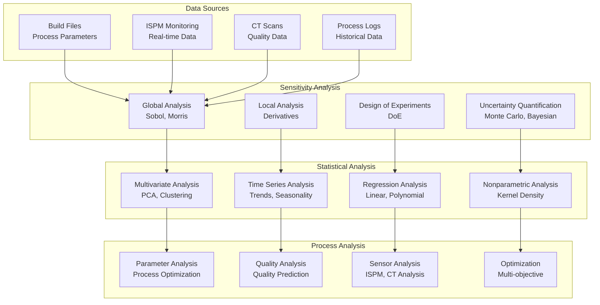

# Sensitivity Analysis - PBF-LB/M Data Pipeline

## 🎯 **Overview**

The Sensitivity Analysis module provides comprehensive statistical analysis capabilities for PBF-LB/M (Powder Bed Fusion - Laser Beam/Metal) additive manufacturing research. It enables researchers to understand the influence of process parameters on build quality and optimize manufacturing processes through advanced statistical methods.

## 🏗️ **Architecture**

### **Multi-Level Analysis Approach**



## 🔧 **Core Components**

### **1. Global Sensitivity Analysis**

Comprehensive global sensitivity analysis using Sobol indices and Morris screening:

```python
from src.data_pipeline.processing.analytics import (
    GlobalSensitivityAnalyzer,
    SobolAnalyzer,
    MorrisAnalyzer
)

# Initialize global sensitivity analyzer
analyzer = GlobalSensitivityAnalyzer()

# Define process parameters
parameters = {
    'laser_power': {'min': 150, 'max': 300, 'unit': 'W'},
    'scan_speed': {'min': 0.5, 'max': 2.0, 'unit': 'mm/s'},
    'layer_thickness': {'min': 0.02, 'max': 0.1, 'unit': 'mm'},
    'hatch_spacing': {'min': 0.05, 'max': 0.2, 'unit': 'mm'},
    'focus_diameter': {'min': 0.05, 'max': 0.15, 'unit': 'mm'}
}

# Perform Sobol analysis
sobol_analyzer = SobolAnalyzer()
sobol_results = sobol_analyzer.analyze(
    parameters=parameters,
    sample_size=1000,
    model_function=build_quality_model
)

# Perform Morris screening
morris_analyzer = MorrisAnalyzer()
morris_results = morris_analyzer.analyze(
    parameters=parameters,
    num_trajectories=10,
    levels=10,
    model_function=build_quality_model
)

# Results interpretation
print("Sobol Indices (First Order):")
for param, index in sobol_results['first_order'].items():
    print(f"  {param}: {index:.3f}")

print("\nMorris Screening Results:")
for param, result in morris_results.items():
    print(f"  {param}: μ*={result['mu_star']:.3f}, σ={result['sigma']:.3f}")
```

### **2. Local Sensitivity Analysis**

Local sensitivity analysis using derivative-based methods:

```python
from src.data_pipeline.processing.analytics import (
    LocalSensitivityAnalyzer,
    DerivativeAnalyzer
)

# Initialize local sensitivity analyzer
local_analyzer = LocalSensitivityAnalyzer()

# Define baseline parameters
baseline_params = {
    'laser_power': 225.0,
    'scan_speed': 1.2,
    'layer_thickness': 0.05,
    'hatch_spacing': 0.1,
    'focus_diameter': 0.1
}

# Perform local sensitivity analysis
local_results = local_analyzer.analyze(
    baseline_parameters=baseline_params,
    perturbation_size=0.01,
    model_function=build_quality_model
)

# Calculate derivatives
derivative_analyzer = DerivativeAnalyzer()
derivatives = derivative_analyzer.calculate_derivatives(
    parameters=baseline_params,
    model_function=build_quality_model,
    step_size=0.001
)

# Results interpretation
print("Local Sensitivity (Derivatives):")
for param, derivative in derivatives.items():
    print(f"  {param}: {derivative:.6f}")
```

### **3. Design of Experiments (DoE)**

Statistical experimental design for systematic parameter exploration:

```python
from src.data_pipeline.processing.analytics import (
    ExperimentalDesigner,
    FactorialDesign,
    ResponseSurfaceDesign
)

# Initialize experimental designer
designer = ExperimentalDesigner()

# Create factorial design
factorial_design = FactorialDesign()
factorial_plan = factorial_design.create_design(
    factors=['laser_power', 'scan_speed', 'layer_thickness'],
    levels=[2, 2, 2],  # 2^3 factorial design
    replicates=3
)

# Create response surface design
rs_design = ResponseSurfaceDesign()
rs_plan = rs_design.create_design(
    factors=['laser_power', 'scan_speed'],
    design_type='central_composite',
    center_points=5,
    alpha='orthogonal'
)

# Generate experimental plan
experimental_plan = designer.generate_plan(
    design_type='factorial',
    parameters=parameters,
    sample_size=50
)

print("Experimental Plan:")
for i, run in enumerate(experimental_plan):
    print(f"Run {i+1}: {run}")
```

### **4. Uncertainty Quantification**

Advanced uncertainty quantification using Monte Carlo and Bayesian methods:

```python
from src.data_pipeline.processing.analytics import (
    UncertaintyQuantifier,
    MonteCarloAnalyzer,
    BayesianAnalyzer
)

# Initialize uncertainty quantifier
uq_analyzer = UncertaintyQuantifier()

# Define parameter distributions
parameter_distributions = {
    'laser_power': {'type': 'normal', 'mean': 225, 'std': 15},
    'scan_speed': {'type': 'uniform', 'min': 0.8, 'max': 1.6},
    'layer_thickness': {'type': 'normal', 'mean': 0.05, 'std': 0.005}
}

# Monte Carlo analysis
mc_analyzer = MonteCarloAnalyzer()
mc_results = mc_analyzer.analyze(
    distributions=parameter_distributions,
    sample_size=10000,
    model_function=build_quality_model
)

# Bayesian analysis
bayesian_analyzer = BayesianAnalyzer()
bayesian_results = bayesian_analyzer.analyze(
    prior_distributions=parameter_distributions,
    observed_data=experimental_data,
    model_function=build_quality_model,
    mcmc_samples=5000
)

# Results interpretation
print("Monte Carlo Results:")
print(f"  Mean Quality: {mc_results['mean']:.3f}")
print(f"  Std Quality: {mc_results['std']:.3f}")
print(f"  95% CI: [{mc_results['ci_lower']:.3f}, {mc_results['ci_upper']:.3f}]")

print("\nBayesian Results:")
print(f"  Posterior Mean: {bayesian_results['posterior_mean']:.3f}")
print(f"  Posterior Std: {bayesian_results['posterior_std']:.3f}")
```

## 📊 **Statistical Analysis Components**

### **1. Multivariate Analysis**

Advanced multivariate statistical methods:

```python
from src.data_pipeline.processing.analytics import (
    MultivariateAnalyzer,
    PCAAnalyzer,
    ClusterAnalyzer
)

# Initialize multivariate analyzer
mv_analyzer = MultivariateAnalyzer()

# Load process data
process_data = load_process_data()  # Shape: (n_samples, n_parameters)

# Principal Component Analysis
pca_analyzer = PCAAnalyzer()
pca_results = pca_analyzer.analyze(
    data=process_data,
    n_components=5,
    standardize=True
)

# Clustering analysis
cluster_analyzer = ClusterAnalyzer()
cluster_results = cluster_analyzer.analyze(
    data=process_data,
    n_clusters=3,
    method='kmeans'
)

# Results interpretation
print("PCA Results:")
print(f"  Explained Variance: {pca_results['explained_variance_ratio']}")
print(f"  Principal Components: {pca_results['components'].shape}")

print("\nClustering Results:")
print(f"  Cluster Centers: {cluster_results['centers']}")
print(f"  Cluster Labels: {cluster_results['labels']}")
```

### **2. Time Series Analysis**

Time series analysis for process monitoring:

```python
from src.data_pipeline.processing.analytics import (
    TimeSeriesAnalyzer,
    TrendAnalyzer,
    SeasonalityAnalyzer
)

# Initialize time series analyzer
ts_analyzer = TimeSeriesAnalyzer()

# Load time series data
time_series_data = load_ispm_data()  # Shape: (n_timestamps, n_sensors)

# Trend analysis
trend_analyzer = TrendAnalyzer()
trend_results = trend_analyzer.analyze(
    data=time_series_data,
    window_size=100,
    method='linear_regression'
)

# Seasonality analysis
seasonality_analyzer = SeasonalityAnalyzer()
seasonality_results = seasonality_analyzer.analyze(
    data=time_series_data,
    period=24,  # 24-hour period
    method='fourier'
)

# Results interpretation
print("Trend Analysis:")
for sensor, trend in trend_results.items():
    print(f"  {sensor}: slope={trend['slope']:.6f}, p_value={trend['p_value']:.3f}")

print("\nSeasonality Analysis:")
for sensor, seasonality in seasonality_results.items():
    print(f"  {sensor}: period={seasonality['period']}, strength={seasonality['strength']:.3f}")
```

### **3. Regression Analysis**

Regression modeling for process optimization:

```python
from src.data_pipeline.processing.analytics import (
    RegressionAnalyzer,
    LinearRegression,
    PolynomialRegression
)

# Initialize regression analyzer
reg_analyzer = RegressionAnalyzer()

# Load training data
X_train, y_train = load_training_data()  # Features and target
X_test, y_test = load_test_data()

# Linear regression
linear_reg = LinearRegression()
linear_results = linear_reg.fit(X_train, y_train)
linear_predictions = linear_reg.predict(X_test)

# Polynomial regression
poly_reg = PolynomialRegression(degree=2)
poly_results = poly_reg.fit(X_train, y_train)
poly_predictions = poly_reg.predict(X_test)

# Model evaluation
linear_score = linear_reg.score(X_test, y_test)
poly_score = poly_reg.score(X_test, y_test)

print(f"Linear Regression R²: {linear_score:.3f}")
print(f"Polynomial Regression R²: {poly_score:.3f}")
```

## 🔬 **Process Analysis Components**

### **1. Parameter Analysis**

Process parameter analysis and optimization:

```python
from src.data_pipeline.processing.analytics import (
    ParameterAnalyzer,
    ProcessParameterOptimizer
)

# Initialize parameter analyzer
param_analyzer = ParameterAnalyzer()

# Analyze parameter relationships
param_analysis = param_analyzer.analyze(
    process_data=process_data,
    quality_data=quality_data,
    correlation_method='pearson'
)

# Process parameter optimization
optimizer = ProcessParameterOptimizer()
optimization_results = optimizer.optimize(
    objective_function=quality_objective,
    constraints=process_constraints,
    method='genetic_algorithm',
    population_size=100,
    generations=50
)

# Results interpretation
print("Parameter Correlations:")
for param1, param2, correlation in param_analysis['correlations']:
    print(f"  {param1} vs {param2}: {correlation:.3f}")

print("\nOptimization Results:")
print(f"  Best Parameters: {optimization_results['best_parameters']}")
print(f"  Best Quality: {optimization_results['best_quality']:.3f}")
```

### **2. Quality Analysis**

Quality prediction and analysis:

```python
from src.data_pipeline.processing.analytics import (
    QualityAnalyzer,
    QualityPredictor
)

# Initialize quality analyzer
quality_analyzer = QualityAnalyzer()

# Analyze quality metrics
quality_analysis = quality_analyzer.analyze(
    quality_data=quality_data,
    process_data=process_data,
    metrics=['density', 'surface_roughness', 'dimensional_accuracy']
)

# Quality prediction
quality_predictor = QualityPredictor()
quality_predictor.fit(
    X=process_data,
    y=quality_data,
    model_type='random_forest'
)

# Predict quality for new parameters
new_parameters = {
    'laser_power': 250,
    'scan_speed': 1.0,
    'layer_thickness': 0.04
}
predicted_quality = quality_predictor.predict(new_parameters)

print("Quality Analysis:")
for metric, analysis in quality_analysis.items():
    print(f"  {metric}: mean={analysis['mean']:.3f}, std={analysis['std']:.3f}")

print(f"\nPredicted Quality: {predicted_quality}")
```

### **3. Sensor Analysis**

ISPM and CT sensor data analysis:

```python
from src.data_pipeline.processing.analytics import (
    SensorAnalyzer,
    ISPMAnalyzer,
    CTSensorAnalyzer
)

# Initialize sensor analyzers
ispm_analyzer = ISPMAnalyzer()
ct_analyzer = CTSensorAnalyzer()

# ISPM data analysis
ispm_data = load_ispm_data()
ispm_analysis = ispm_analyzer.analyze(
    data=ispm_data,
    analysis_types=['anomaly_detection', 'trend_analysis', 'correlation']
)

# CT scan analysis
ct_data = load_ct_data()
ct_analysis = ct_analyzer.analyze(
    data=ct_data,
    analysis_types=['porosity_analysis', 'defect_detection', 'density_analysis']
)

# Results interpretation
print("ISPM Analysis:")
print(f"  Anomalies Detected: {ispm_analysis['anomalies']['count']}")
print(f"  Trend Direction: {ispm_analysis['trend']['direction']}")

print("\nCT Analysis:")
print(f"  Porosity: {ct_analysis['porosity']['percentage']:.2f}%")
print(f"  Defects: {ct_analysis['defects']['count']}")
```

## 📈 **Reporting & Visualization**

### **1. Analysis Reports**

Automated report generation:

```python
from src.data_pipeline.processing.analytics import (
    AnalysisReportGenerator,
    SensitivityReportGenerator
)

# Generate sensitivity analysis report
sensitivity_report = SensitivityReportGenerator()
sensitivity_report.generate_report(
    sobol_results=sobol_results,
    morris_results=morris_results,
    local_results=local_results,
    output_format='html',
    output_path='sensitivity_report.html'
)

# Generate comprehensive analysis report
analysis_report = AnalysisReportGenerator()
analysis_report.generate_report(
    sensitivity_analysis=sensitivity_results,
    statistical_analysis=statistical_results,
    process_analysis=process_results,
    output_format='pdf',
    output_path='comprehensive_analysis.pdf'
)
```

### **2. Visualization**

Advanced visualization capabilities:

```python
from src.data_pipeline.processing.analytics import (
    AnalysisVisualizer,
    SensitivityVisualizer
)

# Initialize visualizers
analysis_viz = AnalysisVisualizer()
sensitivity_viz = SensitivityVisualizer()

# Create sensitivity plots
sensitivity_viz.plot_sobol_indices(sobol_results)
sensitivity_viz.plot_morris_screening(morris_results)
sensitivity_viz.plot_parameter_interactions(interaction_results)

# Create analysis plots
analysis_viz.plot_parameter_distributions(parameter_data)
analysis_viz.plot_quality_correlations(correlation_data)
analysis_viz.plot_optimization_convergence(optimization_results)
```

## 🚀 **Usage Examples**

### **1. Complete Sensitivity Analysis Workflow**

```python
from src.data_pipeline.processing.analytics import (
    GlobalSensitivityAnalyzer,
    SobolAnalyzer,
    MorrisAnalyzer,
    AnalysisReportGenerator
)

def complete_sensitivity_analysis():
    """Complete sensitivity analysis workflow."""
    
    # Initialize analyzers
    sobol_analyzer = SobolAnalyzer()
    morris_analyzer = MorrisAnalyzer()
    
    # Define parameters
    parameters = {
        'laser_power': {'min': 150, 'max': 300},
        'scan_speed': {'min': 0.5, 'max': 2.0},
        'layer_thickness': {'min': 0.02, 'max': 0.1},
        'hatch_spacing': {'min': 0.05, 'max': 0.2}
    }
    
    # Model function (simplified)
    def build_quality_model(params):
        # Simplified quality model
        power_effect = (params['laser_power'] - 225) / 75
        speed_effect = (params['scan_speed'] - 1.25) / 0.75
        thickness_effect = (params['layer_thickness'] - 0.06) / 0.04
        spacing_effect = (params['hatch_spacing'] - 0.125) / 0.075
        
        quality = 0.8 + 0.1 * power_effect - 0.05 * speed_effect - 0.03 * thickness_effect - 0.02 * spacing_effect
        return max(0, min(1, quality))  # Clamp to [0, 1]
    
    # Perform analyses
    sobol_results = sobol_analyzer.analyze(
        parameters=parameters,
        sample_size=1000,
        model_function=build_quality_model
    )
    
    morris_results = morris_analyzer.analyze(
        parameters=parameters,
        num_trajectories=10,
        levels=10,
        model_function=build_quality_model
    )
    
    # Generate report
    report_generator = AnalysisReportGenerator()
    report_generator.generate_report(
        sobol_results=sobol_results,
        morris_results=morris_results,
        output_format='html',
        output_path='sensitivity_analysis_report.html'
    )
    
    return sobol_results, morris_results

# Run analysis
sobol_results, morris_results = complete_sensitivity_analysis()
```

### **2. Process Optimization Workflow**

```python
from src.data_pipeline.processing.analytics import (
    ProcessParameterOptimizer,
    QualityPredictor,
    ParameterAnalyzer
)

def optimize_process_parameters():
    """Optimize process parameters for maximum quality."""
    
    # Load historical data
    process_data, quality_data = load_historical_data()
    
    # Train quality predictor
    quality_predictor = QualityPredictor()
    quality_predictor.fit(
        X=process_data,
        y=quality_data,
        model_type='random_forest'
    )
    
    # Define optimization objective
    def objective_function(params):
        return quality_predictor.predict(params)
    
    # Define constraints
    constraints = {
        'laser_power': {'min': 150, 'max': 300},
        'scan_speed': {'min': 0.5, 'max': 2.0},
        'layer_thickness': {'min': 0.02, 'max': 0.1}
    }
    
    # Optimize parameters
    optimizer = ProcessParameterOptimizer()
    optimization_results = optimizer.optimize(
        objective_function=objective_function,
        constraints=constraints,
        method='genetic_algorithm',
        population_size=100,
        generations=50
    )
    
    return optimization_results

# Run optimization
optimal_params = optimize_process_parameters()
print(f"Optimal Parameters: {optimal_params['best_parameters']}")
print(f"Expected Quality: {optimal_params['best_quality']:.3f}")
```

## 🔧 **Configuration & Setup**

### **1. Dependencies**

The analytics module requires several scientific computing libraries:

```bash
# Core dependencies
pip install numpy scipy pandas scikit-learn

# Sensitivity analysis
pip install SALib

# Bayesian analysis
pip install pymc

# Visualization
pip install matplotlib seaborn plotly

# Optimization
pip install pymoo
```

### **2. Configuration**

Configure the analytics module:

```yaml
# config/ml/analytics.yaml
analytics:
  sensitivity_analysis:
    sobol:
      sample_size: 1000
      confidence_level: 0.95
      bootstrap_samples: 100
    morris:
      levels: 10
      num_trajectories: 10
      grid_jump: 2
  
  statistical_analysis:
    pca:
      n_components: 5
      standardize: true
    clustering:
      method: 'kmeans'
      n_clusters: 3
  
  process_analysis:
    optimization:
      method: 'genetic_algorithm'
      population_size: 100
      generations: 50
    quality_prediction:
      model_type: 'random_forest'
      n_estimators: 100
  
  reporting:
    output_formats: ['html', 'pdf']
    include_visualizations: true
    save_intermediate_results: true
```

## 🎯 **Key Benefits**

1. **Comprehensive Analysis**: Multiple sensitivity analysis methods
2. **Statistical Rigor**: Advanced statistical methods and validation
3. **Process Optimization**: Automated parameter optimization
4. **Quality Prediction**: ML-based quality prediction models
5. **Automated Reporting**: Comprehensive analysis reports
6. **Visualization**: Advanced plotting and visualization
7. **Research-Ready**: Built for academic and industrial research
8. **Scalable**: Handles large datasets efficiently

## 📚 **API Reference**

### **Global Sensitivity Analysis**

```python
class GlobalSensitivityAnalyzer:
    def analyze(self, parameters: Dict, model_function: Callable) -> Dict

class SobolAnalyzer:
    def analyze(self, parameters: Dict, sample_size: int, model_function: Callable) -> Dict

class MorrisAnalyzer:
    def analyze(self, parameters: Dict, num_trajectories: int, levels: int, model_function: Callable) -> Dict
```

### **Statistical Analysis**

```python
class MultivariateAnalyzer:
    def analyze(self, data: np.ndarray) -> Dict

class TimeSeriesAnalyzer:
    def analyze(self, data: np.ndarray, analysis_types: List[str]) -> Dict

class RegressionAnalyzer:
    def fit(self, X: np.ndarray, y: np.ndarray) -> Dict
    def predict(self, X: np.ndarray) -> np.ndarray
```

### **Process Analysis**

```python
class ParameterAnalyzer:
    def analyze(self, process_data: np.ndarray, quality_data: np.ndarray) -> Dict

class QualityPredictor:
    def fit(self, X: np.ndarray, y: np.ndarray, model_type: str) -> None
    def predict(self, X: np.ndarray) -> np.ndarray

class ProcessOptimizer:
    def optimize(self, objective_function: Callable, constraints: Dict, method: str) -> Dict
```

This sensitivity analysis module provides a comprehensive, research-ready platform for understanding and optimizing PBF-LB/M manufacturing processes through advanced statistical analysis and machine learning techniques.
