# Data Pipeline Orchestration: Kafka, Airflow & ETL Spark Integration

This document explains how Apache Kafka, Apache Airflow, and ETL Spark work together in synchronization to create a robust, scalable data pipeline for PBF-LB/M additive manufacturing research.

## 🎯 **Why This Integration Matters**

### **The Challenge**
PBF-LB/M manufacturing generates:
- **Real-time sensor data** (ISPM monitoring, temperature, pressure)
- **Batch data** (CT scans, build files, quality reports)
- **Streaming data** (powder bed images, process parameters)
- **Historical data** (machine logs, maintenance records)

### **The Solution**
A synchronized orchestration system that:
- **Ingests** data from multiple sources simultaneously
- **Processes** data in real-time and batch modes
- **Orchestrates** complex workflows with dependencies
- **Ensures** data consistency and reliability
- **Scales** to handle manufacturing data volumes

## 🏗️ **System Architecture Overview**

```mermaid
graph TB
    %% Data Sources
    subgraph "📊 Data Sources"
        ISPM[ISPM Sensors<br/>📡 Real-time]
        CT[CT Scans<br/>🔬 Batch]
        BUILD[Build Files<br/>🏗️ Batch]
        POWDER[Powder Bed<br/>📷 Streaming]
        MACHINE[Machine Logs<br/>📋 Batch]
    end

    %% Kafka Layer
    subgraph "🌊 Apache Kafka - Data Streaming"
        KAFKA_TOPICS[Topics<br/>📝 Data Streams]
        KAFKA_PRODUCERS[Producers<br/>📤 Data Ingestion]
        KAFKA_CONSUMERS[Consumers<br/>📥 Data Processing]
        KAFKA_CONNECT[Kafka Connect<br/>🔌 External Systems]
    end

    %% Airflow Layer
    subgraph "⏰ Apache Airflow - Workflow Orchestration"
        DAGS[DAGs<br/>📋 Workflow Definitions]
        TASKS[Tasks<br/>⚙️ Individual Operations]
        SCHEDULER[Scheduler<br/>⏰ Task Scheduling]
        EXECUTORS[Executors<br/>🚀 Task Execution]
    end

    %% Spark Layer
    subgraph "⚡ Apache Spark - Data Processing"
        SPARK_STREAMING[Spark Streaming<br/>🌊 Real-time Processing]
        SPARK_BATCH[Spark Batch<br/>📦 Batch Processing]
        SPARK_SQL[Spark SQL<br/>🗄️ SQL Processing]
        SPARK_ML[Spark MLlib<br/>🤖 Machine Learning]
    end

    %% Storage Layer
    subgraph "🗄️ Multi-Model Storage"
        subgraph "🏠 Local Storage"
            POSTGRES[(PostgreSQL<br/>🗄️ Primary DB)]
            MONGODB[(MongoDB<br/>🍃 Documents)]
            REDIS[(Redis<br/>⚡ Cache)]
            LOCAL_S3[(Local S3<br/>📦 Data Lake)]
        end
        subgraph "☁️ Cloud Storage"
            CLOUD_S3[(AWS S3<br/>☁️ Data Lake)]
            SNOWFLAKE[(Snowflake<br/>❄️ Data Warehouse)]
            CLOUD_MONGO[(MongoDB Atlas<br/>🍃 Cloud Documents)]
        end
    end

    %% Data Flow
    ISPM --> KAFKA_PRODUCERS
    POWDER --> KAFKA_PRODUCERS
    CT --> DAGS
    BUILD --> DAGS
    MACHINE --> DAGS

    KAFKA_TOPICS --> KAFKA_CONSUMERS
    KAFKA_CONSUMERS --> SPARK_STREAMING
    DAGS --> SPARK_BATCH
    TASKS --> SPARK_SQL

    SPARK_STREAMING --> POSTGRES
    SPARK_STREAMING --> CLOUD_S3
    SPARK_BATCH --> MONGODB
    SPARK_BATCH --> SNOWFLAKE
    SPARK_SQL --> REDIS
    SPARK_SQL --> CLOUD_MONGO
    SPARK_ML --> LOCAL_S3
    SPARK_ML --> CLOUD_S3

    %% Orchestration
    SCHEDULER --> TASKS
    EXECUTORS --> SPARK_BATCH
    KAFKA_CONNECT --> KAFKA_TOPICS
```



## 🗄️ **Data Storage Strategy: Local vs Cloud**

### **Why Data Storage Matters for ML Research**

The data storage layer is crucial for PBF-LB/M research because:

1. **ML Model Training**: Large datasets need to be stored efficiently for model training
2. **Advanced Analytics**: Complex queries require optimized storage structures
3. **Research Collaboration**: Data needs to be accessible across different environments
4. **Cost Optimization**: Balance between performance and cost
5. **Compliance**: Some data may need to stay local for security reasons

### **Storage Architecture**

```mermaid
graph TB
    subgraph "📊 Data Sources"
        ISPM[ISPM Sensors]
        CT[CT Scans]
        BUILD[Build Files]
        CAD[CAD Models]
    end

    subgraph "⚙️ Processing Layer"
        KAFKA[Kafka Streaming]
        SPARK[Spark Processing]
        AIRFLOW[Airflow Orchestration]
    end

    subgraph "🏠 Local Storage"
        subgraph "🗄️ Data Warehouse"
            POSTGRES[(PostgreSQL<br/>📊 Structured Data)]
            MONGODB[(MongoDB<br/>📄 Documents)]
            REDIS[(Redis<br/>⚡ Cache)]
        end
        subgraph "📦 Data Lake"
            LOCAL_S3[(Local S3<br/>🗂️ Raw Data)]
            HDFS[(HDFS<br/>📁 Distributed Files)]
        end
    end

    subgraph "☁️ Cloud Storage"
        subgraph "❄️ Data Warehouse"
            SNOWFLAKE[(Snowflake<br/>📊 Analytics)]
            BIGQUERY[(BigQuery<br/>🔍 Queries)]
        end
        subgraph "☁️ Data Lake"
            AWS_S3[(AWS S3<br/>🗂️ Scalable Storage)]
            AZURE_BLOB[(Azure Blob<br/>📁 Cloud Files)]
        end
    end

    subgraph "🤖 ML & Analytics"
        ML_TRAINING[ML Model Training]
        ADVANCED_ANALYTICS[Advanced Analytics]
        RESEARCH[Research Queries]
        VISUALIZATION[Data Visualization]
    end

    %% Data Flow
    ISPM --> KAFKA
    CT --> SPARK
    BUILD --> SPARK
    CAD --> SPARK

    KAFKA --> POSTGRES
    KAFKA --> AWS_S3
    SPARK --> MONGODB
    SPARK --> SNOWFLAKE
    SPARK --> LOCAL_S3
    SPARK --> AWS_S3

    %% ML and Analytics Usage
    POSTGRES --> ML_TRAINING
    SNOWFLAKE --> ADVANCED_ANALYTICS
    AWS_S3 --> RESEARCH
    MONGODB --> VISUALIZATION
    LOCAL_S3 --> ML_TRAINING
    BIGQUERY --> ADVANCED_ANALYTICS
```



### **Storage Use Cases**

#### **Local Storage (On-Premises)**
- **PostgreSQL**: Real-time operational data, user management, system logs
- **MongoDB**: Document-based data, configuration files, metadata
- **Redis**: Caching, session management, real-time counters
- **Local S3**: Raw data backup, development datasets, sensitive data

#### **Cloud Storage (AWS/Azure/GCP)**
- **Snowflake**: Large-scale analytics, data warehousing, business intelligence
- **AWS S3**: Scalable data lake, long-term storage, data archiving
- **BigQuery**: Ad-hoc queries, data exploration, research analytics
- **MongoDB Atlas**: Managed document storage, global distribution

### **Data Flow for ML Research**


## 🔄 **How They Work Together**

### **1. Data Ingestion Phase**

#### **Real-time Data (Kafka)**
```python
# ISPM sensor data flows through Kafka
ISPM_SENSOR_DATA = {
    "timestamp": "2024-01-15T10:30:00Z",
    "sensor_id": "ispm_001",
    "temperature": 1650.5,
    "pressure": 0.95,
    "laser_power": 200.0,
    "scan_speed": 1.2
}

# Kafka Producer sends to topic
kafka_producer.send("ispm-monitoring", ISPM_SENSOR_DATA)
```

#### **Batch Data (Airflow)**
```python
# Airflow DAG triggers batch processing
@dag(schedule_interval="@daily")
def ct_scan_processing_dag():
    # Task 1: Download CT scan data
    download_ct_data = PythonOperator(
        task_id="download_ct_data",
        python_callable=download_ct_scans
    )
    
    # Task 2: Process with Spark
    process_ct_data = SparkSubmitOperator(
        task_id="process_ct_data",
        application="ct_scan_processor.py"
    )
```

### **2. Data Processing Phase**

#### **Streaming Processing (Spark + Kafka)**
```python
# Spark Streaming consumes from Kafka
from pyspark.streaming import StreamingContext
from pyspark.streaming.kafka import KafkaUtils

# Create streaming context
ssc = StreamingContext(sparkContext, 1)  # 1 second batches

# Consume from Kafka
kafka_stream = KafkaUtils.createDirectStream(
    ssc, 
    ["ispm-monitoring"], 
    {"metadata.broker.list": "localhost:9092"}
)

# Process streaming data
def process_ispm_data(rdd):
    # Real-time anomaly detection
    anomalies = rdd.filter(lambda x: detect_anomaly(x))
    
    # Store in PostgreSQL
    anomalies.foreachPartition(store_in_postgres)

kafka_stream.foreachRDD(process_ispm_data)
```

#### **Batch Processing (Spark + Airflow)**
```python
# Airflow triggers Spark batch job
@task
def process_build_files():
    spark = SparkSession.builder \
        .appName("BuildFileProcessor") \
        .getOrCreate()
    
    # Read build files
    build_files = spark.read \
        .format("binary") \
        .load("s3://pbf-data/build-files/*.mtt")
    
    # Process with libSLM
    processed_data = build_files.map(parse_build_file)
    
    # Store in MongoDB
    processed_data.write \
        .format("mongo") \
        .mode("append") \
        .save()
```

### **3. Orchestration Phase**

#### **Workflow Dependencies (Airflow)**
```python
# Complex workflow with dependencies
@dag(schedule_interval="@hourly")
def pbf_process_monitoring_dag():
    # Real-time monitoring
    start_kafka_consumer = PythonOperator(
        task_id="start_kafka_consumer",
        python_callable=start_ispm_monitoring
    )
    
    # Batch processing
    process_ct_data = SparkSubmitOperator(
        task_id="process_ct_data",
        application="ct_processor.py"
    )
    
    # Data fusion
    fuse_data = PythonOperator(
        task_id="fuse_data",
        python_callable=fuse_multimodal_data
    )
    
    # Quality assessment
    quality_check = PythonOperator(
        task_id="quality_check",
        python_callable=assess_quality
    )
    
    # Dependencies
    start_kafka_consumer >> process_ct_data >> fuse_data >> quality_check
```

## 🔄 **Synchronization Mechanisms**

### **1. Event-Driven Synchronization**


### **2. Time-Based Synchronization**

```python
# Watermark-based synchronization
class WatermarkManager:
    def __init__(self):
        self.kafka_watermark = None
        self.spark_watermark = None
        self.airflow_watermark = None
    
    def sync_watermarks(self):
        # Ensure all systems are processing same time window
        current_time = datetime.now()
        
        # Kafka watermark (streaming)
        self.kafka_watermark = current_time - timedelta(minutes=5)
        
        # Spark watermark (processing)
        self.spark_watermark = current_time - timedelta(minutes=10)
        
        # Airflow watermark (orchestration)
        self.airflow_watermark = current_time - timedelta(minutes=15)
        
        # Synchronize if needed
        if self.are_watermarks_synced():
            self.trigger_batch_processing()
```

### **3. Data Consistency Synchronization**

```python
# Transactional consistency across systems
class DataConsistencyManager:
    def __init__(self):
        self.kafka_offsets = {}
        self.spark_checkpoints = {}
        self.airflow_task_states = {}
    
    def ensure_consistency(self):
        # Check Kafka offsets
        kafka_lag = self.check_kafka_lag()
        
        # Check Spark checkpoints
        spark_lag = self.check_spark_checkpoints()
        
        # Check Airflow task states
        airflow_lag = self.check_airflow_tasks()
        
        # Synchronize if inconsistencies found
        if kafka_lag > 1000 or spark_lag > 1000:
            self.trigger_recovery_process()
```

## ⚡ **Real-World Example: PBF Process Monitoring**

### **Scenario**: Monitoring a PBF build process

#### **Step 1: Real-time Data Ingestion**
```python
# ISPM sensors send data to Kafka
ispm_data = {
    "build_id": "build_001",
    "layer": 45,
    "timestamp": "2024-01-15T10:30:00Z",
    "temperature": 1650.5,
    "laser_power": 200.0,
    "scan_speed": 1.2,
    "hatch_spacing": 0.1
}

# Kafka producer
kafka_producer.send("ispm-monitoring", ispm_data)
```

#### **Step 2: Stream Processing**
```python
# Spark Streaming processes in real-time
def process_ispm_stream(rdd):
    # Detect anomalies
    anomalies = rdd.filter(lambda x: x["temperature"] > 1700)
    
    # Calculate quality metrics
    quality_metrics = rdd.map(calculate_quality_metrics)
    
    # Store in PostgreSQL
    quality_metrics.foreachPartition(store_quality_metrics)
    
    # Trigger alerts if needed
    if anomalies.count() > 0:
        trigger_alert_dag()

# Process every 1 second
kafka_stream.foreachRDD(process_ispm_stream)
```

#### **Step 3: Batch Processing**
```python
# Airflow DAG runs every hour
@dag(schedule_interval="@hourly")
def hourly_quality_analysis():
    # Process last hour's data
    analyze_quality = SparkSubmitOperator(
        task_id="analyze_quality",
        application="quality_analyzer.py",
        conf={
            "spark.sql.adaptive.enabled": "true",
            "spark.sql.adaptive.coalescePartitions.enabled": "true"
        }
    )
    
    # Generate quality report
    generate_report = PythonOperator(
        task_id="generate_report",
        python_callable=generate_quality_report
    )
    
    analyze_quality >> generate_report
```

#### **Step 4: Data Fusion**
```python
# Combine streaming and batch data
def fuse_pbf_data():
    spark = SparkSession.builder.getOrCreate()
    
    # Read streaming data (last hour)
    streaming_data = spark.read \
        .format("jdbc") \
        .option("url", "jdbc:postgresql://localhost/pbf") \
        .option("dbtable", "ispm_monitoring") \
        .option("timestampColumn", "timestamp") \
        .load()
    
    # Read batch data (CT scans, build files)
    batch_data = spark.read \
        .format("mongo") \
        .option("uri", "mongodb://localhost/pbf") \
        .option("collection", "build_data") \
        .load()
    
    # Join and analyze
    fused_data = streaming_data.join(batch_data, "build_id")
    
    # Store results
    fused_data.write \
        .format("delta") \
        .mode("append") \
        .save("s3://pbf-data/fused-data/")
```

## 🚀 **Performance Optimization**

### **1. Kafka Optimization**
```python
# Kafka producer configuration
kafka_producer_config = {
    "bootstrap.servers": "localhost:9092",
    "acks": "all",  # Wait for all replicas
    "retries": 3,
    "batch.size": 16384,  # Batch size
    "linger.ms": 5,  # Wait for batch
    "compression.type": "snappy",  # Compression
    "buffer.memory": 33554432  # Buffer size
}
```

### **2. Spark Optimization**
```python
# Spark configuration
spark_config = {
    "spark.sql.adaptive.enabled": "true",
    "spark.sql.adaptive.coalescePartitions.enabled": "true",
    "spark.sql.adaptive.skewJoin.enabled": "true",
    "spark.serializer": "org.apache.spark.serializer.KryoSerializer",
    "spark.sql.execution.arrow.pyspark.enabled": "true"
}
```

### **3. Airflow Optimization**
```python
# Airflow configuration
airflow_config = {
    "parallelism": 32,
    "dag_concurrency": 16,
    "max_active_runs_per_dag": 1,
    "executor": "LocalExecutor",
    "sql_alchemy_pool_size": 5,
    "sql_alchemy_max_overflow": 10
}
```

## 🔧 **Monitoring & Alerting**

### **1. System Health Monitoring**
```python
# Monitor all components
class PipelineMonitor:
    def __init__(self):
        self.kafka_monitor = KafkaMonitor()
        self.spark_monitor = SparkMonitor()
        self.airflow_monitor = AirflowMonitor()
    
    def check_system_health(self):
        # Check Kafka
        kafka_health = self.kafka_monitor.check_health()
        
        # Check Spark
        spark_health = self.spark_monitor.check_health()
        
        # Check Airflow
        airflow_health = self.airflow_monitor.check_health()
        
        # Overall health
        overall_health = all([kafka_health, spark_health, airflow_health])
        
        if not overall_health:
            self.send_alert("Pipeline health check failed")
        
        return overall_health
```

### **2. Data Quality Monitoring**
```python
# Monitor data quality across systems
class DataQualityMonitor:
    def __init__(self):
        self.quality_rules = load_quality_rules()
    
    def monitor_data_quality(self):
        # Check Kafka data quality
        kafka_quality = self.check_kafka_data_quality()
        
        # Check Spark processing quality
        spark_quality = self.check_spark_data_quality()
        
        # Check Airflow task quality
        airflow_quality = self.check_airflow_data_quality()
        
        # Overall quality score
        quality_score = (kafka_quality + spark_quality + airflow_quality) / 3
        
        if quality_score < 0.8:
            self.trigger_data_quality_alert()
        
        return quality_score
```

## 🎯 **Key Benefits of This Integration**

### **1. Scalability**
- **Kafka**: Handles millions of messages per second
- **Spark**: Processes petabytes of data
- **Airflow**: Orchestrates thousands of tasks

### **2. Reliability**
- **Kafka**: Replication and durability
- **Spark**: Fault tolerance and recovery
- **Airflow**: Retry mechanisms and error handling

### **3. Flexibility**
- **Kafka**: Multiple data sources and sinks
- **Spark**: Batch and streaming processing
- **Airflow**: Complex workflow orchestration

### **4. Real-time Capabilities**
- **Kafka**: Low-latency data streaming
- **Spark**: Real-time processing
- **Airflow**: Event-driven workflows

## 🔍 **Common Use Cases**

### **1. Real-time Process Monitoring**
- ISPM sensors → Kafka → Spark Streaming → PostgreSQL
- Airflow triggers quality analysis every hour

### **2. Batch Data Processing**
- CT scans → Airflow → Spark Batch → MongoDB
- Build files → Airflow → Spark Batch → S3

### **3. Data Fusion**
- Multiple sources → Kafka → Spark → Data Lake
- Airflow orchestrates the entire process

### **4. Quality Assessment**
- Real-time data → Spark Streaming → Quality metrics
- Batch data → Airflow → Quality reports

## 🚨 **Best Practices**

### **1. Error Handling**
```python
# Comprehensive error handling
try:
    # Kafka operation
    kafka_producer.send(topic, data)
except KafkaError as e:
    logger.error(f"Kafka error: {e}")
    # Retry or fallback

try:
    # Spark operation
    spark.sql("SELECT * FROM table")
except SparkException as e:
    logger.error(f"Spark error: {e}")
    # Retry or fallback

try:
    # Airflow operation
    task.execute(context)
except AirflowException as e:
    logger.error(f"Airflow error: {e}")
    # Retry or fallback
```

### **2. Resource Management**
```python
# Proper resource cleanup
class ResourceManager:
    def __init__(self):
        self.kafka_producer = None
        self.spark_session = None
        self.airflow_client = None
    
    def cleanup(self):
        if self.kafka_producer:
            self.kafka_producer.close()
        if self.spark_session:
            self.spark_session.stop()
        if self.airflow_client:
            self.airflow_client.close()
```

### **3. Configuration Management**
```python
# Centralized configuration
class ConfigManager:
    def __init__(self):
        self.kafka_config = self.load_kafka_config()
        self.spark_config = self.load_spark_config()
        self.airflow_config = self.load_airflow_config()
    
    def get_unified_config(self):
        return {
            "kafka": self.kafka_config,
            "spark": self.spark_config,
            "airflow": self.airflow_config
        }
```

This integration provides a robust, scalable, and reliable data pipeline that can handle the complex requirements of PBF-LB/M additive manufacturing research, ensuring data consistency, real-time processing, and comprehensive orchestration.
