# Data Storage Strategy: Where Your Data Goes

This document explains the comprehensive data storage strategy for the PBF-LB/M NoSQL Data Warehouse, detailing where different types of data are stored and why, with a focus on supporting ML research and advanced analytics.

## 🎯 **Storage Strategy Overview**

### **Important Clarification: MinIO vs AWS S3**

**MinIO** (Local Object Storage):
- Runs on **your own servers** (on-premises)
- **S3-compatible API** (same commands as AWS S3)
- **Fixed cost** (your hardware)
- **Local control** of data

**AWS S3** (Cloud Object Storage):
- Runs on **Amazon's servers** (cloud)
- **Amazon's service** (managed by AWS)
- **Pay-per-use** pricing
- **Cloud-based** storage

*Both use the same S3 API, but MinIO is local while AWS S3 is cloud-based.*

### **Why This Matters for PBF-LB/M Research**

The storage strategy is designed to support:
- **ML Model Training**: Large datasets need efficient, accessible storage
- **Advanced Analytics**: Complex queries require optimized storage structures
- **Research Collaboration**: Data must be accessible across different environments
- **Cost Optimization**: Balance between performance and cost
- **Compliance**: Some data may need to stay local for security reasons

## 🗄️ **Storage Architecture**

### **Hybrid Storage Model**

```mermaid
graph TB
    subgraph "📊 Data Sources"
        ISPM[ISPM Sensors<br/>📡 Real-time]
        CT[CT Scans<br/>🔬 Batch]
        BUILD[Build Files<br/>🏗️ Batch]
        CAD[CAD Models<br/>📐 Batch]
        POWDER[Powder Bed<br/>📷 Streaming]
    end

    subgraph "⚙️ Processing Layer"
        KAFKA[Kafka Streaming]
        SPARK[Spark Processing]
        AIRFLOW[Airflow Orchestration]
    end

    subgraph "🏠 Local Storage (On-Premises)"
        subgraph "🗄️ Data Warehouse"
            POSTGRES[(PostgreSQL<br/>📊 Structured Data)]
            MONGODB[(MongoDB<br/>📄 Documents)]
            REDIS[(Redis<br/>⚡ Cache)]
        end
        subgraph "📦 Data Lake"
            MINIO[(MinIO<br/>🗂️ Object Storage)]
            HDFS[(HDFS<br/>📁 Distributed Files)]
        end
    end

    subgraph "☁️ Cloud Storage (AWS/Azure/GCP)"
        subgraph "❄️ Data Warehouse"
            SNOWFLAKE[(Snowflake<br/>📊 Analytics)]
            BIGQUERY[(BigQuery<br/>🔍 Queries)]
        end
        subgraph "☁️ Data Lake"
            AWS_S3[(AWS S3<br/>🗂️ Scalable Storage)]
            AZURE_BLOB[(Azure Blob<br/>📁 Cloud Files)]
        end
    end

    subgraph "🤖 ML & Analytics"
        ML_TRAINING[ML Model Training]
        ADVANCED_ANALYTICS[Advanced Analytics]
        RESEARCH[Research Queries]
        VISUALIZATION[Data Visualization]
    end

    %% Data Flow
    ISPM --> KAFKA --> POSTGRES
    CT --> SPARK --> MONGODB
    BUILD --> SPARK --> SNOWFLAKE
    CAD --> SPARK --> MINIO
    POWDER --> KAFKA --> REDIS

    %% ML and Analytics Usage
    POSTGRES --> ML_TRAINING
    SNOWFLAKE --> ADVANCED_ANALYTICS
    AWS_S3 --> RESEARCH
    MONGODB --> VISUALIZATION
    MINIO --> ML_TRAINING
    BIGQUERY --> ADVANCED_ANALYTICS
```



## 🏠 **Local Storage (On-Premises)**

### **Purpose**: Fast access, operational data, development, sensitive data

#### **PostgreSQL - Primary Operational Database**
- **What**: Real-time sensor data, system logs, user management
- **Why**: ACID compliance, complex queries, relational data
- **Use Cases**:
  - ISPM monitoring data (real-time)
  - System configuration and metadata
  - User authentication and authorization
  - Operational dashboards

#### **MongoDB - Document Storage**
- **What**: Unstructured data, configuration files, metadata
- **Why**: Flexible schema, JSON-like documents, horizontal scaling
- **Use Cases**:
  - CT scan metadata
  - Build file configurations
  - System logs and events
  - User preferences and settings

#### **Redis - High-Performance Cache**
- **What**: Session data, real-time counters, temporary data
- **Why**: In-memory storage, sub-millisecond latency
- **Use Cases**:
  - Real-time dashboards
  - Session management
  - Rate limiting and throttling
  - Temporary computation results

#### **MinIO - Local Object Storage**
- **What**: S3-compatible object storage running on your servers
- **Why**: Object storage, cost-effective, local control, S3 API compatibility
- **Use Cases**:
  - Raw CT scan files
  - Build file backups
  - Development datasets
  - Sensitive research data
  - Local data lake

## ☁️ **Cloud Storage (AWS/Azure/GCP)**

### **Purpose**: Scalability, collaboration, analytics, long-term storage

#### **Snowflake - Data Warehouse**
- **What**: Structured analytics data, business intelligence
- **Why**: Columnar storage, automatic scaling, SQL interface
- **Use Cases**:
  - Historical process data
  - Quality metrics and KPIs
  - Business intelligence reports
  - Cross-build analysis

#### **AWS S3 - Data Lake**
- **What**: Raw data, processed data, ML training datasets
- **Why**: Unlimited storage, cost-effective, global access
- **Use Cases**:
  - Raw sensor data archives
  - Processed CT scan data
  - ML training datasets
  - Research data sharing

#### **BigQuery - Research Analytics**
- **What**: Ad-hoc queries, data exploration, research analytics
- **Why**: Serverless, petabyte-scale, SQL interface
- **Use Cases**:
  - Research data exploration
  - Ad-hoc analysis queries
  - Cross-dataset correlation
  - Publication data preparation

#### **MongoDB Atlas - Managed Documents**
- **What**: Document data, global distribution, managed service
- **Why**: Global replication, managed infrastructure, automatic scaling
- **Use Cases**:
  - Global research collaboration
  - Document-based analytics
  - Metadata management
  - Cross-region data access

## 🤖 **ML Research & Advanced Analytics**

### **Data Flow for ML Research**


### **ML Training Data Strategy**

#### **Local Storage for ML Training**
- **Fast Access**: Sub-second data retrieval for model training
- **Development**: Quick iteration during model development
- **Sensitive Data**: Data that cannot leave the premises
- **Cost Control**: No cloud egress charges for frequent access

#### **Cloud Storage for ML Training**
- **Scalability**: Handle large datasets that exceed local capacity
- **Collaboration**: Share training data across research teams
- **Cost Efficiency**: Pay only for storage used
- **Global Access**: Access data from anywhere in the world

### **Advanced Analytics Strategy**

#### **Data Warehouse Analytics**
- **Snowflake**: Complex analytical queries, business intelligence
- **BigQuery**: Research queries, data exploration
- **PostgreSQL**: Real-time operational analytics

#### **Data Lake Analytics**
- **AWS S3**: Raw data exploration, data science workflows
- **Local S3**: Development and testing analytics

## 📊 **Data Routing Strategy**

### **Automatic Data Routing**

The system automatically routes data based on:

1. **Data Type**
   - **Structured** → PostgreSQL (local) / Snowflake (cloud)
   - **Documents** → MongoDB (local) / MongoDB Atlas (cloud)
   - **Time-series** → Redis (local) / BigQuery (cloud)
   - **Files** → Local S3 / AWS S3

2. **Access Pattern**
   - **Real-time** → Local storage (PostgreSQL, Redis)
   - **Batch** → Cloud storage (Snowflake, S3)
   - **ML Training** → Both local and cloud
   - **Research** → Cloud storage for collaboration

3. **Data Sensitivity**
   - **Public** → Cloud storage
   - **Internal** → Local storage
   - **Sensitive** → Local storage only
   - **Confidential** → Encrypted local storage

4. **Cost Optimization**
   - **Hot Data** → Local storage (fast access)
   - **Warm Data** → Cloud storage (cost-effective)
   - **Cold Data** → Cloud archival storage

## 🔄 **Data Synchronization**

### **Local to Cloud Sync**

```mermaid
graph LR
    subgraph "🏠 Local Storage"
        POSTGRES[(PostgreSQL)]
        MONGODB[(MongoDB)]
        REDIS[(Redis)]
        LOCAL_S3[(Local S3)]
    end

    subgraph "☁️ Cloud Storage"
        SNOWFLAKE[(Snowflake)]
        CLOUD_MONGO[(MongoDB Atlas)]
        BIGQUERY[(BigQuery)]
        AWS_S3[(AWS S3)]
    end

    POSTGRES -->|Batch Sync| SNOWFLAKE
    MONGODB -->|Real-time Sync| CLOUD_MONGO
    REDIS -->|Periodic Sync| BIGQUERY
    LOCAL_S3 -->|Continuous Sync| AWS_S3
```



### **Sync Strategies**

#### **Real-time Sync**
- **Use Case**: Critical operational data
- **Method**: Change Data Capture (CDC)
- **Examples**: User authentication, system configuration

#### **Batch Sync**
- **Use Case**: Historical data, analytics data
- **Method**: Scheduled ETL jobs
- **Examples**: Process data, quality metrics

#### **Continuous Sync**
- **Use Case**: File data, raw data
- **Method**: Event-driven replication
- **Examples**: CT scans, build files

## 💰 **Cost Optimization**

### **Storage Cost Strategy**

#### **Local Storage Costs**
- **Fixed Costs**: Hardware, maintenance, power
- **Benefits**: No egress charges, predictable costs
- **Best For**: Frequently accessed data, sensitive data

#### **Cloud Storage Costs**
- **Variable Costs**: Pay per GB stored, per request
- **Benefits**: No upfront investment, automatic scaling
- **Best For**: Infrequently accessed data, large datasets

### **Cost Optimization Techniques**

1. **Data Lifecycle Management**
   - **Hot Data** (0-30 days): Local storage
   - **Warm Data** (30-365 days): Cloud storage
   - **Cold Data** (1+ years): Cloud archival storage

2. **Compression and Deduplication**
   - **Compression**: Reduce storage costs by 60-80%
   - **Deduplication**: Eliminate duplicate data
   - **Format Optimization**: Use efficient formats (Parquet, ORC)

3. **Intelligent Tiering**
   - **Automatic**: Move data between storage tiers
   - **Based on**: Access patterns, age, size
   - **Result**: Optimal cost-performance balance

## 🔒 **Security & Compliance**

### **Data Security Strategy**

#### **Local Storage Security**
- **Network Isolation**: Air-gapped networks for sensitive data
- **Encryption**: At-rest and in-transit encryption
- **Access Control**: Role-based access control (RBAC)
- **Audit Logging**: Complete audit trail

#### **Cloud Storage Security**
- **Encryption**: Customer-managed keys (CMK)
- **Access Control**: Identity and Access Management (IAM)
- **Network Security**: VPC, private endpoints
- **Compliance**: SOC 2, ISO 27001, GDPR

### **Compliance Considerations**

- **Data Residency**: Some data must stay in specific regions
- **Data Retention**: Legal requirements for data retention
- **Data Privacy**: GDPR, CCPA compliance
- **Industry Standards**: HIPAA, PCI DSS where applicable

## 📈 **Performance Optimization**

### **Performance Tuning**

#### **Local Storage Performance**
- **SSD Storage**: Fast random access for databases
- **Memory Optimization**: Adequate RAM for caching
- **Network Optimization**: High-speed local networks
- **Indexing**: Proper database indexing

#### **Cloud Storage Performance**
- **CDN**: Content delivery network for global access
- **Caching**: CloudFront, Redis for caching
- **Partitioning**: Data partitioning for parallel access
- **Compression**: Efficient data compression

### **Monitoring and Alerting**

- **Storage Utilization**: Monitor storage usage and growth
- **Performance Metrics**: Latency, throughput, error rates
- **Cost Monitoring**: Track storage costs and trends
- **Alerting**: Proactive alerts for issues

## 🚀 **Getting Started**

### **1. Choose Your Storage Strategy**

#### **For Development**
- Start with local storage (PostgreSQL, MongoDB, Redis)
- Use local S3 for file storage
- Minimal cloud storage for testing

#### **For Production**
- Hybrid approach: Local + Cloud
- Local for operational data
- Cloud for analytics and research

#### **For Research**
- Cloud-first approach
- Focus on collaboration and sharing
- Use data warehouses for analytics

### **2. Configure Storage**

```bash
# Local storage configuration
export POSTGRES_HOST=localhost
export MONGODB_HOST=localhost
export REDIS_HOST=localhost
export LOCAL_S3_ENDPOINT=http://localhost:9000

# Cloud storage configuration
export AWS_ACCESS_KEY_ID=your_key
export AWS_SECRET_ACCESS_KEY=your_secret
export SNOWFLAKE_ACCOUNT=your_account
export BIGQUERY_PROJECT_ID=your_project
```

### **3. Test Data Flow**

```python
# Test data storage
from src.data_pipeline.storage.unified_storage_manager import UnifiedStorageManager

# Initialize storage manager
storage_manager = UnifiedStorageManager(local_config, cloud_config)

# Store test data
success = storage_manager.store_data(
    data=test_data,
    storage_type='ml_training',
    data_type='parquet',
    metadata={'key': 'test_data'}
)

print(f"Data storage successful: {success}")
```

This comprehensive storage strategy ensures that your PBF-LB/M research data is stored optimally for ML research, advanced analytics, and collaboration while maintaining security, performance, and cost efficiency.
