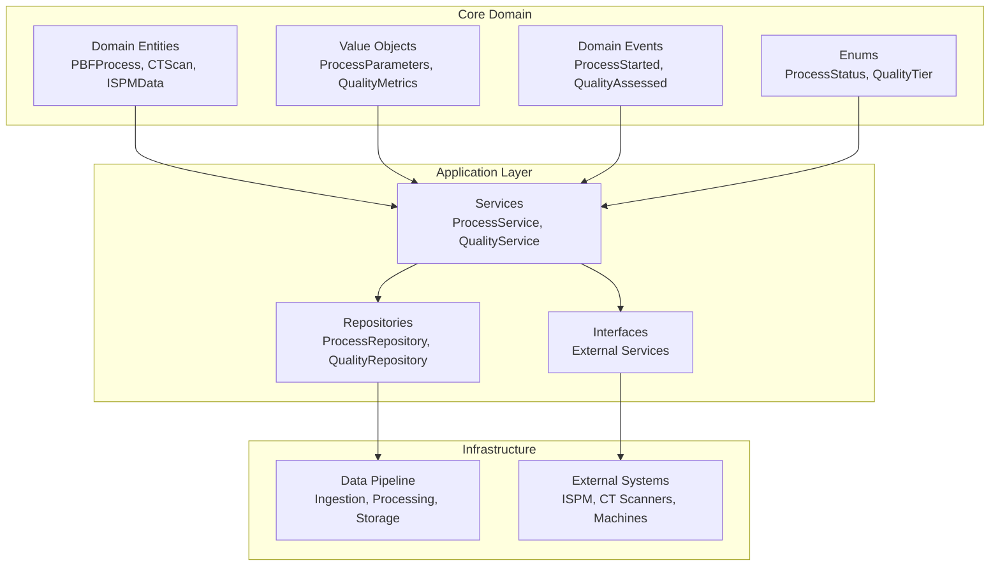
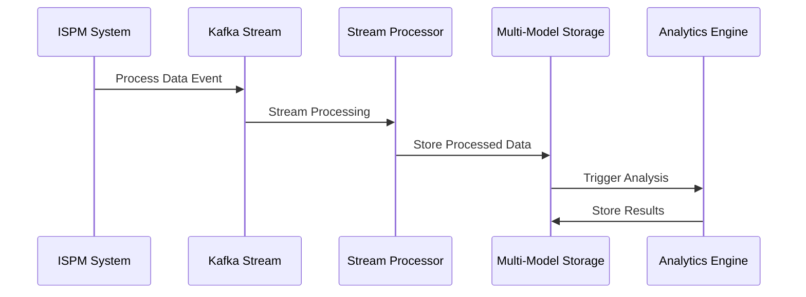
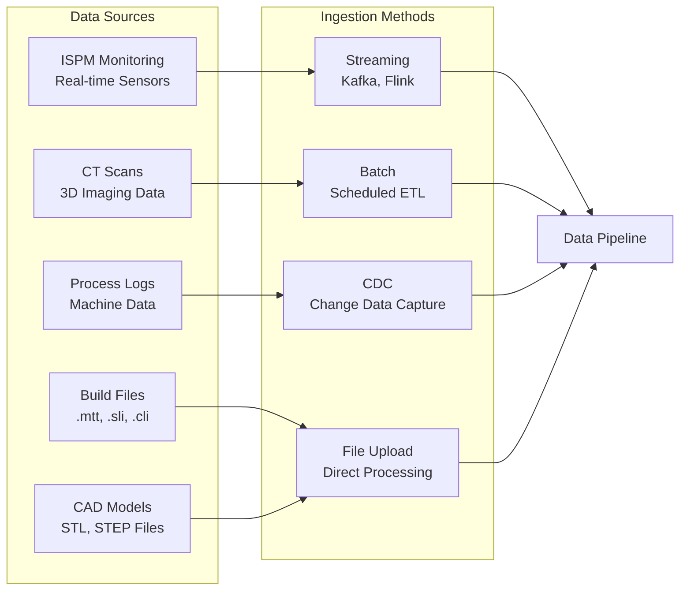
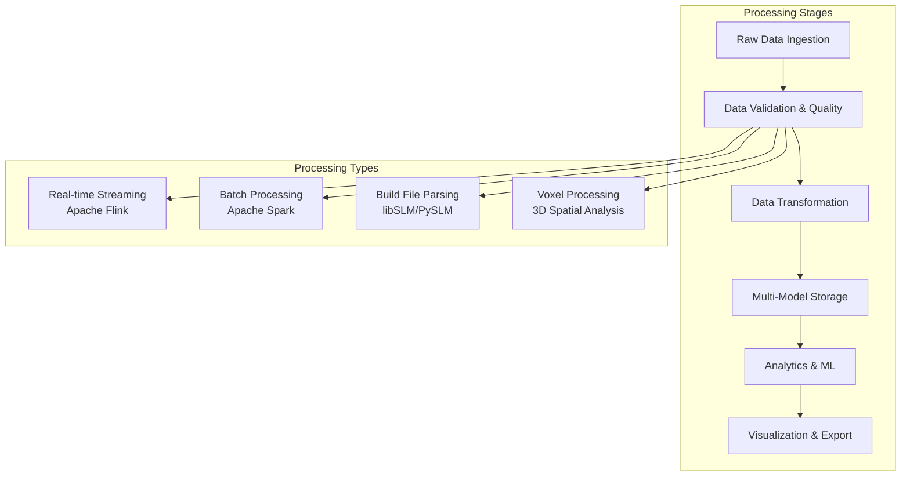
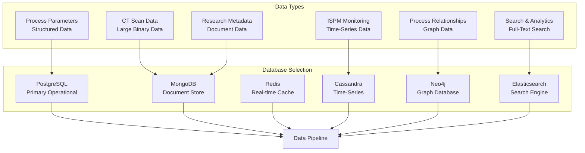
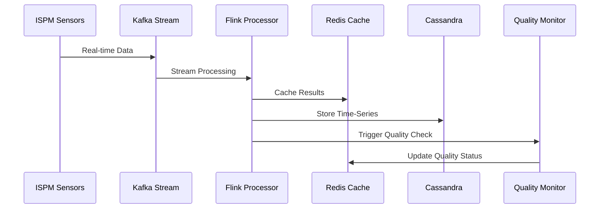
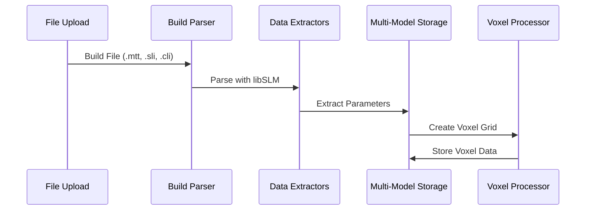
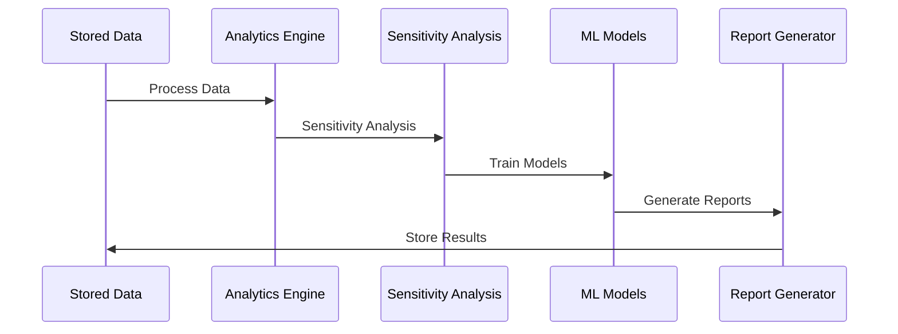

# System Architecture Overview

## 🎯 **PBF-LB/M NoSQL Data Warehouse Architecture**

The PBF-LB/M (Powder Bed Fusion - Laser Beam/Metal) NoSQL Data Warehouse is a comprehensive data engineering platform designed for additive manufacturing research. It provides end-to-end data processing capabilities from raw sensor data to advanced analytics and visualization.

## 🏗️ **Core Architecture Principles**

### **1. Multi-Model Data Architecture**
The system employs a multi-model NoSQL approach, using different database technologies optimized for specific data types:

- **PostgreSQL**: Primary operational database for structured data
- **MongoDB**: Document store for flexible PBF process data
- **Redis**: In-memory cache for real-time data access
- **Cassandra**: Time-series data for ISPM monitoring
- **Elasticsearch**: Full-text search and analytics
- **Neo4j**: Graph database for process relationships

### **2. Domain-Driven Design**
The architecture follows Domain-Driven Design principles with clear separation of concerns:



### **3. Event-Driven Architecture**
The system uses event-driven patterns for loose coupling and scalability:



## 📊 **Data Flow Architecture**

### **1. Data Ingestion Layer**



### **2. Data Processing Pipeline**



## 🔧 **Core Components**

### **1. Data Pipeline Module**

The main data pipeline orchestrates all data processing activities:

```python
# Core data pipeline components
from src.data_pipeline import (
    # Configuration
    config_manager,
    get_pipeline_settings,
    get_etl_config,
    
    # Ingestion
    KafkaProducer,
    KafkaConsumer,
    ISPMStreamProcessor,
    CTDataIngester,
    
    # Processing
    ETLOrchestrator,
    extract_from_mongodb,
    transform_document_data,
    load_to_cassandra,
    
    # Storage
    MongoDBClient,
    RedisClient,
    CassandraClient,
    ElasticsearchClient,
    Neo4jClient,
    
    # Quality
    DataQualityService,
    AnomalyDetector,
    RemediationService,
    
    # Orchestration
    PBFProcessDAG,
    AirflowClient,
    JobScheduler
)
```

### **2. Build File Processing**

Advanced build file parsing leveraging libSLM and PySLM:

```python
# Build file processing components
from src.data_pipeline.processing.build_parsing import (
    # Core parsing
    BuildFileParser,
    FormatDetector,
    MetadataExtractor,
    
    # Format-specific parsers
    EOSParser,      # EOS machines (.sli, .cli)
    MTTParser,      # MTT format
    RealizerParser, # Realizer format
    SLMParser,      # SLM Solutions format
    
    # Data extractors (10 specialized extractors)
    PowerExtractor,           # Laser power analysis
    VelocityExtractor,        # Scan velocity analysis
    PathExtractor,           # Scan path geometry
    EnergyExtractor,         # Energy consumption
    LayerExtractor,          # Layer-specific data
    TimestampExtractor,      # Timing data
    LaserFocusExtractor,     # Laser focus analysis
    JumpParametersExtractor, # Jump speed/delay
    BuildStyleExtractor,     # Build style metadata
    GeometryTypeExtractor    # Geometry distribution
)
```

### **3. Analytics Engine**

Comprehensive analytics and sensitivity analysis:

```python
# Analytics components
from src.data_pipeline.processing.analytics import (
    # Sensitivity Analysis
    GlobalSensitivityAnalyzer,
    SobolAnalyzer,
    MorrisAnalyzer,
    UncertaintyQuantifier,
    
    # Statistical Analysis
    MultivariateAnalyzer,
    TimeSeriesAnalyzer,
    RegressionAnalyzer,
    
    # Process Analysis
    ParameterAnalyzer,
    QualityAnalyzer,
    ProcessOptimizer,
    
    # Reporting
    AnalysisReportGenerator,
    SensitivityVisualizer
)
```

### **4. Voxel Visualization**

3D voxel-based visualization and analysis:

```python
# Voxel visualization components
from src.data_pipeline.visualization.voxel_clients import (
    # Core voxel processing
    CADVoxelizer,
    VoxelGrid,
    MultiModalFusion,
    VoxelRenderer,
    
    # Analysis tools
    SpatialQualityAnalyzer,
    DefectDetector3D,
    PorosityAnalyzer,
    
    # Interaction
    VoxelController,
    VoxelExporter
)
```

### **5. Virtual Environment**

Virtual testing and simulation capabilities:

```python
# Virtual environment components
from src.data_pipeline.virtual_environment import (
    # VM Management
    VMOrchestrator,
    VMProvisioner,
    
    # Simulation Engines
    ThermalSimulator,
    FluidDynamicsSimulator,
    MultiPhysicsSimulator,
    
    # Digital Twin
    DigitalTwinModel,
    TwinSynchronizer,
    TwinPredictor,
    
    # Testing Frameworks
    VirtualExperimentDesigner,
    AutomatedTestRunner,
    
    # Cloud Integration
    CloudProviderManager,
    DistributedComputingManager
)
```

## 🗄️ **Storage Architecture**

### **Multi-Model Database Strategy**



### **Data Routing Strategy**

The system automatically routes data to the most appropriate database based on data characteristics:

- **Structured Process Data** → PostgreSQL
- **Time-Series Sensor Data** → Cassandra
- **Large Binary Data (CT Scans)** → MongoDB
- **Real-time Cache Data** → Redis
- **Relationship Data** → Neo4j
- **Searchable Content** → Elasticsearch

## 🔄 **Processing Workflows**

### **1. Real-Time Processing Workflow**



### **2. Build File Processing Workflow**



### **3. Analytics Workflow**



## 🚀 **Scalability & Performance**

### **Horizontal Scaling**

- **Kafka Clusters**: Multiple brokers for high-throughput streaming
- **Spark Clusters**: Distributed processing for large datasets
- **Database Sharding**: Horizontal partitioning across multiple nodes
- **Container Orchestration**: Kubernetes for dynamic scaling

### **Performance Optimization**

- **Multi-Level Caching**: Redis for hot data, application-level caching
- **Parallel Processing**: Concurrent data processing pipelines
- **Index Optimization**: Database-specific indexing strategies
- **Query Optimization**: Optimized queries for each database type

## 🔒 **Security & Compliance**

### **Data Security**

- **Encryption**: End-to-end encryption for sensitive data
- **Access Control**: Role-based access control (RBAC)
- **Audit Logging**: Comprehensive audit trails
- **Data Privacy**: GDPR compliance and data anonymization

### **System Security**

- **Network Security**: Secure network architecture
- **Container Security**: Secure container deployment
- **API Security**: OAuth 2.0 and JWT authentication
- **Monitoring**: Security monitoring and alerting

## 📈 **Monitoring & Observability**

### **System Monitoring**

- **Application Performance**: APM with DataDog
- **Infrastructure Monitoring**: Prometheus and Grafana
- **Log Aggregation**: Centralized logging system
- **Distributed Tracing**: Jaeger for request tracing

### **Data Quality Monitoring**

- **Real-time Quality Checks**: Automated data validation
- **Quality Dashboards**: Visual quality metrics
- **Anomaly Detection**: ML-based anomaly detection
- **Alerting**: Proactive quality alerts

## 🎯 **Key Benefits**

1. **Comprehensive Data Integration**: Unified platform for all PBF-LB/M data types
2. **Advanced Analytics**: Sophisticated sensitivity analysis and ML capabilities
3. **Real-Time Processing**: Low-latency data processing and analysis
4. **Scalable Architecture**: Horizontal scaling for growing data volumes
5. **Research-Ready**: Built specifically for additive manufacturing research
6. **Quality Assurance**: Comprehensive data quality management
7. **Visualization**: Advanced 3D voxel visualization capabilities
8. **Virtual Testing**: Virtual environment for controlled experiments

This architecture provides a robust, scalable, and comprehensive platform for PBF-LB/M additive manufacturing research, enabling advanced data analysis, process optimization, and quality assurance.
