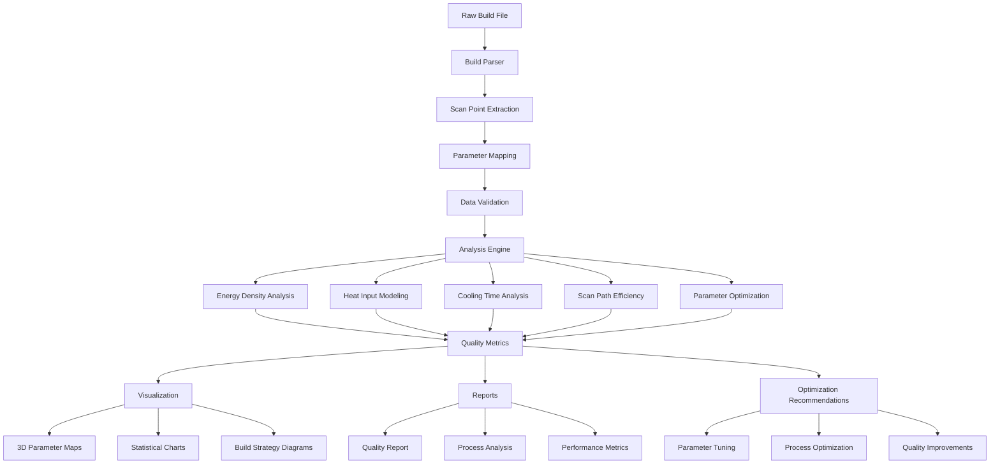
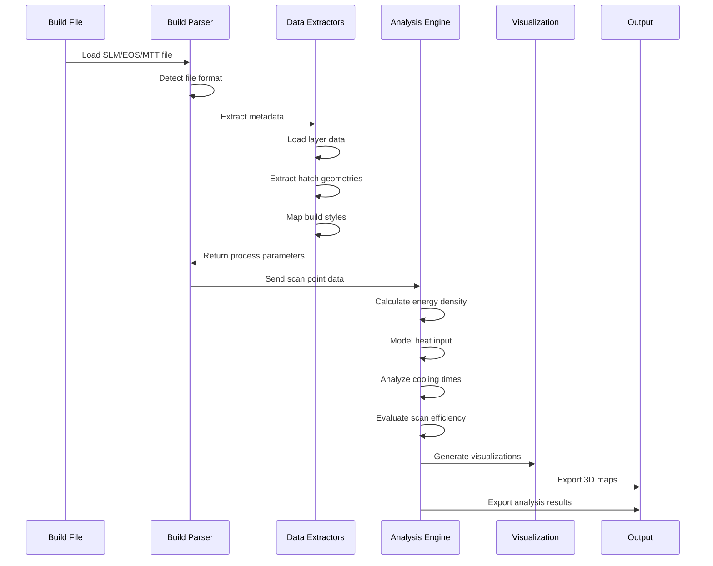
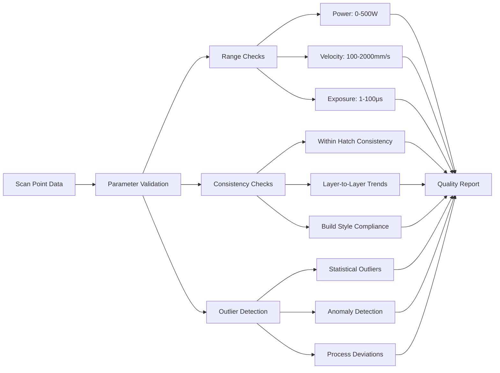
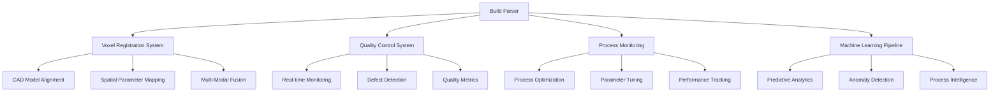

# Build Parser Analysis Workflow

## Analysis Pipeline

## Data Flow Architecture

## Analysis Capabilities Matrix

| Analysis Type | Input Data | Output | Application |
|---------------|------------|--------|-------------|
| **Energy Density** | Power, Velocity | J/mm² | Over-melt detection |
| **Heat Input** | Power, Time, Length | J/mm | Thermal modeling |
| **Cooling Time** | Delays, Jumps | μs | Microstructure prediction |
| **Scan Efficiency** | Path length, Volume | Ratio | Build optimization |
| **Parameter Consistency** | All parameters | Statistics | Quality control |

## Quality Control Workflow

## Integration Points

