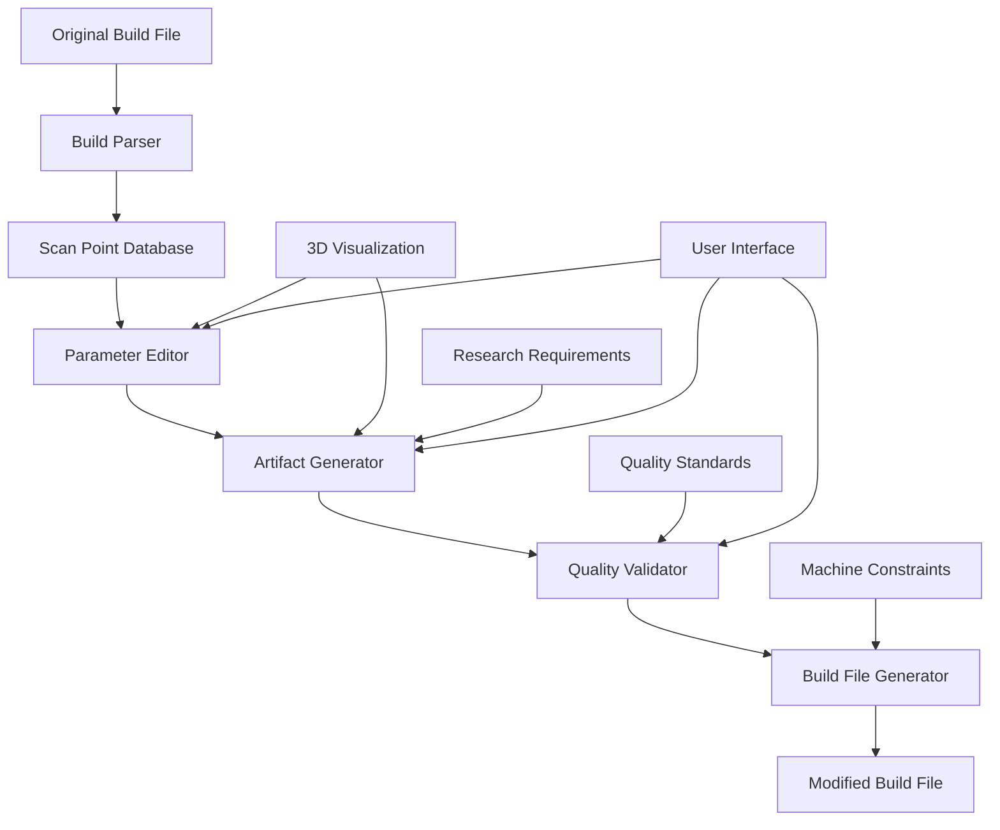
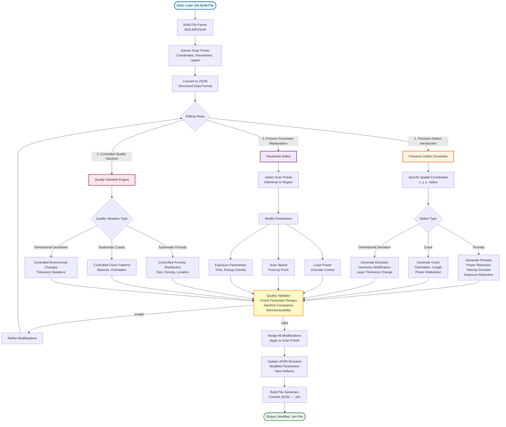
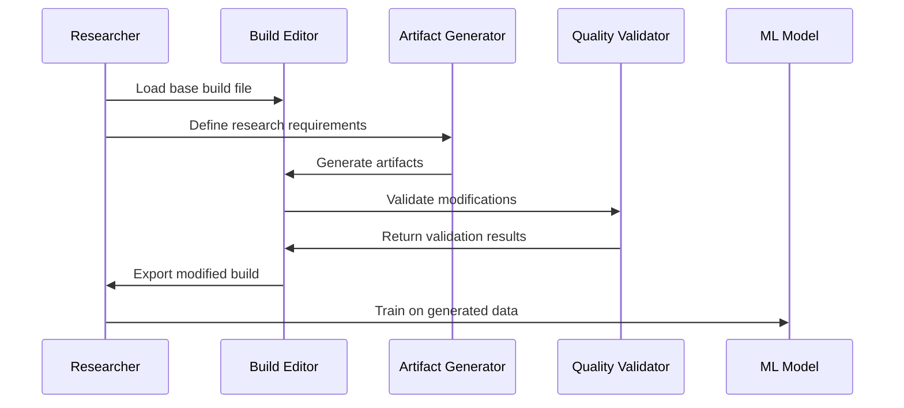

# Build File Editor - Game Changer for PBF-LB/M Research

## 🎯 **Revolutionary Concept**

The Build File Editor transforms the Build Parser from an analysis tool into a **complete process development platform**. It enables researchers and engineers to modify build files, generate artificial artifacts, and create controlled test specimens without expensive trial builds.

## 🚀 **Why This is a Game Changer**

### **Traditional Approach:**
```
Design → Build → Test → Analyze → Redesign → Build → Test...
```
**Time**: Weeks to months | **Cost**: $10,000s per iteration

### **Build File Editor Approach:**
```
Design → Edit Build File → Simulate → Optimize → Generate Final Build
```
**Time**: Hours to days | **Cost**: $100s per iteration

## 🎯 **Core Capabilities**

### 1. **Artificial Artifact Generation**
Generate controlled defects and features at any desired location:

```python
# Generate artificial porosity for research
editor.add_artifact(
    artifact_type="porosity",
    location=(x=10, y=15, z=5, radius=2),
    parameters={
        "power_reduction": 0.7,
        "velocity_increase": 1.5,
        "exposure_reduction": 0.8
    }
)
```

### 2. **Process Parameter Optimization**
Modify parameters for specific regions or entire builds:

```python
# Optimize for surface quality in critical regions
editor.optimize_region(
    bounds=(x_min=0, x_max=20, y_min=0, y_max=20, z_min=0, z_max=10),
    target_properties={
        "surface_quality": "high",
        "density": "maximum",
        "roughness": "minimum"
    }
)
```

### 3. **Research Specimen Generation**
Create standardized test specimens for material research:

```python
# Generate tensile test specimen with controlled microstructure
editor.generate_specimen(
    specimen_type="tensile_test",
    material="Ti6Al4V",
    test_requirements={
        "gauge_length": 50,
        "microstructure": "equiaxed",
        "grain_size": "fine"
    }
)
```

## 🏗️ **System Architecture**



## ⚡ **Defect Generation & Process Modification Workflow**

### **Complete Process Flowchart**



### **Key Capabilities Breakdown**

#### **1. Precision Defect Introduction**
- **Input**: Original .slm file
- **Process**: .slm → JSON conversion → Spatial coordinate specification → Defect generation
- **Output**: Modified .slm with controlled defects at precise locations
- **Features**:
  - Coordinate-based defect placement (x, y, z, radius)
  - Multiple defect types (porosity, cracks, dimensional deviations)
  - Parameter-controlled defect characteristics

#### **2. Process Parameter Manipulation**
- **Input**: JSON scan point data
- **Process**: Individual scan point selection → Granular parameter modification
- **Output**: Modified .slm with optimized parameters
- **Features**:
  - Point-by-point laser power control
  - Individual scan speed adjustment
  - Per-point exposure parameter modification

#### **3. Controlled Quality Variation**
- **Input**: Research requirements and quality specifications
- **Process**: Systematic variation generation → Quality distribution application
- **Output**: Modified .slm with controlled quality variations
- **Features**:
  - Systematic porosity introduction
  - Controlled crack pattern generation
  - Dimensional deviation control

## 🔧 **Technical Implementation**

### **Core Classes**

```python
class BuildFileEditor:
    """Main editor class for build file modification"""
    
    def __init__(self, build_file_path):
        self.parser = BuildFileParser()
        self.scan_points = self.parser.parse_file(build_file_path)
        self.modifications = []
        self.artifacts = []
    
    def modify_region(self, bounds, modifications):
        """Modify parameters in a specific 3D region"""
        pass
    
    def add_artifact(self, artifact_type, location, parameters):
        """Add artificial artifact at specified location"""
        pass
    
    def optimize_parameters(self, optimization_strategy):
        """Apply optimization algorithms to parameters"""
        pass
    
    def export_build_file(self, output_path, format="SLM"):
        """Export modified build file in specified format"""
        pass

class ArtifactGenerator:
    """Generate various types of artificial artifacts"""
    
    def generate_porosity(self, location, size, density):
        """Generate controlled porosity"""
        pass
    
    def generate_crack(self, location, orientation, length):
        """Generate artificial crack for fatigue studies"""
        pass
    
    def generate_microstructure_gradient(self, region, gradient_type):
        """Create microstructure variations"""
        pass

class QualityValidator:
    """Validate modified parameters for manufacturability"""
    
    def validate_parameters(self, scan_points):
        """Check parameter ranges and consistency"""
        pass
    
    def validate_artifacts(self, artifacts):
        """Ensure artifacts are manufacturable"""
        pass
    
    def estimate_build_time(self, scan_points):
        """Calculate estimated build time"""
        pass
```

## 🎯 **Use Cases & Applications**

### **1. Research & Development**

#### **Material Property Studies**
```python
# Generate specimens with controlled microstructure
editor = BuildFileEditor("base_specimen.slm")

# Create grain size gradient
editor.add_microstructure_gradient(
    region=(0, 0, 0, 20, 20, 10),
    gradient_type="grain_size",
    start_size=10,  # μm
    end_size=50     # μm
)

# Export for testing
editor.export_build_file("gradient_specimen.slm")
```

#### **Defect Analysis**
```python
# Generate controlled defects for ML training
defects = [
    {"type": "porosity", "location": (5, 5, 2), "size": 1.0},
    {"type": "crack", "location": (10, 10, 3), "length": 2.0},
    {"type": "inclusion", "location": (15, 15, 4), "size": 0.5}
]

for defect in defects:
    editor.add_artifact(**defect)

editor.export_build_file("defect_training_data.slm")
```

### **2. Process Development**

#### **Parameter Optimization**
```python
# Optimize parameters for new material
editor = BuildFileEditor("test_part.slm")

# Apply optimization strategy
editor.optimize_parameters(
    strategy="genetic_algorithm",
    objectives=["minimize_roughness", "maximize_density"],
    constraints=["build_time < 8_hours", "power < 400W"]
)

# Export optimized build
editor.export_build_file("optimized_build.slm")
```

#### **Build Strategy Testing**
```python
# Test different scanning strategies
strategies = ["raster", "spiral", "contour_fill", "island"]

for strategy in strategies:
    editor = BuildFileEditor("base_part.slm")
    editor.apply_scanning_strategy(strategy)
    editor.export_build_file(f"part_{strategy}.slm")
```

### **3. Quality Control**

#### **Test Specimen Generation**
```python
# Generate standardized test specimens
test_specimens = {
    "tensile": {"gauge_length": 50, "width": 10, "thickness": 3},
    "fatigue": {"gauge_length": 30, "width": 8, "thickness": 2},
    "impact": {"length": 55, "width": 10, "thickness": 10}
}

for test_type, dimensions in test_specimens.items():
    editor = BuildFileEditor("base_specimen.slm")
    editor.generate_specimen(test_type, dimensions)
    editor.export_build_file(f"{test_type}_specimen.slm")
```

## 📊 **Workflow Examples**

### **Research Workflow**


### **Process Development Workflow**
```mermaid
sequenceDiagram
    participant E as Engineer
    participant BE as Build Editor
    participant OPT as Optimizer
    participant SIM as Simulator
    participant M as Machine
    
    E->>BE: Load original build
    E->>OPT: Define optimization goals
    OPT->>BE: Apply optimizations
    BE->>SIM: Simulate build process
    SIM->>E: Return simulation results
    E->>BE: Refine parameters
    BE->>M: Export final build
```

## 🎯 **Advanced Features**

### **1. 3D Visualization**
- **Real-time parameter** visualization
- **Artifact preview** before generation
- **Build simulation** with parameter mapping

### **2. Machine Learning Integration**
- **Defect prediction** based on parameters
- **Parameter optimization** using ML models
- **Quality assessment** with AI

### **3. Batch Processing**
- **Multiple file** processing
- **Parameter sweep** studies
- **Automated optimization** workflows

### **4. API Integration**
- **RESTful API** for external access
- **Cloud processing** capabilities
- **Database integration** for parameter storage

## 📈 **Impact & Benefits**

### **Research Acceleration**
- **10x faster** iteration cycles
- **100x cheaper** than physical builds
- **Unlimited** parameter combinations

### **Process Development**
- **Risk-free** parameter testing
- **Optimized** build strategies
- **Reduced** development time

### **Quality Control**
- **Standardized** test specimens
- **Controlled** defect generation
- **Reproducible** results

### **Cost Reduction**
- **Minimal** material waste
- **Reduced** machine time
- **Lower** development costs

## 🚀 **Future Roadmap**

### **Phase 1: Core Editor** (Current)
- Basic parameter modification
- Simple artifact generation
- File format support

### **Phase 2: Advanced Features** (Next 6 months)
- 3D visualization
- ML integration
- Batch processing

### **Phase 3: Platform** (Next 12 months)
- Cloud platform
- API services
- Community features

## 🎉 **Conclusion**

The Build File Editor represents a **paradigm shift** in PBF-LB/M research and development. By enabling virtual parameter modification and artifact generation, it transforms the traditional trial-and-error approach into a **data-driven, efficient process**.

This tool will:
- **Accelerate research** by 10x
- **Reduce costs** by 100x
- **Enable new discoveries** through controlled experimentation
- **Democratize** advanced process development

**It's not just a tool - it's a revolution in additive manufacturing research!** 🚀

## 📚 **Getting Started**

```python
# Install the build file editor
pip install build-file-editor

# Basic usage
from build_file_editor import BuildFileEditor

# Load and modify a build file
editor = BuildFileEditor("my_part.slm")
editor.add_artifact("porosity", (10, 10, 5), {"size": 1.0})
editor.export_build_file("modified_part.slm")
```

## 🤝 **Contributing**

We welcome contributions! This is an open-source project that will benefit the entire additive manufacturing community.

## 📄 **License**

MIT License - Free for research and commercial use.

---

**Ready to revolutionize your PBF-LB/M research? Let's build the future of additive manufacturing together!** 🚀
