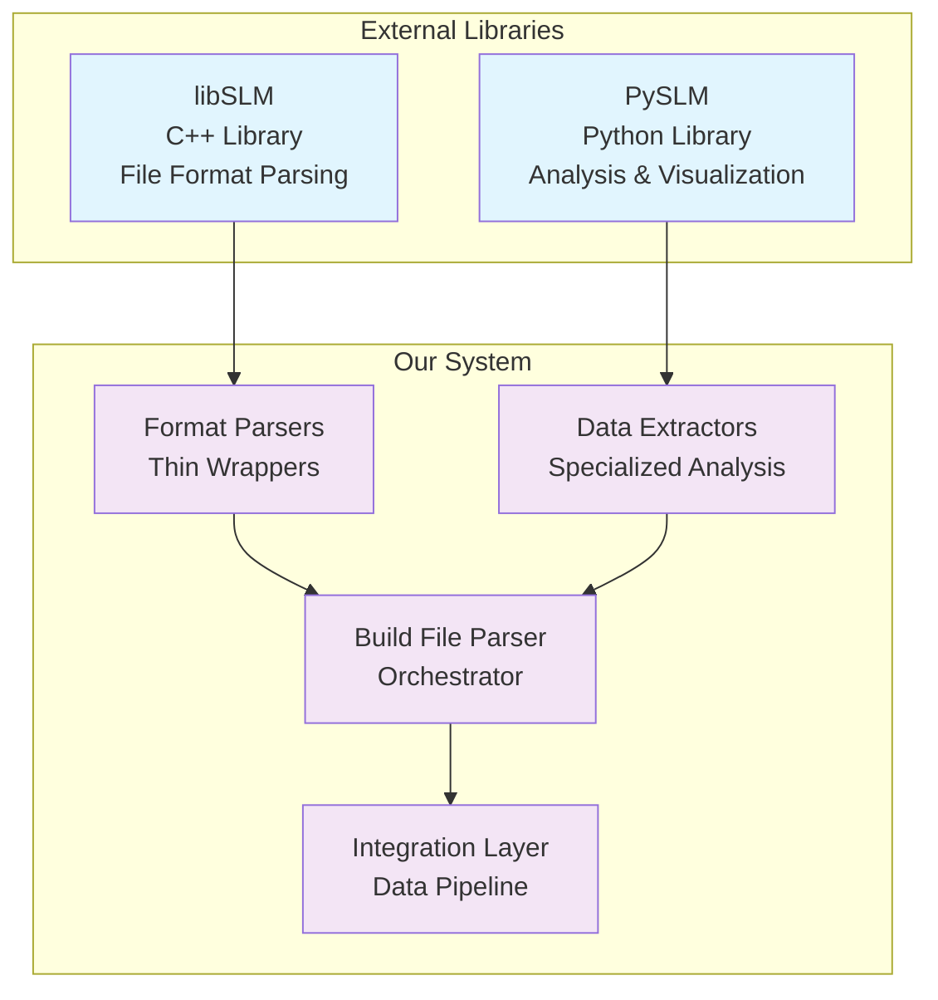

# Build File Parser - PBF-LB/M Data Pipeline

## 🎯 **Overview**

The Build File Parser is a comprehensive system for processing PBF-LB/M (Powder Bed Fusion - Laser Beam/Metal) machine build files. It leverages the powerful libSLM and PySLM libraries to provide world-class build file parsing capabilities without reinventing existing functionality.

## 🏗️ **Architecture**

### **Core Philosophy: Leverage, Don't Reinvent**

The build file parser follows a clear architectural principle:



### **What We DON'T Do**
- ❌ **Reinvent file format parsing** - libSLM already handles this
- ❌ **Recreate 3D geometry processing** - PySLM already provides this
- ❌ **Build visualization from scratch** - PySLM has excellent visualization
- ❌ **Implement basic math operations** - Use existing libraries

### **What We DO**
- ✅ **Orchestrate** libSLM and PySLM for maximum efficiency
- ✅ **Extract** specific data types (power, velocity, energy, paths)
- ✅ **Integrate** with our data pipeline architecture
- ✅ **Provide** clean, consistent APIs for our use cases
- ✅ **Bridge** between build files and our voxel/analysis systems

## 📁 **Module Structure**

```
build_parsing/
├── __init__.py                    # Factory functions and main exports
├── base_parser.py                 # Abstract base class (minimal)
├── core/
│   ├── build_file_parser.py       # Main orchestrator (uses libSLM/PySLM)
│   ├── format_detector.py         # Auto-detect formats (leverages libSLM)
│   └── metadata_extractor.py      # Extract metadata (from libSLM output)
├── format_parsers/                # Format-specific wrappers
│   ├── eos_parser.py              # EOS wrapper (uses libSLM.translators.eos)
│   ├── mtt_parser.py              # MTT wrapper (uses libSLM.translators.mtt)
│   ├── realizer_parser.py         # Realizer wrapper (uses libSLM.translators.realizer)
│   ├── slm_parser.py              # SLM wrapper (uses libSLM.translators.slmsol)
│   └── generic_parser.py          # Generic fallback parser
├── data_extractors/               # Extract specific data types
│   ├── power_extractor.py         # Laser power analysis (from libSLM data)
│   ├── velocity_extractor.py      # Scan velocity analysis (from libSLM data)
│   ├── path_extractor.py          # Scan path geometry (from libSLM data)
│   ├── energy_extractor.py        # Energy consumption (calculated from libSLM data)
│   ├── layer_extractor.py         # Layer-specific data (from libSLM data)
│   ├── timestamp_extractor.py     # Timing data (libSLM built-in methods)
│   ├── laser_focus_extractor.py   # Laser focus & beam quality
│   ├── jump_parameters_extractor.py # Jump speed & delay
│   ├── build_style_extractor.py   # Build style metadata
│   └── geometry_type_extractor.py # Geometry distribution
└── utils/
    ├── file_utils.py              # File handling (standard Python)
    └── validation_utils.py        # Data validation (standard Python)
```

## 🔧 **Core Components**

### **1. BuildFileParser - Main Orchestrator**

The main orchestrator that coordinates all parsing activities:

```python
from src.data_pipeline.processing.build_parsing import BuildFileParser

# Initialize parser
parser = BuildFileParser()

# Parse any supported build file
result = parser.parse_file("path/to/buildfile.mtt")

# Access parsed data
metadata = result['metadata']
layers = result['layers']
build_styles = result['build_styles']
```

**Key Features:**
- **Format Auto-Detection**: Automatically detects file format
- **Multi-Format Support**: Handles .mtt, .sli, .cli, .rea, .slm files
- **Comprehensive Extraction**: Extracts all available data types
- **Error Handling**: Robust error handling and validation
- **Performance**: Optimized for large build files

### **2. Format-Specific Parsers**

Thin wrappers around libSLM translators:

```python
# EOS Parser for .sli and .cli files
from src.data_pipeline.processing.build_parsing.format_parsers import EOSParser

eos_parser = EOSParser()
eos_data = eos_parser.parse_file("buildfile.sli")

# MTT Parser for .mtt files
from src.data_pipeline.processing.build_parsing.format_parsers import MTTParser

mtt_parser = MTTParser()
mtt_data = mtt_parser.parse_file("buildfile.mtt")
```

**Supported Formats:**
- **EOS Parser**: .sli, .cli files (EOS machines)
- **MTT Parser**: .mtt files (MTT format)
- **Realizer Parser**: .rea files (Realizer format)
- **SLM Parser**: .slm files (SLM Solutions format)
- **Generic Parser**: Fallback for other formats

### **3. Data Extractors - 10 Specialized Extractors**

Comprehensive data extraction for all process parameters:

```python
# Power analysis
from src.data_pipeline.processing.build_parsing.data_extractors import PowerExtractor

power_extractor = PowerExtractor()
power_data = power_extractor.extract_power_data(build_data)

# Velocity analysis
from src.data_pipeline.processing.build_parsing.data_extractors import VelocityExtractor

velocity_extractor = VelocityExtractor()
velocity_data = velocity_extractor.extract_velocity_data(build_data)

# Complete parameter extraction
extractors = [
    PowerExtractor(),           # Laser power parameters
    VelocityExtractor(),        # Laser speed parameters
    PathExtractor(),           # Scan path coordinates
    EnergyExtractor(),         # Energy density analysis
    LayerExtractor(),          # Layer-level statistics
    TimestampExtractor(),      # Timing data (libSLM built-in)
    LaserFocusExtractor(),     # Laser focus & beam quality
    JumpParametersExtractor(), # Jump speed & delay
    BuildStyleExtractor(),     # Build style metadata
    GeometryTypeExtractor()    # Geometry distribution
]

for extractor in extractors:
    data = extractor.extract_data(build_data)
    # Process extracted data...
```

## 📊 **Data Extraction Capabilities**

### **1. Power Analysis**

Extract and analyze laser power parameters:

```python
power_data = {
    'global_power': {
        'min_power': 150.0,
        'max_power': 300.0,
        'mean_power': 225.0,
        'std_power': 45.0
    },
    'layer_power': [
        {
            'layer_index': 0,
            'power_values': [200.0, 250.0, 300.0],
            'power_statistics': {...}
        }
    ],
    'geometry_power': [
        {
            'layer_index': 0,
            'geometry_index': 0,
            'geometry_type': 'hatch',
            'power': 250.0,
            'coordinates': [[x1, y1], [x2, y2], ...]
        }
    ],
    'spatial_power_map': {
        'voxel_grid': [...],
        'power_distribution': [...]
    }
}
```

### **2. Velocity Analysis**

Extract and analyze scan velocity parameters:

```python
velocity_data = {
    'global_velocity': {
        'min_velocity': 0.5,
        'max_velocity': 2.0,
        'mean_velocity': 1.2,
        'std_velocity': 0.3
    },
    'velocity_by_geometry': {
        'hatch': {'mean': 1.5, 'std': 0.2},
        'contour': {'mean': 0.8, 'std': 0.1},
        'point': {'mean': 0.3, 'std': 0.05}
    },
    'velocity_visualization': {
        'heatmap_data': [...],
        'time_series': [...],
        'spatial_distribution': [...]
    }
}
```

### **3. Path Analysis**

Extract scan path geometry and coordinates:

```python
path_data = {
    'total_paths': 1250,
    'paths_by_type': {
        'hatch': 1000,
        'contour': 200,
        'point': 50
    },
    'path_details': [
        {
            'path_id': 'path_001',
            'layer_index': 0,
            'geometry_type': 'hatch',
            'coordinates': [[x1, y1], [x2, y2], ...],
            'length': 15.5,
            'build_style_id': 'style_001'
        }
    ],
    'spatial_analysis': {
        'path_density': [...],
        'overlap_analysis': [...],
        'coverage_map': [...]
    }
}
```

### **4. Energy Analysis**

Calculate energy consumption and distribution:

```python
energy_data = {
    'total_energy': 12500.0,  # Joules
    'energy_by_layer': [
        {
            'layer_index': 0,
            'layer_energy': 125.0,
            'energy_density': 0.8  # J/mm³
        }
    ],
    'energy_distribution': {
        'hatch_energy': 10000.0,
        'contour_energy': 2000.0,
        'point_energy': 500.0
    },
    'energy_optimization': {
        'recommendations': [...],
        'efficiency_score': 0.85
    }
}
```

### **5. Timestamp Analysis**

Extract timing data using libSLM's built-in methods:

```python
timestamp_data = {
    'build_start_time': '2024-01-15T10:30:00Z',
    'total_build_time': 3600.0,  # seconds
    'layer_timestamps': [
        {
            'layer_index': 0,
            'start_time': '2024-01-15T10:30:00Z',
            'end_time': '2024-01-15T10:35:00Z',
            'duration': 300.0
        }
    ],
    'geometry_timestamps': [
        {
            'geometry_id': 'geom_001',
            'start_time': '2024-01-15T10:30:15Z',
            'end_time': '2024-01-15T10:30:45Z',
            'duration': 30.0
        }
    ],
    'timeline_reconstruction': {
        'complete_timeline': [...],
        'laser_position_by_time': [...],
        'process_parameters_by_time': [...]
    }
}
```

## 🔗 **Integration with Data Pipeline**

### **1. Data Pipeline Integration**

The build file parser seamlessly integrates with the main data pipeline:

```python
from src.data_pipeline.processing.build_parsing import BuildFileParser
from src.data_pipeline.storage import MongoDBClient, CassandraClient

# Parse build file
parser = BuildFileParser()
build_data = parser.parse_file("buildfile.mtt")

# Store in appropriate databases
mongodb = MongoDBClient()
cassandra = CassandraClient()

# Store metadata in MongoDB
mongodb.insert_document("build_metadata", build_data['metadata'])

# Store time-series data in Cassandra
for layer_data in build_data['layers']:
    cassandra.insert_time_series("layer_data", layer_data)
```

### **2. Voxel Integration**

Build file data can be directly used for voxel processing:

```python
from src.data_pipeline.visualization.voxel_clients import CADVoxelizer
from src.data_pipeline.processing.build_parsing import BuildFileParser

# Parse build file
parser = BuildFileParser()
build_data = parser.parse_file("buildfile.mtt")

# Create voxel grid
voxelizer = CADVoxelizer()
voxel_grid = voxelizer.create_voxel_grid(
    cad_file="part.stl",
    process_data=build_data,
    voxel_size=0.1
)

# Map process parameters to voxels
voxel_grid.map_process_parameters(build_data['process_parameters'])
```

### **3. Analytics Integration**

Build file data feeds into the analytics engine:

```python
from src.data_pipeline.processing.analytics import SensitivityAnalyzer
from src.data_pipeline.processing.build_parsing import BuildFileParser

# Parse multiple build files
parser = BuildFileParser()
build_files = ["build1.mtt", "build2.mtt", "build3.mtt"]

# Extract process parameters for sensitivity analysis
process_data = []
for build_file in build_files:
    data = parser.parse_file(build_file)
    process_data.append(data['process_parameters'])

# Perform sensitivity analysis
analyzer = SensitivityAnalyzer()
sensitivity_results = analyzer.analyze_process_parameters(process_data)
```

## 🚀 **Performance & Optimization**

### **1. libSLM Integration Benefits**

- **C++ Performance**: Native C++ parsing for maximum speed
- **Memory Efficiency**: Optimized memory usage for large files
- **Format Support**: Comprehensive support for all major formats
- **Reliability**: Battle-tested library with years of development

### **2. PySLM Integration Benefits**

- **High-Level API**: Easy-to-use Python interface
- **Advanced Analysis**: Built-in analysis and visualization
- **Scientific Computing**: Integration with NumPy, SciPy, Matplotlib
- **Research-Ready**: Designed for research applications

### **3. Optimization Strategies**

```python
# Parallel processing for multiple files
from concurrent.futures import ThreadPoolExecutor

def parse_build_file(file_path):
    parser = BuildFileParser()
    return parser.parse_file(file_path)

# Process multiple files in parallel
with ThreadPoolExecutor(max_workers=4) as executor:
    results = list(executor.map(parse_build_file, build_files))

# Caching for repeated access
from functools import lru_cache

@lru_cache(maxsize=100)
def cached_parse(file_path):
    parser = BuildFileParser()
    return parser.parse_file(file_path)
```

## 📈 **Usage Examples**

### **1. Basic Build File Analysis**

```python
from src.data_pipeline.processing.build_parsing import BuildFileParser

# Initialize parser
parser = BuildFileParser()

# Parse build file
result = parser.parse_file("example_build.mtt")

# Access different data types
metadata = result['metadata']
layers = result['layers']
build_styles = result['build_styles']

print(f"Build file: {metadata['file_name']}")
print(f"Layers: {metadata['layer_count']}")
print(f"Build styles: {len(build_styles)}")
```

### **2. Comprehensive Parameter Extraction**

```python
from src.data_pipeline.processing.build_parsing.data_extractors import (
    PowerExtractor, VelocityExtractor, PathExtractor, EnergyExtractor
)

# Initialize extractors
power_extractor = PowerExtractor()
velocity_extractor = VelocityExtractor()
path_extractor = PathExtractor()
energy_extractor = EnergyExtractor()

# Parse build file
parser = BuildFileParser()
build_data = parser.parse_file("buildfile.mtt")

# Extract all parameters
power_data = power_extractor.extract_power_data(build_data)
velocity_data = velocity_extractor.extract_velocity_data(build_data)
path_data = path_extractor.extract_path_data(build_data)
energy_data = energy_extractor.extract_energy_data(build_data)

# Analyze results
print(f"Power range: {power_data['global_power']['min_power']} - {power_data['global_power']['max_power']} W")
print(f"Velocity range: {velocity_data['global_velocity']['min_velocity']} - {velocity_data['global_velocity']['max_velocity']} mm/s")
print(f"Total paths: {path_data['total_paths']}")
print(f"Total energy: {energy_data['total_energy']} J")
```

### **3. CT-Build Correlation**

```python
# Parse build file
parser = BuildFileParser()
build_data = parser.parse_file("buildfile.mtt")

# Extract timing data
timestamp_extractor = TimestampExtractor()
timing_data = timestamp_extractor.extract_timing_data(build_data)

# Correlate with CT scan data
def correlate_ct_with_build(ct_scan_data, build_timing_data):
    """Correlate CT defects with build process timeline."""
    correlations = []
    
    for defect in ct_scan_data['defects']:
        defect_time = defect['timestamp']
        
        # Find process parameters at defect time
        process_params = find_process_at_time(build_timing_data, defect_time)
        
        correlations.append({
            'defect_location': defect['coordinates'],
            'defect_time': defect_time,
            'process_parameters': process_params
        })
    
    return correlations

# Perform correlation
correlations = correlate_ct_with_build(ct_scan_data, timing_data)
```

## 🔧 **Configuration & Setup**

### **1. Dependencies**

The build file parser requires libSLM and PySLM:

```bash
# Install libSLM (C++ library with Python bindings)
cd src/data_pipeline/external/libSLM
mkdir build && cd build
cmake ..
make -j4
make install

# Install PySLM (Python library)
cd src/data_pipeline/external/pyslm
pip install -e .
```

### **2. Configuration**

Configure the parser through the main data pipeline configuration:

```yaml
# config/data_pipeline/processing/build_parsing.yaml
build_parsing:
  libslm_path: "src/data_pipeline/external/libSLM"
  pyslm_path: "src/data_pipeline/external/pyslm"
  supported_formats:
    - ".mtt"
    - ".sli"
    - ".cli"
    - ".rea"
    - ".slm"
  extraction_settings:
    power_analysis: true
    velocity_analysis: true
    path_analysis: true
    energy_analysis: true
    timestamp_analysis: true
  performance:
    parallel_processing: true
    max_workers: 4
    cache_size: 100
```

## 🎯 **Key Benefits**

1. **World-Class Quality**: Leverages years of libSLM/PySLM development
2. **Fast Development**: Don't reinvent, just integrate
3. **Reliability**: Uses battle-tested libraries
4. **Performance**: Optimized C++ (libSLM) and Python (PySLM) code
5. **Future-Proof**: Libraries are actively maintained and updated
6. **Research-Ready**: Built specifically for PBF-LB/M research
7. **Comprehensive**: Extracts all available process parameters
8. **Integration**: Seamless integration with data pipeline

## 📚 **API Reference**

### **BuildFileParser**

```python
class BuildFileParser:
    def __init__(self)
    def parse_file(self, file_path: str) -> Dict[str, Any]
    def get_supported_formats(self) -> List[str]
    def validate_file(self, file_path: str) -> bool
```

### **Data Extractors**

```python
class PowerExtractor:
    def extract_power_data(self, build_data: Any) -> Dict[str, Any]
    def get_extractor_info(self) -> Dict[str, Any]

class VelocityExtractor:
    def extract_velocity_data(self, build_data: Any) -> Dict[str, Any]
    def get_extractor_info(self) -> Dict[str, Any]

# ... similar for all 10 extractors
```

This build file parser provides a comprehensive, high-performance solution for processing PBF-LB/M build files while leveraging existing world-class libraries for maximum reliability and performance.
