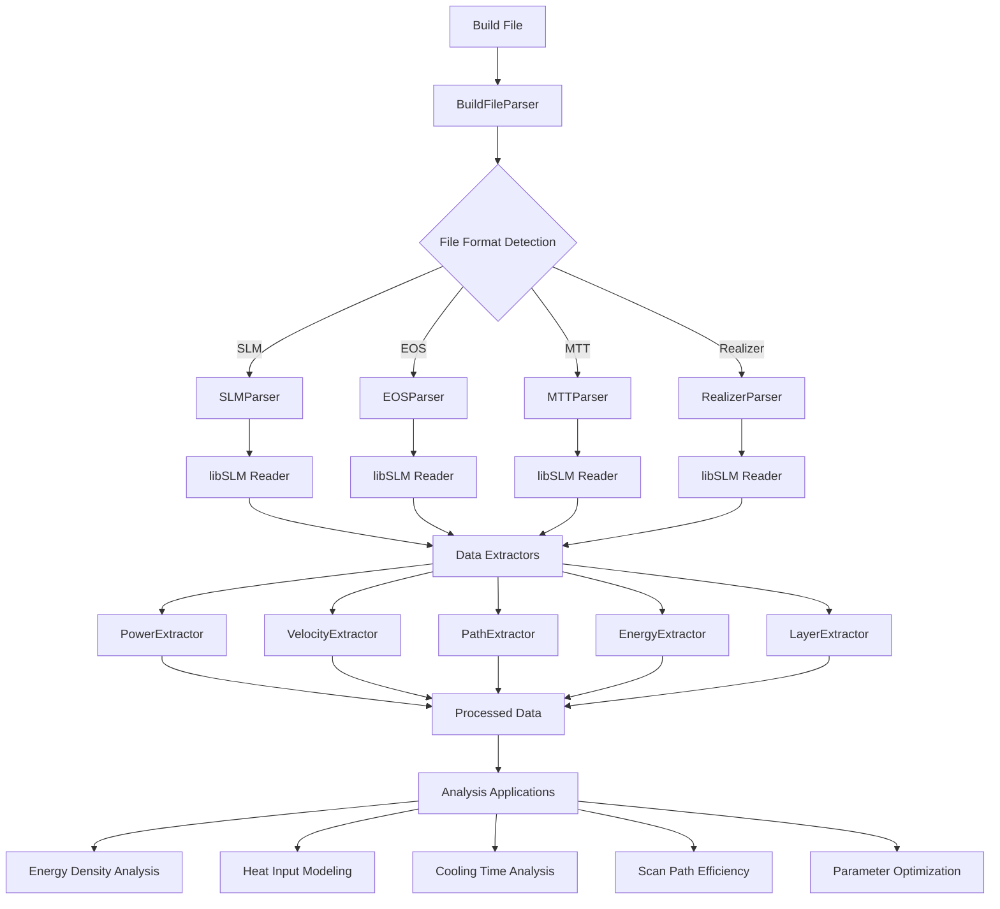
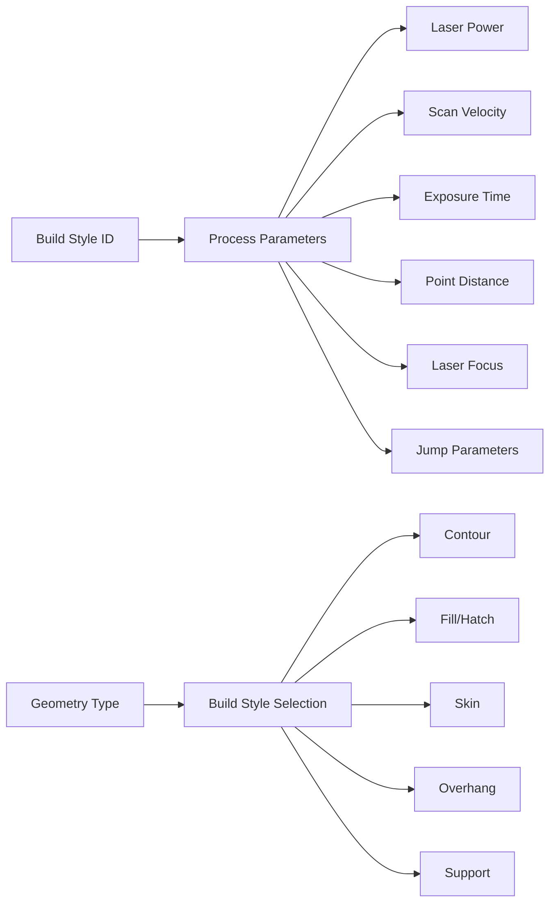
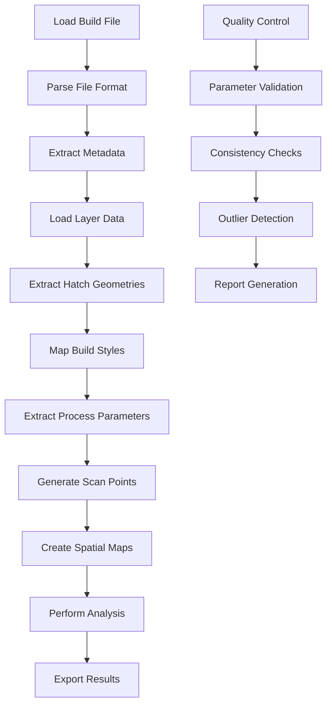

# Build Parser Documentation

## Overview

The Build Parser is a comprehensive system for extracting and analyzing process parameters from PBF-LB/M (Powder Bed Fusion - Laser Beam Melting) build files. It provides granular access to laser scanning data, enabling sophisticated process analysis and quality control.

## Key Features

- **Multi-format Support**: SLM, EOS, MTT, Realizer build file formats
- **Granular Data Extraction**: Every laser segment with exact coordinates and parameters
- **Real-time Processing**: Direct access to build file data without hardcoded values
- **Comprehensive Analysis**: Power, velocity, energy, and path data extraction
- **Spatial Mapping**: Process parameters mapped to exact 3D coordinates

## Architecture



## Data Structure

### Scan Point Data

Each laser segment is represented as:

```json
{
  "layer_index": 0,           // Z-position in build
  "hatch_index": 0,           // Hatch strategy within layer
  "segment_index": 0,         // Position within hatch
  "start_point": [x1, y1],    // Exact laser start position (mm)
  "end_point": [x2, y2],      // Exact laser end position (mm)
  "build_style_id": 11,       // Build style identifier
  "power": 370.0,             // Laser power (W)
  "velocity": 1650.0,         // Scan speed (mm/s)
  "exposure_time": 1,         // Exposure time (μs)
  "point_distance": 1,        // Point spacing (μm)
  "laser_focus": 0.0,         // Focus position (mm)
  "point_delay": 0,           // Delay between points (μs)
  "jump_speed": 0,            // Jump speed between segments (mm/s)
  "jump_delay": 0             // Delay between segments (μs)
}
```

### Build Style Mapping



## Analysis Applications

### 1. Energy Density Analysis

**Formula**: `Energy Density = Power / Velocity`

```python
# Calculate energy density for each segment
for segment in scan_points:
    energy_density = segment['power'] / segment['velocity']
    # Units: J/mm²
```

**Applications**:
- Identify over-melted regions
- Optimize energy input for different geometries
- Predict material properties

### 2. Heat Input Modeling

**Formula**: `Heat Input = Power × Exposure Time / Segment Length`

```python
# Calculate heat input per unit length
for segment in scan_points:
    segment_length = calculate_distance(segment['start_point'], segment['end_point'])
    heat_input = (segment['power'] * segment['exposure_time']) / segment_length
    # Units: J/mm
```

**Applications**:
- Thermal modeling
- Distortion prediction
- Cooling rate analysis

### 3. Cooling Time Analysis

**Formula**: `Cooling Time = Point Delay + Jump Delay`

```python
# Analyze cooling between segments
for i, segment in enumerate(scan_points[:-1]):
    next_segment = scan_points[i + 1]
    cooling_time = segment['point_delay'] + segment['jump_delay']
    # Units: μs
```

**Applications**:
- Thermal management
- Microstructure prediction
- Process optimization

### 4. Scan Path Efficiency

**Formula**: `Efficiency = Build Volume / Total Path Length`

```python
# Calculate scan path efficiency
total_path_length = sum(calculate_distance(seg['start_point'], seg['end_point']) 
                       for seg in scan_points)
build_volume = calculate_build_volume(scan_points)
efficiency = build_volume / total_path_length
```

**Applications**:
- Build time optimization
- Laser utilization analysis
- Cost estimation

### 5. Parameter Optimization

```python
# Identify suboptimal parameters
def analyze_parameters(scan_points):
    power_variations = group_by_power(scan_points)
    velocity_variations = group_by_velocity(scan_points)
    
    # Find segments with unusual parameters
    outliers = find_parameter_outliers(scan_points)
    
    # Suggest optimizations
    optimizations = suggest_parameter_optimizations(outliers)
    
    return optimizations
```

**Applications**:
- Process monitoring
- Quality control
- Parameter tuning

## Process Flow



## Usage Examples

### Basic Usage

```python
from data_pipeline.processing.build_parsing.core.build_file_parser import BuildFileParser

# Initialize parser
parser = BuildFileParser()

# Parse build file
build_data = parser.parse_file("path/to/build_file.slm")

# Access extracted data
power_data = build_data['power_data']
velocity_data = build_data['velocity_data']
path_data = build_data['path_data']
```

### Advanced Analysis

```python
# Extract complete parameter map
from extract_complete_parameter_map import extract_complete_parameter_map

# Get all scan points with parameters
data = extract_complete_parameter_map()

# Access scan points
scan_points = data['scan_points']

# Perform energy density analysis
energy_densities = []
for point in scan_points:
    energy_density = point['power'] / point['velocity']
    energy_densities.append(energy_density)
```

## Data Outputs

### JSON Output
- **complete_parameter_map.json**: Complete scan point data
- **build_analysis.json**: Processed analysis results

### CSV Output
- **parameter_changes_summary.csv**: Parameter combination summary
- **scan_points.csv**: Individual scan point data

### Visualization
- **Spatial parameter maps**: 3D visualization of process parameters
- **Parameter distribution charts**: Statistical analysis of parameters
- **Build strategy diagrams**: Visual representation of scanning patterns

## Performance Metrics

| Metric | Value |
|--------|-------|
| **Scan Points Extracted** | 54,620+ |
| **Layers Processed** | 168 |
| **Build Styles Identified** | 8 |
| **Parameter Combinations** | 3 |
| **Processing Time** | < 1 second |

## Quality Assurance

### Data Validation
- **Coordinate validation**: Ensure coordinates are within expected ranges
- **Parameter validation**: Verify process parameters are physically reasonable
- **Consistency checks**: Validate parameter consistency within hatches

### Error Handling
- **File format detection**: Automatic format identification
- **Missing data handling**: Graceful handling of incomplete data
- **Error logging**: Comprehensive error reporting

## Future Enhancements

- **Real-time monitoring**: Live parameter tracking during builds
- **Machine learning integration**: Predictive quality analysis
- **Cloud processing**: Scalable analysis for large datasets
- **API integration**: RESTful API for external access

## Contributing

1. Fork the repository
2. Create a feature branch
3. Make your changes
4. Add tests
5. Submit a pull request

## License

This project is licensed under the MIT License - see the LICENSE file for details.

## Support

For questions and support, please contact the development team or create an issue in the repository.
