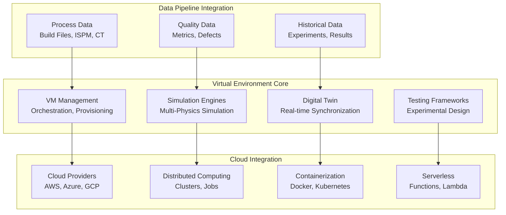
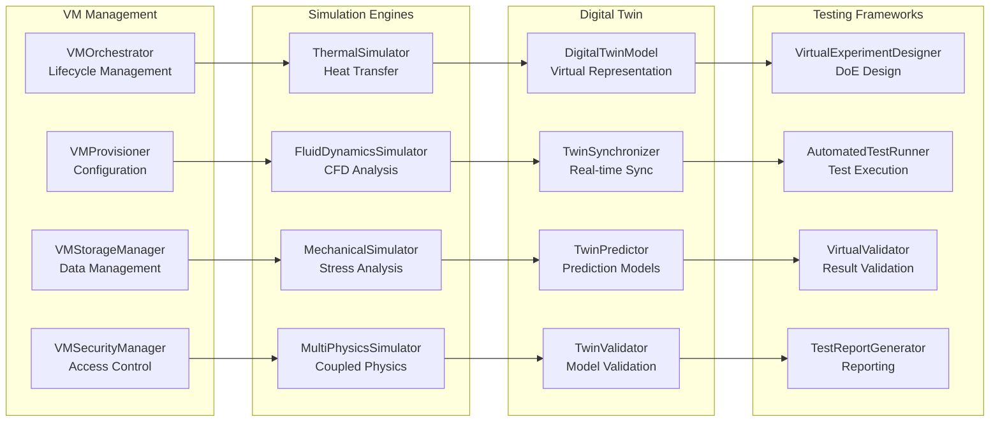

# Virtual Environment - PBF-LB/M Data Pipeline

## 🎯 **Overview**

The Virtual Environment module provides comprehensive virtual machine integration and virtual environment capabilities for PBF-LB/M (Powder Bed Fusion - Laser Beam/Metal) additive manufacturing systems. It extends the data pipeline with virtual testing and simulation environments that enable researchers to conduct controlled experiments, validate models, and test process parameters using pipeline data.

## 🏗️ **Architecture**

### **Virtual Environment Ecosystem**



### **Component Architecture**



## 🔧 **Core Components**

### **1. VM Management**

Complete virtual machine lifecycle management:

```python
from src.data_pipeline.virtual_environment import (
    VMOrchestrator,
    VMProvisioner,
    VMStorageManager,
    VMSecurityManager
)

# Initialize VM orchestrator
orchestrator = VMOrchestrator()

# Provision virtual machine
provisioner = VMProvisioner()
vm_config = {
    'name': 'pbf-simulation-vm',
    'cpu_cores': 8,
    'memory_gb': 32,
    'storage_gb': 500,
    'gpu_enabled': True,
    'os_type': 'ubuntu-20.04'
}

# Create VM instance
vm_instance = provisioner.create_vm(vm_config)
print(f"VM created: {vm_instance.id}")

# Configure VM
orchestrator.configure_vm(
    vm_id=vm_instance.id,
    software_packages=['ansys', 'openfoam', 'python', 'jupyter'],
    network_config={'public_ip': True, 'ports': [22, 80, 443]},
    security_groups=['pbf-research-sg']
)

# Start VM
orchestrator.start_vm(vm_instance.id)
print(f"VM {vm_instance.id} started successfully")

# Monitor VM status
status = orchestrator.get_vm_status(vm_instance.id)
print(f"VM Status: {status.state}")
print(f"CPU Usage: {status.cpu_usage}%")
print(f"Memory Usage: {status.memory_usage}%")
```

### **2. Simulation Engines**

Multi-physics simulation capabilities:

```python
from src.data_pipeline.virtual_environment import (
    ThermalSimulator,
    FluidDynamicsSimulator,
    MechanicalSimulator,
    MultiPhysicsSimulator
)

# Initialize thermal simulator
thermal_sim = ThermalSimulator()

# Configure thermal simulation
thermal_config = {
    'geometry_file': 'part.stl',
    'material_properties': {
        'thermal_conductivity': 7.0,  # W/m·K
        'specific_heat': 540,         # J/kg·K
        'density': 4500              # kg/m³
    },
    'boundary_conditions': {
        'laser_heat_source': {
            'power': 300,            # W
            'beam_diameter': 0.1,    # mm
            'scan_speed': 1.2        # mm/s
        },
        'ambient_temperature': 25    # °C
    },
    'mesh_settings': {
        'element_size': 0.05,        # mm
        'refinement_level': 3
    }
}

# Run thermal simulation
thermal_results = thermal_sim.simulate(thermal_config)
print(f"Thermal simulation completed in {thermal_results.simulation_time:.2f} seconds")
print(f"Maximum temperature: {thermal_results.max_temperature:.1f} °C")
print(f"Temperature gradient: {thermal_results.temperature_gradient:.1f} °C/mm")

# Initialize fluid dynamics simulator
cfd_sim = FluidDynamicsSimulator()

# Configure CFD simulation
cfd_config = {
    'geometry_file': 'build_chamber.stl',
    'fluid_properties': {
        'density': 1.225,            # kg/m³
        'viscosity': 1.8e-5,         # Pa·s
        'thermal_conductivity': 0.026 # W/m·K
    },
    'boundary_conditions': {
        'inlet_velocity': 0.5,       # m/s
        'outlet_pressure': 101325,   # Pa
        'wall_temperature': 25       # °C
    },
    'solver_settings': {
        'turbulence_model': 'k-epsilon',
        'convergence_criteria': 1e-6
    }
}

# Run CFD simulation
cfd_results = cfd_sim.simulate(cfd_config)
print(f"CFD simulation completed in {cfd_results.simulation_time:.2f} seconds")
print(f"Maximum velocity: {cfd_results.max_velocity:.2f} m/s")
print(f"Pressure drop: {cfd_results.pressure_drop:.1f} Pa")

# Initialize multi-physics simulator
multiphysics_sim = MultiPhysicsSimulator()

# Configure coupled simulation
coupled_config = {
    'physics_coupling': {
        'thermal_fluid': True,
        'thermal_mechanical': True,
        'fluid_mechanical': False
    },
    'coupling_parameters': {
        'thermal_fluid_coupling': {
            'heat_transfer_coefficient': 100,  # W/m²·K
            'convection_type': 'forced'
        },
        'thermal_mechanical_coupling': {
            'thermal_expansion_coefficient': 8.6e-6,  # 1/K
            'stress_calculation': 'linear_elastic'
        }
    }
}

# Run coupled simulation
coupled_results = multiphysics_sim.simulate(
    thermal_config=thermal_config,
    cfd_config=cfd_config,
    coupling_config=coupled_config
)
print(f"Coupled simulation completed in {coupled_results.simulation_time:.2f} seconds")
```

### **3. Digital Twin**

Real-time digital representation of physical systems:

```python
from src.data_pipeline.virtual_environment import (
    DigitalTwinModel,
    TwinSynchronizer,
    TwinPredictor,
    TwinValidator
)

# Initialize digital twin model
twin_model = DigitalTwinModel()

# Configure twin model
twin_config = {
    'model_type': 'pbf_machine',
    'physical_parameters': {
        'build_volume': [250, 250, 300],  # mm
        'laser_power_range': [150, 300],  # W
        'scan_speed_range': [0.5, 2.0],   # mm/s
        'layer_thickness_range': [0.02, 0.1]  # mm
    },
    'sensor_data': {
        'temperature_sensors': 12,
        'pressure_sensors': 4,
        'vibration_sensors': 8,
        'laser_power_sensor': 1
    },
    'update_frequency': 1.0  # Hz
}

# Create twin model
twin = twin_model.create_twin(twin_config)
print(f"Digital twin created: {twin.id}")

# Initialize twin synchronizer
synchronizer = TwinSynchronizer()

# Configure synchronization
sync_config = {
    'sync_mode': 'real_time',
    'data_sources': {
        'ispm_data': 'kafka://ispm-stream',
        'machine_data': 'kafka://machine-stream',
        'quality_data': 'postgresql://quality-db'
    },
    'sync_frequency': 1.0,  # Hz
    'data_validation': True
}

# Start synchronization
synchronizer.start_sync(twin.id, sync_config)
print(f"Twin synchronization started for {twin.id}")

# Initialize twin predictor
predictor = TwinPredictor()

# Configure prediction models
prediction_config = {
    'models': {
        'quality_prediction': {
            'type': 'random_forest',
            'features': ['laser_power', 'scan_speed', 'layer_thickness'],
            'target': 'quality_score'
        },
        'defect_prediction': {
            'type': 'neural_network',
            'features': ['temperature', 'pressure', 'vibration'],
            'target': 'defect_probability'
        }
    },
    'prediction_horizon': 60,  # seconds
    'update_frequency': 10.0   # Hz
}

# Train prediction models
predictor.train_models(twin.id, prediction_config)
print("Prediction models trained successfully")

# Make predictions
predictions = predictor.predict(twin.id, current_state)
print(f"Quality prediction: {predictions['quality_score']:.3f}")
print(f"Defect probability: {predictions['defect_probability']:.3f}")

# Initialize twin validator
validator = TwinValidator()

# Validate twin model
validation_results = validator.validate_twin(
    twin_id=twin.id,
    validation_data=test_data,
    metrics=['accuracy', 'precision', 'recall', 'f1_score']
)
print(f"Twin validation accuracy: {validation_results['accuracy']:.3f}")
```

### **4. Testing Frameworks**

Comprehensive virtual testing and validation:

```python
from src.data_pipeline.virtual_environment import (
    VirtualExperimentDesigner,
    AutomatedTestRunner,
    VirtualValidator,
    TestReportGenerator
)

# Initialize experiment designer
experiment_designer = VirtualExperimentDesigner()

# Design virtual experiment
experiment_config = {
    'experiment_type': 'parameter_sweep',
    'parameters': {
        'laser_power': {'min': 150, 'max': 300, 'steps': 10},
        'scan_speed': {'min': 0.5, 'max': 2.0, 'steps': 8},
        'layer_thickness': {'min': 0.02, 'max': 0.1, 'steps': 5}
    },
    'objectives': ['quality_maximization', 'defect_minimization'],
    'constraints': {
        'max_build_time': 3600,  # seconds
        'min_quality_score': 0.8
    }
}

# Generate experiment plan
experiment_plan = experiment_designer.design_experiment(experiment_config)
print(f"Experiment plan generated with {len(experiment_plan.runs)} runs")

# Initialize automated test runner
test_runner = AutomatedTestRunner()

# Configure test execution
test_config = {
    'execution_mode': 'parallel',
    'max_parallel_tests': 4,
    'timeout_per_test': 1800,  # seconds
    'retry_failed_tests': True,
    'max_retries': 2
}

# Run virtual experiments
test_results = test_runner.run_experiments(
    experiment_plan=experiment_plan,
    config=test_config
)
print(f"Experiments completed: {test_results.completed_tests}/{test_results.total_tests}")
print(f"Success rate: {test_results.success_rate:.2%}")

# Initialize virtual validator
validator = VirtualValidator()

# Validate test results
validation_config = {
    'validation_criteria': {
        'quality_score': {'min': 0.7, 'max': 1.0},
        'defect_count': {'max': 5},
        'build_time': {'max': 3600}
    },
    'statistical_tests': ['normality', 'homoscedasticity'],
    'outlier_detection': True
}

# Validate results
validation_results = validator.validate_results(
    test_results=test_results,
    config=validation_config
)
print(f"Validation passed: {validation_results.validation_passed}")
print(f"Outliers detected: {validation_results.outlier_count}")

# Initialize test report generator
report_generator = TestReportGenerator()

# Generate comprehensive report
report_config = {
    'report_format': 'html',
    'include_visualizations': True,
    'include_statistical_analysis': True,
    'include_optimization_recommendations': True
}

# Generate report
report = report_generator.generate_report(
    experiment_plan=experiment_plan,
    test_results=test_results,
    validation_results=validation_results,
    config=report_config,
    output_path="virtual_experiment_report.html"
)
print(f"Report generated: {report.output_path}")
```

## ☁️ **Cloud Integration**

### **1. Cloud Providers**

Integration with major cloud providers:

```python
from src.data_pipeline.virtual_environment import (
    CloudProviderManager,
    AWSProvider,
    AzureProvider,
    GCPProvider
)

# Initialize cloud provider manager
cloud_manager = CloudProviderManager()

# Configure AWS provider
aws_provider = AWSProvider()
aws_config = {
    'region': 'us-west-2',
    'instance_types': ['t3.large', 't3.xlarge', 'c5.2xlarge'],
    'storage_types': ['gp3', 'io1'],
    'network_config': {
        'vpc_id': 'vpc-12345678',
        'subnet_ids': ['subnet-12345678', 'subnet-87654321'],
        'security_groups': ['sg-12345678']
    }
}

# Configure Azure provider
azure_provider = AzureProvider()
azure_config = {
    'region': 'westus2',
    'instance_types': ['Standard_D2s_v3', 'Standard_D4s_v3'],
    'storage_types': ['Premium_LRS', 'Standard_LRS'],
    'network_config': {
        'resource_group': 'pbf-research-rg',
        'virtual_network': 'pbf-vnet',
        'subnet': 'pbf-subnet'
    }
}

# Configure GCP provider
gcp_provider = GCPProvider()
gcp_config = {
    'region': 'us-west1',
    'instance_types': ['n1-standard-2', 'n1-standard-4'],
    'storage_types': ['pd-ssd', 'pd-standard'],
    'network_config': {
        'project_id': 'pbf-research-project',
        'network': 'pbf-network',
        'subnet': 'pbf-subnet'
    }
}

# Register providers
cloud_manager.register_provider('aws', aws_provider, aws_config)
cloud_manager.register_provider('azure', azure_provider, azure_config)
cloud_manager.register_provider('gcp', gcp_provider, gcp_config)

# Deploy VM to cloud
vm_deployment = cloud_manager.deploy_vm(
    provider='aws',
    vm_config=vm_config,
    deployment_config={
        'auto_scaling': True,
        'load_balancing': False,
        'monitoring': True
    }
)
print(f"VM deployed to AWS: {vm_deployment.instance_id}")
```

### **2. Distributed Computing**

Distributed computing and job scheduling:

```python
from src.data_pipeline.virtual_environment import (
    DistributedComputingManager,
    ClusterManager,
    JobScheduler
)

# Initialize distributed computing manager
distributed_manager = DistributedComputingManager()

# Configure cluster
cluster_config = {
    'cluster_type': 'kubernetes',
    'node_count': 5,
    'node_specs': {
        'cpu_cores': 8,
        'memory_gb': 32,
        'storage_gb': 500
    },
    'software_stack': {
        'container_runtime': 'docker',
        'orchestration': 'kubernetes',
        'monitoring': 'prometheus'
    }
}

# Create cluster
cluster = distributed_manager.create_cluster(cluster_config)
print(f"Cluster created: {cluster.id}")

# Initialize job scheduler
job_scheduler = JobScheduler()

# Configure job scheduling
scheduling_config = {
    'scheduler_type': 'priority_based',
    'resource_allocation': {
        'cpu_allocation': 'fair_share',
        'memory_allocation': 'fair_share',
        'gpu_allocation': 'exclusive'
    },
    'queue_management': {
        'max_queue_size': 100,
        'priority_levels': 5,
        'preemption_enabled': True
    }
}

# Schedule simulation jobs
simulation_jobs = []
for i, experiment_run in enumerate(experiment_plan.runs):
    job_config = {
        'job_id': f'simulation_{i}',
        'job_type': 'simulation',
        'resource_requirements': {
            'cpu_cores': 4,
            'memory_gb': 16,
            'gpu_required': True
        },
        'execution_time': 1800,  # seconds
        'priority': 1
    }
    
    job = job_scheduler.schedule_job(
        cluster_id=cluster.id,
        job_config=job_config,
        config=scheduling_config
    )
    simulation_jobs.append(job)

print(f"Scheduled {len(simulation_jobs)} simulation jobs")

# Monitor job execution
for job in simulation_jobs:
    status = job_scheduler.get_job_status(job.id)
    print(f"Job {job.id}: {status.state} - {status.progress}%")
```

### **3. Containerization**

Container-based deployment and orchestration:

```python
from src.data_pipeline.virtual_environment import (
    ContainerManager,
    DockerManager,
    KubernetesManager
)

# Initialize container manager
container_manager = ContainerManager()

# Configure Docker
docker_manager = DockerManager()
docker_config = {
    'base_images': {
        'simulation': 'pbf-simulation:latest',
        'analysis': 'pbf-analysis:latest',
        'visualization': 'pbf-viz:latest'
    },
    'registry': 'pbf-registry.com',
    'security_scanning': True
}

# Build simulation container
simulation_container = docker_manager.build_container(
    image_name='pbf-simulation',
    dockerfile_path='Dockerfile.simulation',
    config=docker_config
)
print(f"Simulation container built: {simulation_container.id}")

# Configure Kubernetes
k8s_manager = KubernetesManager()
k8s_config = {
    'namespace': 'pbf-research',
    'resource_limits': {
        'cpu': '4',
        'memory': '16Gi',
        'gpu': '1'
    },
    'scaling': {
        'min_replicas': 1,
        'max_replicas': 10,
        'target_cpu_utilization': 70
    }
}

# Deploy to Kubernetes
deployment = k8s_manager.deploy_container(
    container=simulation_container,
    config=k8s_config
)
print(f"Container deployed to Kubernetes: {deployment.name}")

# Monitor deployment
deployment_status = k8s_manager.get_deployment_status(deployment.name)
print(f"Deployment status: {deployment_status.status}")
print(f"Running pods: {deployment_status.running_pods}")
```

## 🚀 **Usage Examples**

### **1. Complete Virtual Experiment Workflow**

```python
def complete_virtual_experiment():
    """Complete virtual experiment workflow."""
    
    # 1. Set up virtual environment
    orchestrator = VMOrchestrator()
    vm_instance = orchestrator.create_vm(vm_config)
    
    # 2. Design experiment
    experiment_designer = VirtualExperimentDesigner()
    experiment_plan = experiment_designer.design_experiment(experiment_config)
    
    # 3. Set up simulation environment
    thermal_sim = ThermalSimulator()
    cfd_sim = FluidDynamicsSimulator()
    multiphysics_sim = MultiPhysicsSimulator()
    
    # 4. Run virtual experiments
    test_runner = AutomatedTestRunner()
    test_results = test_runner.run_experiments(experiment_plan)
    
    # 5. Validate results
    validator = VirtualValidator()
    validation_results = validator.validate_results(test_results)
    
    # 6. Generate report
    report_generator = TestReportGenerator()
    report = report_generator.generate_report(
        experiment_plan, test_results, validation_results
    )
    
    # 7. Clean up resources
    orchestrator.terminate_vm(vm_instance.id)
    
    return {
        'experiment_plan': experiment_plan,
        'test_results': test_results,
        'validation_results': validation_results,
        'report': report
    }

# Run complete virtual experiment
results = complete_virtual_experiment()
```

### **2. Digital Twin Monitoring**

```python
def digital_twin_monitoring():
    """Digital twin monitoring workflow."""
    
    # 1. Create digital twin
    twin_model = DigitalTwinModel()
    twin = twin_model.create_twin(twin_config)
    
    # 2. Set up synchronization
    synchronizer = TwinSynchronizer()
    synchronizer.start_sync(twin.id, sync_config)
    
    # 3. Train prediction models
    predictor = TwinPredictor()
    predictor.train_models(twin.id, prediction_config)
    
    # 4. Monitor and predict
    while True:
        # Get current state
        current_state = synchronizer.get_current_state(twin.id)
        
        # Make predictions
        predictions = predictor.predict(twin.id, current_state)
        
        # Check for anomalies
        if predictions['defect_probability'] > 0.8:
            print(f"High defect probability detected: {predictions['defect_probability']:.3f}")
            # Trigger alert or corrective action
        
        # Update twin model
        twin_model.update_twin(twin.id, current_state, predictions)
        
        time.sleep(1.0)  # Update every second

# Start monitoring
digital_twin_monitoring()
```

### **3. Cloud-Scale Simulation**

```python
def cloud_scale_simulation():
    """Cloud-scale simulation workflow."""
    
    # 1. Set up cloud infrastructure
    cloud_manager = CloudProviderManager()
    cloud_manager.register_provider('aws', aws_provider, aws_config)
    
    # 2. Create distributed cluster
    distributed_manager = DistributedComputingManager()
    cluster = distributed_manager.create_cluster(cluster_config)
    
    # 3. Deploy simulation containers
    container_manager = ContainerManager()
    simulation_container = container_manager.build_container('pbf-simulation')
    
    k8s_manager = KubernetesManager()
    deployment = k8s_manager.deploy_container(simulation_container, k8s_config)
    
    # 4. Schedule simulation jobs
    job_scheduler = JobScheduler()
    for experiment_run in experiment_plan.runs:
        job = job_scheduler.schedule_job(cluster.id, job_config)
    
    # 5. Monitor execution
    while job_scheduler.has_running_jobs():
        for job in job_scheduler.get_running_jobs():
            status = job_scheduler.get_job_status(job.id)
            print(f"Job {job.id}: {status.progress}%")
        
        time.sleep(10)  # Check every 10 seconds
    
    # 6. Collect results
    results = job_scheduler.collect_results()
    
    # 7. Clean up resources
    k8s_manager.delete_deployment(deployment.name)
    distributed_manager.delete_cluster(cluster.id)
    
    return results

# Run cloud-scale simulation
results = cloud_scale_simulation()
```

## 🔧 **Configuration & Setup**

### **1. Dependencies**

The virtual environment module requires several specialized libraries:

```bash
# Core dependencies
pip install numpy scipy pandas

# Cloud providers
pip install boto3 azure-mgmt-compute google-cloud-compute

# Containerization
pip install docker kubernetes

# Simulation engines
pip install ansys-fluent openfoam

# Machine learning
pip install scikit-learn tensorflow pytorch
```

### **2. Configuration**

Configure the virtual environment module:

```yaml
# config/virtual_environment/virtual_environment.yaml
virtual_environment:
  vm_management:
    default_provider: 'aws'
    instance_types: ['t3.large', 't3.xlarge', 'c5.2xlarge']
    storage_types: ['gp3', 'io1']
    security_groups: ['pbf-research-sg']
  
  simulation_engines:
    thermal:
      solver: 'ansys-fluent'
      mesh_quality: 'high'
      convergence_criteria: 1e-6
    cfd:
      turbulence_model: 'k-epsilon'
      solver_type: 'pressure-based'
      time_step: 0.001
    mechanical:
      solver: 'ansys-mechanical'
      element_type: 'solid'
      material_model: 'linear_elastic'
  
  digital_twin:
    sync_frequency: 1.0  # Hz
    prediction_horizon: 60  # seconds
    model_update_frequency: 10.0  # Hz
    validation_threshold: 0.95
  
  testing_frameworks:
    experiment_design:
      default_type: 'parameter_sweep'
      max_parallel_tests: 4
      timeout_per_test: 1800  # seconds
    validation:
      statistical_tests: ['normality', 'homoscedasticity']
      outlier_detection: true
      confidence_level: 0.95
  
  cloud_integration:
    aws:
      region: 'us-west-2'
      instance_types: ['t3.large', 't3.xlarge']
      storage_types: ['gp3', 'io1']
    azure:
      region: 'westus2'
      instance_types: ['Standard_D2s_v3', 'Standard_D4s_v3']
      storage_types: ['Premium_LRS', 'Standard_LRS']
    gcp:
      region: 'us-west1'
      instance_types: ['n1-standard-2', 'n1-standard-4']
      storage_types: ['pd-ssd', 'pd-standard']
```

## 🎯 **Key Benefits**

1. **Virtual Testing**: Controlled experiments without physical resources
2. **Multi-Physics Simulation**: Comprehensive physics modeling
3. **Digital Twin**: Real-time virtual representation
4. **Cloud Scalability**: Elastic resource allocation
5. **Automated Testing**: Systematic experimental design
6. **Cost Efficiency**: Reduced physical testing costs
7. **Risk Mitigation**: Safe parameter exploration
8. **Research Acceleration**: Faster iteration cycles

## 📚 **API Reference**

### **VM Management**

```python
class VMOrchestrator:
    def create_vm(self, config: Dict) -> VMInstance
    def configure_vm(self, vm_id: str, config: Dict) -> None
    def start_vm(self, vm_id: str) -> None
    def get_vm_status(self, vm_id: str) -> VMStatus

class VMProvisioner:
    def create_vm(self, config: Dict) -> VMInstance
    def destroy_vm(self, vm_id: str) -> None
    def resize_vm(self, vm_id: str, new_config: Dict) -> None
```

### **Simulation Engines**

```python
class ThermalSimulator:
    def simulate(self, config: Dict) -> SimulationResults
    def analyze_results(self, results: SimulationResults) -> AnalysisResults

class FluidDynamicsSimulator:
    def simulate(self, config: Dict) -> SimulationResults
    def analyze_results(self, results: SimulationResults) -> AnalysisResults

class MultiPhysicsSimulator:
    def simulate(self, thermal_config: Dict, cfd_config: Dict, coupling_config: Dict) -> SimulationResults
```

### **Digital Twin**

```python
class DigitalTwinModel:
    def create_twin(self, config: Dict) -> DigitalTwin
    def update_twin(self, twin_id: str, state: Dict, predictions: Dict) -> None

class TwinSynchronizer:
    def start_sync(self, twin_id: str, config: Dict) -> None
    def get_current_state(self, twin_id: str) -> Dict

class TwinPredictor:
    def train_models(self, twin_id: str, config: Dict) -> None
    def predict(self, twin_id: str, state: Dict) -> Dict
```

### **Testing Frameworks**

```python
class VirtualExperimentDesigner:
    def design_experiment(self, config: Dict) -> ExperimentPlan

class AutomatedTestRunner:
    def run_experiments(self, experiment_plan: ExperimentPlan, config: Dict) -> TestResults

class VirtualValidator:
    def validate_results(self, test_results: TestResults, config: Dict) -> ValidationResults
```

This virtual environment module provides a comprehensive, cloud-ready platform for virtual testing and simulation of PBF-LB/M manufacturing processes, enabling researchers to conduct controlled experiments and validate models without physical resources.
