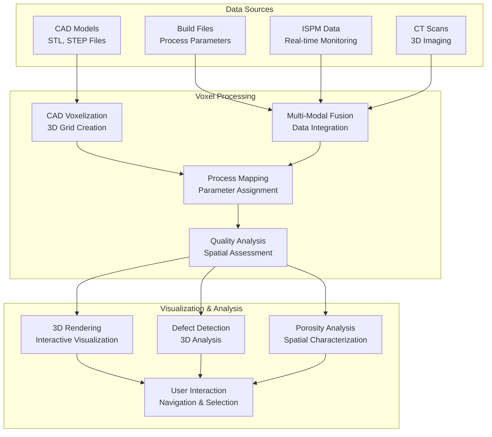
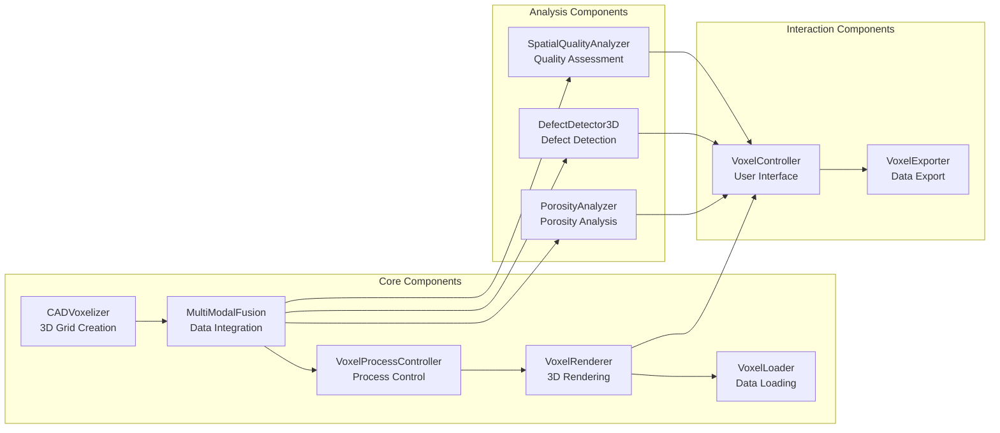

# Voxel Visualization - PBF-LB/M Data Pipeline

## 🎯 **Overview**

The Voxel Visualization module provides comprehensive 3D voxel-based visualization and analysis capabilities for PBF-LB/M (Powder Bed Fusion - Laser Beam/Metal) additive manufacturing research. It enables spatially-resolved process control and quality analysis at the voxel level, allowing researchers to understand and optimize manufacturing processes with unprecedented spatial resolution.

## 🏗️ **Architecture**

### **Voxel-Based Data Representation**



### **Core Components Architecture**



## 🔧 **Core Components**

### **1. CAD Voxelization**

Convert CAD models into voxel grid representations:

```python
from src.data_pipeline.visualization.voxel_clients import (
    CADVoxelizer,
    VoxelGrid,
    VoxelizationConfig
)

# Initialize voxelizer
voxelizer = CADVoxelizer()

# Configure voxelization
config = VoxelizationConfig(
    voxel_size=0.1,  # 0.1 mm voxels
    padding=2.0,     # 2 mm padding around model
    material_type='titanium',
    quality_level='high'
)

# Voxelize CAD model
voxel_grid = voxelizer.voxelize_cad_model(
    cad_file_path="part.stl",
    config=config
)

# Access voxel data
print(f"Voxel grid dimensions: {voxel_grid.dimensions}")
print(f"Total voxels: {voxel_grid.total_voxels}")
print(f"Solid voxels: {voxel_grid.solid_voxels}")
print(f"Void voxels: {voxel_grid.void_voxels}")

# Voxel grid properties
print(f"Origin: {voxel_grid.origin}")
print(f"Voxel size: {voxel_grid.voxel_size} mm")
print(f"Bounds: {voxel_grid.bounds}")
```

### **2. Multi-Modal Data Fusion**

Integrate multiple data sources into unified voxel representation:

```python
from src.data_pipeline.visualization.voxel_clients import (
    MultiModalFusion,
    FusedVoxelData
)

# Initialize fusion system
fusion = MultiModalFusion()

# Load data from different sources
cad_voxels = voxelizer.voxelize_cad_model("part.stl")
build_data = load_build_file("build.mtt")
ispm_data = load_ispm_data("ispm_logs.csv")
ct_data = load_ct_scan("ct_scan.nii")

# Fuse data into unified representation
fused_data = fusion.fuse_data(
    cad_voxels=cad_voxels,
    build_data=build_data,
    ispm_data=ispm_data,
    ct_data=ct_data,
    fusion_strategy='weighted_average'
)

# Access fused voxel data
print(f"Fused voxel data shape: {fused_data.voxel_data.shape}")
print(f"Data channels: {fused_data.data_channels}")
print(f"Fusion quality: {fused_data.fusion_quality}")

# Access specific data channels
process_voxels = fused_data.get_channel('process_parameters')
quality_voxels = fused_data.get_channel('quality_metrics')
defect_voxels = fused_data.get_channel('defect_probability')
```

### **3. Voxel Process Controller**

Control and optimize process parameters at voxel level:

```python
from src.data_pipeline.visualization.voxel_clients import (
    VoxelProcessController,
    ProcessControlConfig,
    ControlMode,
    OptimizationObjective
)

# Initialize process controller
controller = VoxelProcessController()

# Configure process control
control_config = ProcessControlConfig(
    control_mode=ControlMode.ADAPTIVE,
    optimization_objective=OptimizationObjective.QUALITY_MAXIMIZATION,
    safety_constraints={
        'max_power': 300.0,
        'min_power': 150.0,
        'max_speed': 2.0,
        'min_speed': 0.5
    }
)

# Set up process control
controller.setup_control(
    voxel_grid=voxel_grid,
    config=control_config
)

# Optimize process parameters
optimization_results = controller.optimize_parameters(
    objective_function=quality_objective,
    constraints=process_constraints,
    method='genetic_algorithm'
)

# Apply optimized parameters
controller.apply_parameters(optimization_results['optimal_parameters'])

# Get voxel-level process parameters
voxel_parameters = controller.get_voxel_parameters()
print(f"Voxel parameters shape: {voxel_parameters.shape}")
```

### **4. 3D Voxel Rendering**

Interactive 3D visualization of voxel data:

```python
from src.data_pipeline.visualization.voxel_clients import (
    VoxelRenderer,
    RenderConfig,
    RenderResult
)

# Initialize renderer
renderer = VoxelRenderer()

# Configure rendering
render_config = RenderConfig(
    resolution=(1920, 1080),
    quality='high',
    lighting='realistic',
    materials='metallic',
    background='white'
)

# Render voxel data
render_result = renderer.render(
    voxel_data=fused_data,
    config=render_config,
    view_angle='isometric'
)

# Access rendered data
print(f"Render time: {render_result.render_time:.2f} seconds")
print(f"Image size: {render_result.image_size}")
print(f"Quality score: {render_result.quality_score}")

# Save rendered image
renderer.save_image(render_result, "voxel_visualization.png")

# Create interactive visualization
interactive_viewer = renderer.create_interactive_viewer(
    voxel_data=fused_data,
    config=render_config
)
```

## 🔍 **Analysis Components**

### **1. Spatial Quality Analysis**

Analyze quality variations across the build volume:

```python
from src.data_pipeline.visualization.voxel_clients import (
    SpatialQualityAnalyzer,
    SpatialQualityMetrics,
    QualityAnalysisConfig
)

# Initialize quality analyzer
quality_analyzer = SpatialQualityAnalyzer()

# Configure quality analysis
quality_config = QualityAnalysisConfig(
    analysis_types=['density', 'surface_roughness', 'dimensional_accuracy'],
    spatial_resolution=0.1,
    statistical_methods=['mean', 'std', 'percentiles']
)

# Analyze spatial quality
quality_metrics = quality_analyzer.analyze(
    voxel_data=fused_data,
    config=quality_config
)

# Access quality metrics
print("Spatial Quality Metrics:")
print(f"  Overall density: {quality_metrics.overall_density:.3f}")
print(f"  Density variation: {quality_metrics.density_variation:.3f}")
print(f"  Surface roughness: {quality_metrics.surface_roughness:.3f}")
print(f"  Dimensional accuracy: {quality_metrics.dimensional_accuracy:.3f}")

# Get spatial quality map
quality_map = quality_metrics.get_spatial_map('density')
print(f"Quality map shape: {quality_map.shape}")

# Identify quality regions
high_quality_regions = quality_analyzer.identify_regions(
    quality_metrics,
    threshold=0.9,
    region_type='high_quality'
)
low_quality_regions = quality_analyzer.identify_regions(
    quality_metrics,
    threshold=0.7,
    region_type='low_quality'
)
```

### **2. 3D Defect Detection**

Automated detection and classification of defects:

```python
from src.data_pipeline.visualization.voxel_clients import (
    DefectDetector3D,
    DefectDetectionConfig,
    DefectDetectionResult,
    DefectType
)

# Initialize defect detector
defect_detector = DefectDetector3D()

# Configure defect detection
detection_config = DefectDetectionConfig(
    defect_types=[DefectType.POROSITY, DefectType.CRACK, DefectType.DELAMINATION],
    detection_method='machine_learning',
    confidence_threshold=0.8,
    spatial_resolution=0.05
)

# Detect defects
detection_result = defect_detector.detect(
    voxel_data=fused_data,
    config=detection_config
)

# Access detection results
print("Defect Detection Results:")
print(f"  Total defects found: {detection_result.total_defects}")
print(f"  Detection confidence: {detection_result.overall_confidence:.3f}")
print(f"  Processing time: {detection_result.processing_time:.2f} seconds")

# Analyze detected defects
for defect in detection_result.defects:
    print(f"  Defect {defect.id}:")
    print(f"    Type: {defect.type}")
    print(f"    Location: {defect.location}")
    print(f"    Size: {defect.size:.3f} mm³")
    print(f"    Confidence: {defect.confidence:.3f}")
    print(f"    Severity: {defect.severity}")

# Get defect probability map
defect_probability_map = detection_result.get_probability_map()
print(f"Defect probability map shape: {defect_probability_map.shape}")
```

### **3. Porosity Analysis**

Comprehensive porosity analysis and characterization:

```python
from src.data_pipeline.visualization.voxel_clients import (
    PorosityAnalyzer,
    PorosityAnalysisConfig,
    PorosityAnalysisResult,
    PorosityCluster
)

# Initialize porosity analyzer
porosity_analyzer = PorosityAnalyzer()

# Configure porosity analysis
porosity_config = PorosityAnalysisConfig(
    analysis_types=['volume_fraction', 'size_distribution', 'spatial_distribution'],
    pore_size_threshold=0.01,  # 0.01 mm³
    clustering_method='dbscan',
    statistical_analysis=True
)

# Analyze porosity
porosity_result = porosity_analyzer.analyze(
    voxel_data=fused_data,
    config=porosity_config
)

# Access porosity results
print("Porosity Analysis Results:")
print(f"  Total porosity: {porosity_result.total_porosity:.2f}%")
print(f"  Number of pores: {porosity_result.num_pores}")
print(f"  Average pore size: {porosity_result.avg_pore_size:.3f} mm³")
print(f"  Pore size range: {porosity_result.min_pore_size:.3f} - {porosity_result.max_pore_size:.3f} mm³")

# Analyze pore clusters
for cluster in porosity_result.clusters:
    print(f"  Cluster {cluster.id}:")
    print(f"    Size: {cluster.size:.3f} mm³")
    print(f"    Pore count: {cluster.pore_count}")
    print(f"    Density: {cluster.density:.3f}")
    print(f"    Location: {cluster.centroid}")

# Get porosity distribution
porosity_distribution = porosity_result.get_size_distribution()
spatial_distribution = porosity_result.get_spatial_distribution()
```

## 🎮 **User Interaction**

### **1. Interactive Voxel Controller**

User interface for navigating and interacting with voxel data:

```python
from src.data_pipeline.visualization.voxel_clients import (
    VoxelController,
    InteractionConfig,
    InteractionMode,
    SelectionType,
    VoxelSelection,
    InteractionEvent
)

# Initialize voxel controller
controller = VoxelController()

# Configure interaction
interaction_config = InteractionConfig(
    interaction_mode=InteractionMode.NAVIGATION,
    selection_type=SelectionType.VOXEL,
    navigation_speed=1.0,
    zoom_sensitivity=0.1
)

# Set up interactive viewer
viewer = controller.setup_viewer(
    voxel_data=fused_data,
    config=interaction_config
)

# Handle user interactions
def on_voxel_selection(event: InteractionEvent):
    """Handle voxel selection events."""
    selected_voxels = event.selection
    print(f"Selected {len(selected_voxels)} voxels")
    
    # Get voxel data
    for voxel in selected_voxels:
        coordinates = voxel.coordinates
        data = voxel.data
        print(f"  Voxel at {coordinates}: {data}")

def on_view_change(event: InteractionEvent):
    """Handle view change events."""
    view_angle = event.view_angle
    zoom_level = event.zoom_level
    print(f"View changed: angle={view_angle}, zoom={zoom_level}")

# Register event handlers
controller.register_handler('voxel_selection', on_voxel_selection)
controller.register_handler('view_change', on_view_change)

# Start interactive session
controller.start_interactive_session()
```

### **2. Voxel Selection and Annotation**

Advanced selection and annotation capabilities:

```python
# Create voxel selection
selection = VoxelSelection(
    selection_type=SelectionType.REGION,
    coordinates=[(10, 10, 10), (20, 20, 20)],
    selection_method='box'
)

# Get selected voxel data
selected_data = controller.get_selection_data(selection)
print(f"Selected region contains {len(selected_data)} voxels")

# Annotate selected region
annotation = controller.create_annotation(
    selection=selection,
    text="High porosity region",
    color='red',
    opacity=0.7
)

# Save annotation
controller.save_annotation(annotation, "porosity_annotation.json")

# Load existing annotations
annotations = controller.load_annotations("annotations.json")
for annotation in annotations:
    print(f"Annotation: {annotation.text} at {annotation.coordinates}")
```

## 📤 **Data Export**

### **1. Voxel Data Export**

Export voxel data in various formats:

```python
from src.data_pipeline.visualization.voxel_clients import (
    VoxelExporter,
    ExportConfig,
    ExportResult
)

# Initialize exporter
exporter = VoxelExporter()

# Configure export
export_config = ExportConfig(
    export_formats=['vtk', 'hdf5', 'numpy'],
    include_metadata=True,
    compression=True,
    quality='high'
)

# Export voxel data
export_result = exporter.export(
    voxel_data=fused_data,
    config=export_config,
    output_path="voxel_data"
)

# Access export results
print("Export Results:")
print(f"  Export time: {export_result.export_time:.2f} seconds")
print(f"  File sizes: {export_result.file_sizes}")
print(f"  Export quality: {export_result.quality_score}")

# Export specific data channels
exporter.export_channel(
    voxel_data=fused_data,
    channel='process_parameters',
    format='csv',
    output_path="process_parameters.csv"
)

exporter.export_channel(
    voxel_data=fused_data,
    channel='quality_metrics',
    format='json',
    output_path="quality_metrics.json"
)
```

### **2. Visualization Export**

Export visualizations and analysis results:

```python
# Export 3D visualization
renderer.export_visualization(
    voxel_data=fused_data,
    output_path="3d_visualization.html",
    format='html',
    interactive=True
)

# Export analysis results
quality_analyzer.export_results(
    quality_metrics=quality_metrics,
    output_path="quality_analysis_report.pdf",
    format='pdf'
)

defect_detector.export_results(
    detection_result=detection_result,
    output_path="defect_detection_report.html",
    format='html'
)

porosity_analyzer.export_results(
    porosity_result=porosity_result,
    output_path="porosity_analysis_data.json",
    format='json'
)
```

## 🚀 **Usage Examples**

### **1. Complete Voxel Analysis Workflow**

```python
def complete_voxel_analysis():
    """Complete voxel analysis workflow."""
    
    # 1. Voxelize CAD model
    voxelizer = CADVoxelizer()
    voxel_grid = voxelizer.voxelize_cad_model("part.stl")
    
    # 2. Load and fuse data
    fusion = MultiModalFusion()
    fused_data = fusion.fuse_data(
        cad_voxels=voxel_grid,
        build_data=load_build_file("build.mtt"),
        ispm_data=load_ispm_data("ispm_logs.csv"),
        ct_data=load_ct_scan("ct_scan.nii")
    )
    
    # 3. Analyze quality
    quality_analyzer = SpatialQualityAnalyzer()
    quality_metrics = quality_analyzer.analyze(fused_data)
    
    # 4. Detect defects
    defect_detector = DefectDetector3D()
    detection_result = defect_detector.detect(fused_data)
    
    # 5. Analyze porosity
    porosity_analyzer = PorosityAnalyzer()
    porosity_result = porosity_analyzer.analyze(fused_data)
    
    # 6. Create visualization
    renderer = VoxelRenderer()
    render_result = renderer.render(fused_data)
    
    # 7. Export results
    exporter = VoxelExporter()
    exporter.export(fused_data, output_path="analysis_results")
    
    return {
        'voxel_data': fused_data,
        'quality_metrics': quality_metrics,
        'defect_detection': detection_result,
        'porosity_analysis': porosity_result,
        'visualization': render_result
    }

# Run complete analysis
results = complete_voxel_analysis()
```

### **2. Interactive Quality Assessment**

```python
def interactive_quality_assessment():
    """Interactive quality assessment workflow."""
    
    # Load voxel data
    fused_data = load_fused_voxel_data("analysis_results")
    
    # Set up interactive controller
    controller = VoxelController()
    viewer = controller.setup_viewer(fused_data)
    
    # Quality assessment workflow
    def assess_quality_region(selection):
        """Assess quality of selected region."""
        region_data = controller.get_selection_data(selection)
        
        # Calculate quality metrics
        density = calculate_density(region_data)
        roughness = calculate_roughness(region_data)
        accuracy = calculate_accuracy(region_data)
        
        # Display results
        print(f"Region Quality Assessment:")
        print(f"  Density: {density:.3f}")
        print(f"  Surface Roughness: {roughness:.3f}")
        print(f"  Dimensional Accuracy: {accuracy:.3f}")
        
        # Color-code region based on quality
        quality_score = (density + (1-roughness) + accuracy) / 3
        color = get_quality_color(quality_score)
        controller.highlight_region(selection, color)
    
    # Register quality assessment handler
    controller.register_handler('region_selection', assess_quality_region)
    
    # Start interactive session
    controller.start_interactive_session()
```

### **3. Process Parameter Optimization**

```python
def optimize_process_parameters():
    """Optimize process parameters using voxel data."""
    
    # Load voxel data with process parameters
    fused_data = load_fused_voxel_data("process_analysis")
    
    # Set up process controller
    controller = VoxelProcessController()
    controller.setup_control(fused_data)
    
    # Define optimization objective
    def quality_objective(parameters):
        """Calculate quality score for given parameters."""
        # Apply parameters to voxel data
        controller.apply_parameters(parameters)
        
        # Calculate quality metrics
        quality_analyzer = SpatialQualityAnalyzer()
        quality_metrics = quality_analyzer.analyze(fused_data)
        
        # Return composite quality score
        return quality_metrics.overall_quality_score
    
    # Optimize parameters
    optimization_results = controller.optimize_parameters(
        objective_function=quality_objective,
        constraints=process_constraints,
        method='genetic_algorithm'
    )
    
    # Apply optimal parameters
    controller.apply_parameters(optimization_results['optimal_parameters'])
    
    # Visualize optimization results
    renderer = VoxelRenderer()
    render_result = renderer.render(fused_data)
    
    return optimization_results, render_result

# Run optimization
optimal_params, visualization = optimize_process_parameters()
```

## 🔧 **Configuration & Setup**

### **1. Dependencies**

The voxel visualization module requires several specialized libraries:

```bash
# Core dependencies
pip install numpy scipy pandas

# 3D processing
pip install trimesh pyvista

# Visualization
pip install matplotlib plotly

# Image processing
pip install opencv-python

# Scientific computing
pip install h5py
```

### **2. Configuration**

Configure the voxel visualization module:

```yaml
# config/visualization/voxel_clients.yaml
voxel_visualization:
  voxelization:
    default_voxel_size: 0.1  # mm
    max_voxels: 1000000
    quality_level: 'high'
    padding: 2.0  # mm
  
  rendering:
    default_resolution: [1920, 1080]
    quality: 'high'
    lighting: 'realistic'
    materials: 'metallic'
    background: 'white'
  
  analysis:
    spatial_resolution: 0.1  # mm
    confidence_threshold: 0.8
    pore_size_threshold: 0.01  # mm³
  
  interaction:
    navigation_speed: 1.0
    zoom_sensitivity: 0.1
    selection_sensitivity: 0.5
  
  export:
    default_formats: ['vtk', 'hdf5']
    compression: true
    include_metadata: true
```

## 🎯 **Key Benefits**

1. **Spatial Resolution**: Voxel-level analysis and control
2. **Multi-Modal Integration**: Unified representation of diverse data
3. **Interactive Visualization**: Real-time 3D interaction and analysis
4. **Automated Analysis**: AI-powered defect detection and quality assessment
5. **Process Optimization**: Voxel-level process parameter optimization
6. **Research-Ready**: Built for academic and industrial research
7. **Export Capabilities**: Multiple export formats for data sharing
8. **Scalable**: Handles large voxel datasets efficiently

## 📚 **API Reference**

### **Core Components**

```python
class CADVoxelizer:
    def voxelize_cad_model(self, cad_file_path: str, config: VoxelizationConfig) -> VoxelGrid

class MultiModalFusion:
    def fuse_data(self, cad_voxels: VoxelGrid, build_data: Dict, ispm_data: Dict, ct_data: Dict) -> FusedVoxelData

class VoxelProcessController:
    def setup_control(self, voxel_data: FusedVoxelData, config: ProcessControlConfig) -> None
    def optimize_parameters(self, objective_function: Callable, constraints: Dict, method: str) -> Dict

class VoxelRenderer:
    def render(self, voxel_data: FusedVoxelData, config: RenderConfig) -> RenderResult
    def create_interactive_viewer(self, voxel_data: FusedVoxelData, config: RenderConfig) -> InteractiveViewer
```

### **Analysis Components**

```python
class SpatialQualityAnalyzer:
    def analyze(self, voxel_data: FusedVoxelData, config: QualityAnalysisConfig) -> SpatialQualityMetrics

class DefectDetector3D:
    def detect(self, voxel_data: FusedVoxelData, config: DefectDetectionConfig) -> DefectDetectionResult

class PorosityAnalyzer:
    def analyze(self, voxel_data: FusedVoxelData, config: PorosityAnalysisConfig) -> PorosityAnalysisResult
```

### **Interaction Components**

```python
class VoxelController:
    def setup_viewer(self, voxel_data: FusedVoxelData, config: InteractionConfig) -> InteractiveViewer
    def register_handler(self, event_type: str, handler: Callable) -> None
    def start_interactive_session(self) -> None

class VoxelExporter:
    def export(self, voxel_data: FusedVoxelData, config: ExportConfig, output_path: str) -> ExportResult
    def export_channel(self, voxel_data: FusedVoxelData, channel: str, format: str, output_path: str) -> None
```

This voxel visualization module provides a comprehensive, research-ready platform for 3D voxel-based analysis and visualization of PBF-LB/M manufacturing processes, enabling unprecedented spatial resolution and multi-modal data integration.
